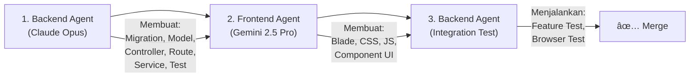

# Panduan AI Agent Instruction
## Sistem WMS & Sales Order — PT Berger Paints Indonesia

> **Versi:** 1.0  
> **Tanggal:** 14 Agustus 2026  
> **Tujuan:** Menjadi acuan utama agar setiap AI Agent yang terlibat dalam pengembangan sistem ini bekerja terarah, konsisten, dan tidak keluar konteks.

---

## 1. Konteks Proyek

Sistem ini adalah **Warehouse Management System (WMS) terintegrasi dengan Sales Order** untuk PT Berger Paints Indonesia. Arsitektur menggunakan **Single Database, Multi-Portal (Monolithic)** dengan satu backend Laravel yang melayani dua portal terpisah: **Portal Warehouse** (desktop-first) dan **Portal Sales** (mobile-first).

### Teknologi Utama
| Layer | Teknologi | Catatan |
|---|---|---|
| Backend Engine | **Laravel 13** (PHP 8.3+) | Eloquent ORM, Middleware, Queue |
| Frontend | Laravel Blade + Livewire 3 + Bootstrap 5.3 | Tidak menggunakan SPA/React/Vue |
| Database | PostgreSQL 16+ | Transaksional, konkurensi tinggi |
| Cache | Redis 7 | Session, cache query, real-time notification |
| Queue | Redis (`queue:work`); Horizon menyusul | Background jobs |
| Auth MFA | Google Authenticator (TOTP) | Untuk semua role |
| Realtime | Laravel Echo + **Soketi** | Notifikasi real-time dengan suara |
| Infra | Docker + CI/CD (GitHub Actions) | Containerized deployment |

> [!NOTE]
> **Status dependensi (per 26 Agustus 2026).** `composer.json` saat ini masih skeleton Laravel. Paket berikut **belum terpasang** dan harus ditambahkan saat modul terkait dikerjakan: Livewire 3, `pragmarx/google2fa-laravel`, `maatwebsite/excel`, DomPDF/Snappy, Laravel Horizon, dan paket RBAC. Jangan berasumsi paket-paket ini sudah tersedia.

---

## 2. Pembagian Peran AI Agent

### 2.1 Google Gemini 2.5 Pro — Frontend Agent

**Scope Tanggung Jawab:**
- Seluruh file Blade template (`resources/views/**/*.blade.php`)
- Seluruh file CSS/SCSS (`resources/css/`, `public/css/`)
- Seluruh file JavaScript frontend (`resources/js/`, `public/js/`)
- Layout dan komponen UI Bootstrap 5
- Responsivitas dan adaptasi mobile/desktop
- Animasi, transisi, dan micro-interaction
- Integrasi notifikasi suara di frontend
- Form validation di sisi client (sebelum dikirim ke server)
- Chart/grafik dashboard menggunakan Chart.js atau ApexCharts

**Batasan Ketat:**
- ❌ TIDAK boleh mengubah file Controller, Model, Migration, Route, atau Middleware
- ❌ TIDAK boleh mengubah logika bisnis di backend
- ❌ TIDAK boleh membuat endpoint API baru
- ❌ TIDAK boleh mengubah konfigurasi database atau `.env`
- ✅ BOLEH membuat partial Blade component baru jika dibutuhkan UI
- ✅ BOLEH menambah JavaScript untuk interaksi UI (AJAX call ke endpoint yang sudah ada)
- ✅ BOLEH mengubah asset frontend (CSS, JS, gambar)

**Panduan Desain:**
```
Portal Sales (Mobile-First):
├── Viewport target: 360px - 428px (smartphone)
├── Touch-friendly: min tap target 44x44px
├── Bottom navigation bar
├── Card-based layout
├── Warna utama: sesuai branding Berger Paints
└── Font: Inter atau Roboto (Google Fonts)

Portal Warehouse (Desktop-First):
├── Viewport target: 1280px - 1920px (monitor/tablet landscape)
├── Sidebar navigation
├── Data-dense table layout dengan DataTables
├── Form-heavy interface
├── Warna utama: tema profesional/industrial
└── Font: Inter atau Roboto (Google Fonts)
```

**Konvensi Penamaan File Blade:**

> [!IMPORTANT]
> **Struktur di bawah ini adalah rencana awal dan SUDAH TIDAK SESUAI dengan kode yang berjalan.** Struktur nyata di repo saat ini:
>
> ```
> resources/views/
> |-- layouts/
> |   |-- soms.blade.php          # Layout Portal Sales   (bukan app-sales)
> |   `-- wms.blade.php           # Layout Portal Warehouse (bukan app-warehouse)
> |-- partials/                   # (bukan layouts/partials)
> |   |-- head.blade.php
> |   |-- navbar-top.blade.php    # DIPAKAI BERSAMA kedua portal
> |   `-- scripts.blade.php
> |-- sales/                      # dashboard, new_order, my_orders
> |-- wms/                        # (bukan warehouse/)
> |   |-- dashboard/  inbound/  inventory/  outbound/
> |   `-- billing/  master/  admin/  reports/
> |-- driver/epod.blade.php
> `-- welcome.blade.php           # halaman login
> ```
>
> **Ikuti struktur nyata di atas**, bukan struktur rencana di bawah. Folder `admin/` terpisah tidak dipakai — halaman admin berada di `wms/admin/` dan `wms/master/`. Belum ada folder `auth/` maupun `components/`; keduanya dibuat saat modul autentikasi dikerjakan.

```
resources/views/
├── layouts/
│   ├── app-sales.blade.php          # Layout utama portal Sales
│   ├── app-warehouse.blade.php      # Layout utama portal Warehouse
│   └── partials/
│       ├── _navbar-sales.blade.php
│       ├── _sidebar-warehouse.blade.php
│       ├── _notification-bell.blade.php
│       └── _footer.blade.php
├── sales/                           # Semua view portal Sales
│   ├── dashboard.blade.php
│   ├── orders/
│   │   ├── index.blade.php
│   │   ├── create.blade.php
│   │   ├── show.blade.php
│   │   └── tracking.blade.php
│   ├── customers/
│   │   ├── index.blade.php
│   │   └── create.blade.php
│   └── profile/
│       └── index.blade.php
├── warehouse/                       # Semua view portal Warehouse
│   ├── dashboard.blade.php
│   ├── inbound/
│   ├── inventory/
│   ├── orders/
│   ├── delivery/
│   ├── billing/
│   └── reports/
├── admin/                           # View khusus Manager/Super Admin
│   ├── dashboard.blade.php
│   ├── users/
│   ├── products/
│   ├── locations/
│   ├── warehouses/
│   ├── customers/
│   ├── stock/
│   ├── audit-logs/
│   └── settings/
├── auth/
│   ├── login.blade.php
│   ├── mfa-verify.blade.php
│   └── locked.blade.php
└── components/                      # Blade components reusable
    ├── alert.blade.php
    ├── modal-confirm.blade.php
    ├── status-badge.blade.php
    ├── notification-toast.blade.php
    └── chart-card.blade.php
```

---

### 2.2 Claude Opus — Backend Agent

**Scope Tanggung Jawab:**
- Seluruh file PHP backend: Controllers, Models, Migrations, Seeders, Factories
- Route definitions (`routes/web.php`, `routes/channels.php`)
- Middleware (autentikasi, RBAC, rate limiting, session management)
- Service classes dan Repository pattern
- Business logic (FIFO, auto-adjustment, pallet splitting, SLA calculation)
- Database schema design dan migration
- Queue jobs dan event broadcasting
- API internal untuk AJAX calls dari frontend
- Unit test dan feature test
- Konfigurasi Docker, CI/CD, dan environment

**Batasan Ketat:**
- ❌ TIDAK boleh mengubah file Blade template, CSS, atau JavaScript frontend
- ❌ TIDAK boleh mengubah layout atau tampilan UI
- ❌ TIDAK boleh hardcode value yang seharusnya konfigurasi
- ✅ BOLEH mengembalikan data berformat JSON untuk konsumsi AJAX frontend
- ✅ BOLEH membuat Blade component sederhana jika dibutuhkan backend logic (`@can`, `@auth`)
- ✅ BOLEH menambahkan variable ke view melalui Controller/ViewComposer

**Arsitektur Backend:**
```
app/
├── Http/
│   ├── Controllers/
│   │   ├── Auth/
│   │   │   ├── LoginController.php
│   │   │   ├── MfaController.php
│   │   │   └── SessionController.php
│   │   ├── Sales/                    # Controller portal Sales
│   │   │   ├── DashboardController.php
│   │   │   ├── OrderController.php
│   │   │   ├── CustomerController.php
│   │   │   └── ProofUploadController.php
│   │   ├── Warehouse/               # Controller portal Warehouse
│   │   │   ├── DashboardController.php
│   │   │   ├── InboundController.php
│   │   │   ├── InventoryController.php
│   │   │   ├── OrderApprovalController.php
│   │   │   ├── PickingController.php
│   │   │   ├── DeliveryNoteController.php
│   │   │   ├── BillingController.php
│   │   │   └── ReportController.php
│   │   └── Admin/                   # Controller Manager/Super Admin
│   │       ├── DashboardController.php
│   │       ├── UserController.php
│   │       ├── ProductController.php
│   │       ├── LocationController.php
│   │       ├── WarehouseController.php
│   │       ├── CustomerApprovalController.php
│   │       ├── StockAdjustmentController.php
│   │       ├── AuditLogController.php
│   │       └── SettingsController.php
│   ├── Middleware/
│   │   ├── CheckRole.php
│   │   ├── CheckMfa.php
│   │   ├── EnforceMaxSessions.php
│   │   ├── CheckOrderCutoff.php
│   │   ├── CheckCustomerBlocked.php
│   │   └── TrackAuditLog.php
│   └── Requests/                    # Form Request validation
│       ├── StoreInboundRequest.php
│       ├── StoreOrderRequest.php
│       ├── UploadProofRequest.php
│       └── ...
├── Models/
│   ├── User.php
│   ├── Role.php
│   ├── Customer.php
│   ├── Product.php
│   ├── ProductCategory.php
│   ├── Location.php
│   ├── Warehouse.php
│   ├── InboundHeader.php
│   ├── InboundDetail.php
│   ├── InventoryStock.php
│   ├── StockMovement.php
│   ├── SalesOrder.php
│   ├── SalesOrderDetail.php
│   ├── DeliveryNote.php
│   ├── DeliveryProof.php
│   ├── OrderTracking.php
│   ├── CustomerBilling.php
│   ├── BillingPayment.php
│   ├── Notification.php
│   ├── AuditLog.php
│   ├── UserSession.php
│   ├── LoginAttempt.php
│   └── SystemSetting.php
├── Services/
│   ├── FifoAllocationService.php
│   ├── PalletSplitService.php
│   ├── StockMovementService.php
│   ├── SlaCalculationService.php
│   ├── OrderProcessingService.php
│   ├── NotificationService.php
│   ├── BillingService.php
│   └── AuditService.php
├── Jobs/
│   ├── ProcessOrderApproval.php
│   ├── SendNotification.php
│   ├── CalculateSla.php
│   └── ArchiveOldAuditLogs.php
├── Events/
│   ├── OrderSubmitted.php
│   ├── OrderApproved.php
│   ├── OrderReadyToShip.php
│   ├── DeliveryNoteIssued.php
│   ├── ProofUploaded.php
│   ├── StockVerified.php
│   └── BillingStatusChanged.php
├── Listeners/
│   └── (Listener untuk setiap Event di atas)
├── Policies/
│   ├── OrderPolicy.php
│   ├── StockPolicy.php
│   ├── CustomerPolicy.php
│   └── AuditLogPolicy.php
└── Exports/
    ├── OrdersExport.php
    ├── StockReportExport.php
    └── LostSalesExport.php
```

---

## 3. Konvensi Kode Bersama

### 3.1 Penamaan

| Elemen | Konvensi | Contoh |
|---|---|---|
| Model | PascalCase, singular | `SalesOrder`, `InventoryStock` |
| Controller | PascalCase + Controller | `OrderController` |
| Migration | snake_case, deskriptif | `create_sales_orders_table` |
| Blade View | kebab-case | `order-detail.blade.php` |
| Route Name | dot notation per modul | `sales.orders.create`, `warehouse.inbound.store` |
| CSS Class | kebab-case (BEM jika kompleks) | `order-card`, `status-badge--approved` |
| JS Function | camelCase | `submitOrder()`, `playNotificationSound()` |
| DB Table | snake_case, plural | `sales_orders`, `inventory_stocks` |
| DB Column | snake_case | `qty_available`, `created_at` |

### 3.2 Komentar & Dokumentasi
- Setiap **method publik** di Controller dan Service wajib memiliki PHPDoc
- Setiap **migration** wajib memiliki komentar di atas kolom yang tidak self-explanatory
- Setiap **Blade section** kompleks wajib memiliki komentar HTML `<!-- Section: ... -->`
- Setiap **JavaScript function** wajib memiliki JSDoc

### 3.3 Git Commit Message
```
Format: <type>(<scope>): <deskripsi singkat>

Contoh:
feat(inbound): add pallet split logic on inbound creation
fix(order): fix FIFO allocation when stock is partially allocated
ui(sales): redesign order tracking timeline on mobile
style(warehouse): adjust table spacing on inventory page
test(order): add unit test for partial fulfillment
chore(docker): update nginx config for file upload limit
```

---

## 4. Workflow Kolaborasi Antar Agent

### 4.1 Urutan Pengembangan Per Fitur



**Aturan:** Backend Agent SELALU mengerjakan duluan sebelum Frontend Agent menyentuh fitur yang sama. Ini memastikan endpoint, data structure, dan validation sudah siap sebelum UI dibuat.

### 4.2 Kontrak Data (Data Contract)

Setiap kali Backend Agent membuat Controller method baru, wajib mendokumentasikan **kontrak data** yang akan dikirim ke view:

```php
/**
 * Menampilkan halaman daftar pesanan untuk Sales.
 *
 * @return \Illuminate\View\View
 *
 * DATA CONTRACT untuk Frontend:
 * - $orders: Collection<SalesOrder> (paginated, 15/page)
 *   -> id, order_number, customer.name, total_items, status, created_at
 * - $statusFilter: string|null (active filter)
 * - $stats: object {pending: int, approved: int, shipping: int, completed: int}
 */
public function index(Request $request): View
```

Frontend Agent membaca kontrak ini untuk mengetahui variabel apa saja yang tersedia di Blade.

### 4.3 Branching per Agent

```
main (production)
├── develop (staging/integration)
│   ├── backend/feature-inbound       # Claude Opus kerja di sini
│   ├── backend/feature-order         
│   ├── frontend/feature-inbound      # Gemini 2.5 Pro kerja di sini
│   ├── frontend/feature-order        
│   ├── backend/fix-fifo-allocation   
│   └── frontend/fix-mobile-layout    
```

---

## 5. Batasan Konteks yang Tidak Boleh Dilanggar

### 5.1 Batasan Bisnis (Berlaku untuk Kedua Agent)

| Aturan | Detail |
|---|---|
| Sales tidak boleh lihat stok | Sistem Semi-Blind: hanya indikator ✅⚠️❌, bukan angka |
| Order cutoff jam 15:00 | Setelah jam 15:00 WIB, form order terkunci |
| Pembayaran 30/60/90 hari | Masuk menu billing. Customer menunggak **DITANDAI**, **BUKAN diblokir** - order tetap boleh dibuat |
| Customer dibuat Admin | Sales **tidak** punya menu pengajuan customer. Manager/Super Admin membuat langsung via Master Customer |
| Cash/Transfer | Langsung complete tanpa billing |
| Palet otomatis | Qty dipecah otomatis berdasarkan kapasitas per UoM |
| FIFO wajib | Stok tertua HARUS keluar duluan; stok `ddp`/`expired` WAJIB dilewati |
| Expiry wajib | Cat **memiliki** masa simpan (default 30 bulan dari tanggal produksi) |
| Stok DDP terpisah | Stok rusak/expired dipisah dari Good Stock, tidak pernah masuk Picking List |
| Maker-Checker inbound | Operator put-away → Logistik verifikasi → Stok aktif |
| Max 2 device per user | Session ketiga menendang session tertua |
| MFA wajib | Semua role wajib Google Authenticator |
| Edit stok | Hanya Manager dan Super Admin melalui menu Stock |
| Qty put-away | Operator **BOLEH** koreksi Qty Aktual (SKU & batch tetap terkunci); selisih dicatat untuk verifikasi Logistik |
| Hak Manager | CRUD User + Pengaturan Dokumen. TIDAK boleh membuat/mengubah akun Super Admin |
| Hak Super Admin | Akses penuh Portal Warehouse termasuk tugas operasional. TIDAK punya akses Portal Sales |

### 5.2 Batasan Teknis

| Aturan | Detail |
|---|---|
| Upload file | Hanya PNG/JPG, max 5MB, atau langsung dari kamera |
| No SPA | Tidak menggunakan React, Vue, atau framework SPA |
| No external API | Tidak ada integrasi ke sistem keuangan atau pihak ketiga |
| No backorder | Sisa pesanan yang tidak terpenuhi = lost sales |
| QR lokasi rak | Scan QR pada rak DIGUNAKAN untuk put-away & picking (bukan barcode produk) |
| Retur | Modul retur **masuk scope** - lihat PRD 6.10 |
| Transfer gudang | Transfer stok antar lokasi & antar gudang **masuk scope** - lihat PRD 6.4 F-INV-05 |

### 5.3 Catatan Khusus - Role Switcher (SELESAI DIHAPUS)

> [!NOTE]
> Dropdown **"Switch Role"** yang sebelumnya ada di `resources/views/partials/navbar-top.blade.php` sudah **dihapus** pada Fase 1 (Autentikasi Nyata — lihat `docs/7_master_build_prompt.md`). Peran kini sepenuhnya ditentukan oleh `auth()->user()->role` lewat login sungguhan (`AuthController`) dan ditegakkan oleh middleware `auth`, `session.track`, dan `portal:{wms|sales}` (lihat `bootstrap/app.php` dan `routes/web.php`).
>
> Jalur `?as=<slug-role>` di `App\Support\CurrentActor` dipertahankan sebagai fallback pengembangan, tapi kini dipagari `app()->environment('production')` dan pada praktiknya sudah tidak terjangkau lewat HTTP biasa — rute wms/sales sudah dibungkus middleware `auth` sehingga tamu ditolak sebelum sempat mencapai jalur tersebut.

---

## 6. Checklist Sebelum Merge ke `develop`

### Backend Agent Checklist:
- [ ] Semua migration berjalan tanpa error (`php artisan migrate:fresh`)
- [ ] Semua model relationship didefinisikan dan di-test
- [ ] Semua route dilindungi middleware yang sesuai
- [ ] Form Request validation lengkap
- [ ] Service class memiliki unit test
- [ ] Controller memiliki feature test
- [ ] Tidak ada N+1 query (gunakan `->with()` eager loading)
- [ ] Audit log tercatat untuk operasi sensitif
- [ ] Event dan Listener terdaftar di `EventServiceProvider`
- [ ] Data contract terdokumentasi di PHPDoc Controller

### Frontend Agent Checklist:
- [ ] Semua halaman responsive sesuai target viewport
- [ ] Tidak ada inline style (semua di CSS file)
- [ ] Notifikasi suara berfungsi
- [ ] Form validation client-side sebelum submit
- [ ] Loading state ditampilkan saat AJAX call
- [ ] Modal konfirmasi untuk aksi destruktif (delete, approve, reject)
- [ ] Semua tabel menggunakan DataTables dengan pagination
- [ ] Dashboard chart menggunakan data dari endpoint yang sudah ada
- [ ] Accessibility: semua input memiliki label, semua button memiliki aria-label
- [ ] Cross-browser test: Chrome, Firefox, Safari mobile

---

## 7. Referensi Dokumen Terkait

| Dokumen | Deskripsi |
|---|---|
| `1_prd.md` | Product Requirements Document lengkap |
| `2_database_design.md` | Skema database, relasi, dan penjelasan kolom |
| `3_system_architecture.md` | Arsitektur teknis, infrastruktur, dan keamanan |
| `4_ui_ux_guidelines.md` | Panduan desain UI/UX per portal |
| `5_testing_strategy.md` | Strategi dan skenario testing |
| `6_cicd_docker_setup.md` | Setup Docker, GitHub Actions, dan branching |

> [!IMPORTANT]
> Setiap AI Agent **WAJIB membaca dokumen referensi yang relevan** sebelum memulai pengembangan fitur apapun. Jangan berasumsi — selalu cek dokumen.
