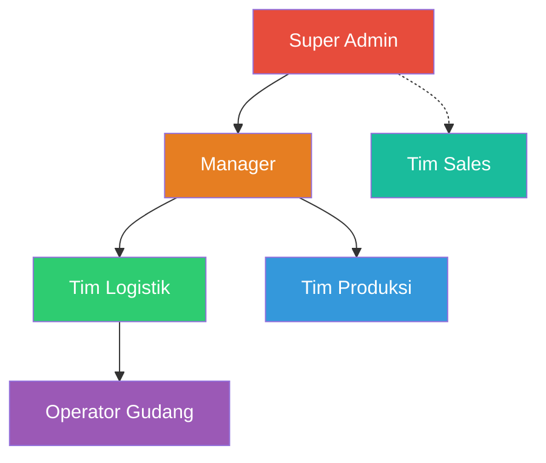

# Product Requirements Document (PRD)
## Sistem Terintegrasi WMS & Sales Order — PT Berger Paints Indonesia

> **Versi:** 1.0  
> **Tanggal:** 14 Agustus 2026  
> **Status:** Draft — Menunggu Final Approval  
> **Pemilik Produk:** PT Berger Paints Indonesia  
> **Tim Pengembang:** AI-Assisted Development (Gemini 3.1 Pro + Claude Opus)

---

## Daftar Isi

1. [Ringkasan Eksekutif](#1-ringkasan-eksekutif)
2. [Latar Belakang & Permasalahan](#2-latar-belakang--permasalahan)
3. [Tujuan & Ruang Lingkup](#3-tujuan--ruang-lingkup)
4. [Stakeholder & Pengguna](#4-stakeholder--pengguna)
5. [Peran Pengguna & Hak Akses (RBAC)](#5-peran-pengguna--hak-akses-rbac)
6. [Spesifikasi Fungsional](#6-spesifikasi-fungsional)
7. [Aturan Bisnis (Business Rules)](#7-aturan-bisnis-business-rules)
8. [Spesifikasi Non-Fungsional](#8-spesifikasi-non-fungsional)
9. [Teknologi & Infrastruktur](#9-teknologi--infrastruktur)
10. [Roadmap & Fase Pengembangan](#10-roadmap--fase-pengembangan)
11. [Glossarium](#11-glossarium)

---

## 1. Ringkasan Eksekutif

Dokumen ini mendefinisikan kebutuhan lengkap untuk pembangunan Sistem Terintegrasi **Warehouse Management System (WMS)** dan **Sales Order** PT Berger Paints Indonesia. Sistem ini bertujuan menggantikan proses manual berbasis WhatsApp yang rentan kesalahan, dengan sebuah platform digital terpusat yang menjadi *Single Source of Truth* untuk seluruh siklus rantai pasok internal — dari penerimaan barang produksi, penyimpanan di gudang, hingga pemesanan dan pengiriman ke pelanggan.

Sistem ini dirancang dengan arsitektur **Single Database, Multi-Portal (Monolithic)**, di mana dua portal terpisah (Portal Sales dan Portal Warehouse/Admin) beroperasi di atas satu basis data PostgreSQL yang sama, dijembatani oleh satu backend Laravel. Pemisahan portal ini menjamin isolasi data antar-divisi tanpa mengorbankan integritas data terpusat.

---

## 2. Latar Belakang & Permasalahan

### 2.1 Kondisi Saat Ini

Sebelum sistem ini dibangun, alur operasional PT Berger Paints Indonesia berjalan sebagai berikut:

1. Tim Sales di lapangan menerima pesanan dari toko/distributor.
2. Pesanan dikirimkan ke Tim Logistik di gudang **melalui pesan WhatsApp**.
3. Tim Logistik memproses pesanan secara manual: mencari barang, mengemas, dan mencetak surat jalan.
4. Koordinasi antar-divisi (Produksi → Gudang → Sales) dilakukan via grup chat tanpa standar format.

### 2.2 Permasalahan yang Teridentifikasi

| No | Permasalahan | Dampak |
|---|---|---|
| 1 | Input pesanan via WhatsApp rentan typo | Salah kirim jenis/jumlah barang |
| 2 | Tidak ada tracking status pesanan | Sales tidak tahu apakah pesanan sudah dikemas atau tertunda |
| 3 | Tidak ada pelacakan lokasi barang di gudang | Operator menghabiskan waktu mencari barang di rak |
| 4 | Tidak ada kontrol stok real-time | Pesanan bisa melebihi stok yang tersedia |
| 5 | Tidak ada jejak audit | Jika terjadi kesalahan, tidak ada bukti siapa yang salah input |
| 6 | Tidak ada pembatasan akses data | Sales bisa mengetahui stok dan melakukan praktik penimbunan |
| 7 | Tidak ada standar pengelolaan barang masuk | Barang dari produksi langsung masuk stok tanpa verifikasi |
| 8 | Tidak ada pengelolaan piutang/penagihan | Pelanggan dengan pembayaran tempo sulit dilacak |

### 2.3 Dampak Bisnis

- **Kerugian finansial** akibat salah kirim dan retur barang yang tidak tercatat
- **Inefisiensi operasional** karena proses pencarian barang manual di gudang
- **Kehilangan penjualan** karena pesanan yang terlambat diproses
- **Risiko kecurangan** tanpa adanya kontrol akses dan audit trail

---

## 3. Tujuan & Ruang Lingkup

### 3.1 Tujuan Utama

1. **Digitalisasi penuh** siklus rantai pasok internal: Produksi → Gudang → Sales → Pengiriman
2. **Single Source of Truth** untuk data stok, pesanan, dan pelanggan
3. **Eliminasi kesalahan manual** melalui validasi otomatis dan alur terstruktur
4. **Pembatasan akses data** (RBAC) antar-divisi untuk menjaga kerahasiaan informasi
5. **Pelacakan real-time** setiap pergerakan barang dan status pesanan
6. **Audit trail digital** yang tidak dapat dimanipulasi

### 3.2 Ruang Lingkup — Dalam Scope (Fase 1)

| Modul | Deskripsi |
|---|---|
| Autentikasi & Keamanan | Login, MFA (Google Authenticator), RBAC, session management |
| Master Data | Pengelolaan User, Produk, Kategori, Lokasi Rak, Gudang, Pelanggan |
| Inbound (Barang Masuk) | Input produksi, put-away, verifikasi Maker-Checker |
| Inventory (Stok) | Stok real-time, stock movement ledger, adjustment oleh Manager |
| Outbound (Sales Order) | Pembuatan PO (Semi-Blind), approval, FIFO allocation, picking, delivery |
| Surat Jalan | Generate nomor otomatis, cetak dokumen, upload bukti tanda tangan |
| Billing (Penagihan) | Manajemen piutang untuk pembayaran tempo 30/60/90 hari |
| Dashboard & Laporan | KPI per role, grafik penjualan, ekspor Excel |
| Notifikasi Real-time | Push notification dengan suara untuk setiap perubahan status |

### 3.3 Ruang Lingkup — Di Luar Scope (Fase Berikutnya)

| Modul | Keterangan |
|---|---|
| Modul Retur / Return | Akan dikembangkan setelah sistem utama selesai 80-90% |
| Transfer Antar Gudang | Setiap gudang beroperasi independen pada Fase 1 |
| Integrasi Keuangan | Tidak ada integrasi ke sistem accounting/ERP |
| Barcode / QR Scanning | Tidak digunakan; validasi dilakukan manual oleh Logistik |
| Tracking Expiry Date | Cat tidak memiliki tanggal kadaluarsa |
| Backorder Management | Sisa pesanan tidak terpenuhi = Lost Sales |

---

## 4. Stakeholder & Pengguna

### 4.1 Stakeholder

| Peran | Kepentingan |
|---|---|
| Manajemen PT Berger Paints | Sponsor proyek, keputusan bisnis final |
| Kepala Gudang / Logistik | Operasional harian, validasi alur kerja |
| Supervisor Sales | Monitoring performa tim sales |
| IT Department | Infrastruktur, deployment, maintenance |

### 4.2 Estimasi Jumlah Pengguna

| Role | Estimasi Jumlah | Portal |
|---|---|---|
| Super Admin | 1-2 orang | Warehouse/Admin |
| Manager | 2-3 orang | Warehouse/Admin |
| Tim Produksi | 3-5 orang | Warehouse |
| Operator Gudang | 5-10 orang per gudang | Warehouse |
| Tim Logistik | 3-5 orang per gudang | Warehouse |
| Tim Sales | 10-30 orang | Sales |

### 4.3 Jumlah Gudang

Saat ini terdapat **3 gudang** yang beroperasi. Sistem harus mendukung **penambahan gudang baru** melalui menu Admin tanpa perubahan kode.

---

## 5. Peran Pengguna & Hak Akses (RBAC)

### 5.1 Hierarki Peran



### 5.2 Matriks Hak Akses Detail

#### Portal Warehouse / Admin

| Fitur | Super Admin | Manager | Tim Logistik | Tim Produksi | Operator Gudang |
|---|:---:|:---:|:---:|:---:|:---:|
| **Dashboard (semua data)** | ✅ | ✅ | ✅ | ❌ | ❌ |
| **Master User (CRUD)** | ✅ | ❌ | ❌ | ❌ | ❌ |
| **Master Produk (CRUD)** | ✅ | ✅ | ❌ | ❌ | ❌ |
| **Master Kategori (CRUD)** | ✅ | ✅ | ❌ | ❌ | ❌ |
| **Master Lokasi Rak (CRUD)** | ✅ | ✅ | ❌ | ❌ | ❌ |
| **Master Gudang (CRUD)** | ✅ | ✅ | ❌ | ❌ | ❌ |
| **Approval Customer Baru** | ✅ | ✅ | ❌ | ❌ | ❌ |
| **Input Inbound (Produksi)** | ❌ | ❌ | ❌ | ✅ | ❌ |
| **Put-away (Penempatan Rak)** | ❌ | ❌ | ❌ | ❌ | ✅ |
| **Verifikasi Inbound (Ceklis)** | ❌ | ❌ | ✅ | ❌ | ❌ |
| **Lihat Stok** | ✅ | ✅ | ✅ | ❌ | ❌ |
| **Edit Stok (Adjustment)** | ✅ | ✅ | ❌ | ❌ | ❌ |
| **Approve/Reject Pesanan** | ❌ | ❌ | ✅ | ❌ | ❌ |
| **Proses Picking** | ❌ | ❌ | ❌ | ❌ | ✅ |
| **Cetak Surat Jalan** | ❌ | ❌ | ✅ | ❌ | ❌ |
| **Verifikasi Bukti Surat Jalan** | ❌ | ❌ | ✅ | ❌ | ❌ |
| **Konfirmasi Pembayaran Billing** | ❌ | ❌ | ✅ | ❌ | ❌ |
| **Laporan & Ekspor Excel** | ✅ | ✅ | ✅ | ❌ | ❌ |
| **Audit Log (Lihat)** | ✅ | ✅ | ❌ | ❌ | ❌ |
| **Hapus Transaksi** | ✅ | ❌ | ❌ | ❌ | ❌ |
| **Pengaturan Sistem** | ✅ | ❌ | ❌ | ❌ | ❌ |

#### Portal Sales

| Fitur | Tim Sales |
|---|:---:|
| **Dashboard (data pribadi)** | ✅ |
| **Buat Pesanan (Semi-Blind)** | ✅ |
| **Lihat Daftar Pesanan Sendiri** | ✅ |
| **Lacak Status Pesanan** | ✅ |
| **Upload Bukti Surat Jalan** | ✅ |
| **Ajukan Customer Baru** | ✅ |
| **Lihat Stok** | ❌ (Hanya indikator ✅⚠️❌) |
| **Edit/Hapus Pesanan** | ❌ |
| **Akses Portal Warehouse** | ❌ |

---

## 6. Spesifikasi Fungsional Sistem

### 6.1 Modul Autentikasi & Keamanan

#### F-AUTH-01: Login
- Pengguna memasukkan email dan password.
- Validasi kredensial terhadap database.
- Jika berhasil, arahkan ke halaman MFA.
- Jika gagal, tampilkan pesan error generik ("Email atau Password salah").

#### F-AUTH-03: Progressive Lockout
- **Batas percobaan:** Maksimal **5 kali** salah memasukkan password/username.
- **Setelah 5 kali salah:** Akun terkunci selama **5 menit**.
- **Jika salah lagi setelah unlock:** Durasi lockout bertambah secara progresif:
  - Percobaan ke-6 gagal: 10 menit
  - Percobaan ke-7 gagal: 30 menit
  - Percobaan ke-8 gagal: 60 menit
  - Percobaan ke-9+ gagal: 120 menit
- **Reset lockout:** Hanya Super Admin yang dapat membuka kunci akun secara manual.

#### F-AUTH-04: Session Management
- **Auto-logout:** Sesi otomatis berakhir setelah **1 jam idle** (tidak ada aktivitas).
- **Maksimal device:** Satu akun hanya boleh aktif di maksimal **2 device** bersamaan.
- **Jika login di device ke-3:** Sesi di device paling lama (tertua) otomatis di-terminate.
- **Session tracking:** Setiap sesi aktif dicatat (device info, IP, waktu login).

#### F-AUTH-05: Routing Berdasarkan Role
- Setelah login + MFA berhasil, pengguna otomatis diarahkan ke portal sesuai rolenya:
  - Super Admin, Manager, Tim Produksi, Operator Gudang, Tim Logistik → **Portal Warehouse/Admin**
  - Tim Sales → **Portal Sales**
- Middleware memblokir akses silang antar-portal.

---

### 6.2 Modul Master Data

#### F-MASTER-01: Manajemen User
- **Akses:** Super Admin
- **Fungsi:** CRUD data pengguna (Nama, Email, Password, Role, Dispatch Code/Gudang Awal).
- **Aturan:**
  - Email harus unik.
  - Password minimal 8 karakter, kombinasi huruf dan angka.
  - Setiap user wajib ditetapkan ke satu gudang (dispatch code) sebagai default.
  - Super Admin dapat reset MFA dan unlock akun terkunci.

#### F-MASTER-02: Manajemen Produk
- **Akses:** Super Admin, Manager
- **Fungsi:** CRUD data produk/SKU.
- **Kapasitas Palet Standar:**

| UoM (Ukuran) | Kapasitas per Palet |
|---|---|
| 0.9 liter | 720 |
| 2.5 liter; 3.6 liter | 180 |
| 15 liter | 40 |
| 18 liter; 20 liter | 27 |
| 0.9 Kg; 1 Kg | 720 |
| 4 Kg; 5 Kg | 180 |
| 18 Kg; 20 Kg; 25 Kg | 36 |
- **Field:** Kode SKU, Deskripsi, Kategori (FK), Unit of Measure (UoM), Kapasitas Maks per Palet.
- **Aturan:** Kapasitas palet dapat diubah per produk oleh Manager/Super Admin.

#### F-MASTER-03: Manajemen Kategori Produk
- **Akses:** Super Admin, Manager
- **Fungsi:** CRUD kategori produk (misal: Cat Tembok, Cat Kayu, Thinner, dll.).

#### F-MASTER-04: Manajemen Lokasi Rak
- **Akses:** Super Admin, Manager
- **Fungsi:** CRUD lokasi penyimpanan di gudang.
- **Format Kode:** `[Rak]-[Lantai]-[Baris]` (contoh: `G-03-04` berarti Rak G, Lantai 3, Baris 4).
- **Relasi:** Setiap lokasi terikat ke satu Gudang (Warehouse).

#### F-MASTER-05: Manajemen Gudang
- **Akses:** Super Admin, Manager
- **Fungsi:** CRUD data gudang / dispatch code.
- **Field:** Kode Gudang (Dispatch Code), Nama Gudang, Alamat, Status (Aktif/Nonaktif).
- **Aturan:** Saat ini 3 gudang aktif. Sistem harus mendukung penambahan gudang baru tanpa perubahan kode.

#### F-MASTER-06: Manajemen Pelanggan (Customer)
- **Pengajuan oleh Sales:**
  - Sales mengisi form: Nama Toko, Alamat, Nama PIC, Nomor Kontak, Tipe Pembayaran Default (Cash/Transfer/Tempo 30/60/90 hari).
  - Status awal: **Pending**.
- **Approval oleh Manager/Super Admin:**
  - Melihat daftar pengajuan customer baru.
  - Menyetujui (status menjadi **Approved**) atau menolak (status menjadi **Rejected**).
  - Hanya customer berstatus Approved yang bisa menerima pesanan.

---

### 6.3 Modul Inbound (Barang Masuk)

#### F-INB-01: Input Produksi (Tim Produksi)
- **Proses: Role Produksi harus bisa memasukkan data hasil produksi dan menyimpannya ke sistem**
  1. Tim Produksi membuka form Inbound.
  2. Mengisi: Nomor Dokumen Produksi (manual), Tanggal Produksi (manual).
  3. Menambahkan detail item: melalui fitur uoload dokumen exel yang berisi data sebagai berikut
    - SKU Produk
    - Deskripsi Produk sesuai sku
    - UoM sesuai sku
    - Total Qty
    - Batch Number
  4. Setelah selesai mengupload dokumen exel, sistem akan menampilkan rincian data yang sudah diupload dan sistem **otomatis memecah** Total Qty ke dalam hitungan palet berdasarkan `max_qty_per_pallet` produk tersebut. **Jika total qty sudah benar maka tidak perlu diedit lagi**
     - Contoh: Input 500 pcs cat 5Kg (maks 180/palet) → Sistem membuat: Palet 1 (180), Palet 2 (180), Palet 3 (140). maka menghasilkan 3 palet.
     - Contoh 2: Input 360 pcs cat 5Kg (maks 180/palet) → Sistem membuat: Palet 1 (180), Palet 2 (180). maka menghasilkan 2 palet.
  5. Setelah data dicek kembali maka jika data sudah sesuai tinggal klik submit, namun jika ada data yang salah role produksi bisa mengedit data tersebut sebelum submit.
  6. Submit. Status inbound: **Production Delivery Note / Menunggu Put-away**.

#### F-INB-02: Put-away (Operator Gudang)
- **Proses: Operator Gudang Harus bisa melihat daftar inbound yang menunggu put-away dan menentukan lokasi penyimpanan barang**
  1. Operator melihat daftar inbound yang menunggu put-away.
  2. Operator meng klik kode produksi yang sudah dibuat.
  3. sistem menampilkan data produksi yang sudah dibuat,Operator **tidak bisa** mengubah qty atau batch number, operator hanya bisa menentukan lokasi penyimpanan barang.
  4. Untuk setiap palet, operator memasukkan **kode lokasi rak** tempat barang diletakkan (misal: `G-03-04`) atau mengklik tombol scan untuk scan barcode lokasi rak. (setiap operator meng klik lokasi rak sistem otomatis memberikan rekomendasi lokasi rak yang masih kosong).
  5. Kode lokasi divalidasi terhadap tabel `locations` — harus lokasi yang valid dan terdaftar di gudang yang sesuai dan masih memiliki kapasitas untuk menampung barang tersebut.
  6. Submit. Status berubah menjadi **Menunggu Verifikasi**.
  7. Stok **belum aktif** — masih "mengambang".

#### F-INB-03: Verifikasi Maker-Checker (Tim Logistik)
- **Proses:**
  1. Tim Logistik melihat jumlah barang yang menunggu verifikasi di halaman dashboard.
  2. Tim Logistik mengklik card jumlah barang atau klik pada halaman dashboard fitur inbound untuk melihat detail barang.
  3. sistem menampilkan data inbound yang perlu di verifikasi.
  4. Logistik meng klik daftar kode produksi yang akan diverifikasi.
  5. sistem menampilkan detail data produk dan lokasinya yang sudah ditentukan oleh operator put-away.
  6. Logistik melakukan pengecekan fisik di gudang.
  7. **Opsi verifikasi:**
     - **Ceklis satu per satu:** Klik ceklis pada setiap palet yang sudah benar.
     - **Ceklis semua:** Jika sudah yakin semua benar, klik "Verifikasi Semua" + konfirmasi.
  8. **Jika ditemukan kesalahan:**
     - Logistik dapat **mengedit** data (qty, lokasi, batch) sebelum verifikasi.
     - Logistik dapat **menunda** verifikasi (status tetap Menunggu Verifikasi).
  9. Setelah diverifikasi, stok **resmi aktif** dan tercatat di `inventory_stocks`.
  10. `stock_movements` mencatat entri `IN` untuk setiap item yang diverifikasi.

#### F-INB-04: Koreksi Pasca-Verifikasi
- **Situasi:** Jika data sudah terlanjur diverifikasi dan ditemukan kesalahan.
- **Solusi:** Koreksi hanya dapat dilakukan melalui **Menu Stok** (bukan menu Inbound).
- **Akses:** Hanya **Manager** dan **Super Admin** yang bisa mengedit stok.
- **Pencatatan:** Setiap perubahan dicatat di `stock_movements` dengan tipe `ADJUSTMENT` dan `audit_logs`.

---

### 6.4 Modul Inventory (Stok)

#### F-INV-01: Tampilan Stok
- **Akses:** Tim Produksi (lihat saja), Operator Gudang (lihat saja), Tim Logistik (lihat saja), Manager, Super Admin.
- **Data yang ditampilkan:** no, SKU, Deskripsi Produk, Batch No, uom, Lokasi Rak, Qty Tersedia, Qty Teralokasi, Tanggal Produksi, Gudang. (sehingga misal ada 1 produk dengan 2 kali tanggal produksi maka akan muncul 2 baris data)
- **Filter:** kategori produk, lokasi rak, batch, tanggal produksi.
- **Pencarian:** kode produksi, SKU atau Deskripsi Produk.
- **Ekspor:** Excel (untuk Logistik, Manager, Super Admin).

#### F-INV-02: Stok Adjustment
- **Akses:** Manager, Super Admin SAJA.
- **Proses:**
  1. Memilih item stok yang akan dikoreksi.
  2. Memasukkan qty baru dan alasan koreksi.
  3. Sistem mencatat perubahan di `stock_movements` (tipe: `ADJUSTMENT`) dan `audit_logs`.
- **Aturan:** Qty tidak boleh dikurangi di bawah `qty_allocated` (stok yang sudah dialokasikan untuk pesanan).

#### F-INV-03: Semi-Blind Stock Indicator
- **Untuk Portal Sales:** Stok ditampilkan sebagai **indikator**, bukan angka:
  - ✅ **Tersedia** — Stok cukup (di atas threshold yang ditentukan Manager)
  - ⚠️ **Terbatas** — Stok mendekati habis
  - ❌ **Habis** — Stok 0
- **Threshold** dapat dikonfigurasi per produk oleh Manager/Super Admin di menu Pengaturan.

---

### 6.5 Modul Outbound (Sales Order)

#### F-OUT-01: Pembuatan PO oleh Sales
- **Proses: Sales harus bisa melakukan pemesanan sesuai dengan pilihan customer tanpa terpengaruh oleh status stok.**
  1. Sales membuka form Buat Pesanan di Portal Sales.
  2. Memilih **Customer** (hanya yang berstatus Approved). Jika customer belum terdaftar sales bisa ke menu pendaftaran customer baru dan menunggu persetujuan dari manager atau super admin (**maka status customer akan berubah menjadi approved atau sudah muncul di list customer jika sudah disetujui**).
  3. **Validasi Customer Billing:**
     - Jika customer memiliki tagihan tempo (30/60/90 hari) yang **belum dikonfirmasi lunas**, sistem **memblokir** pembuatan PO baru dengan pesan: *"Customer ini memiliki tagihan belum lunas. Hubungi tim logistik."*
     - Jika customer pembayaran Cash/Transfer, atau semua tagihan tempo sudah lunas → lanjut.
  4. Memilih **Dispatch Code** (gudang tujuan pengiriman).
  5. Menambahkan item produk dan qty pesanan. **Sales TIDAK melihat angka stok**, hanya indikator (✅⚠️❌).
  6. Memilih **Payment Term**: Cash, Transfer, Tempo 30 Hari, Tempo 60 Hari, Tempo 90 Hari.
  7. Simpan draft. atau Submit. Status: **masuk ke riwayat order**. Jika draft masih bisa diedit atau di hapus pada riwayat namun jika telah di submit maka status berubah menjadi menunggu aproval dan tidak bisa di edit sama sekali
  8. Sistem mengirim **notifikasi real-time + suara** ke dashboard Logistik.

- **Batasan Waktu Order:**
  - Order hanya dapat di-submit **sebelum pukul 15:00 WIB** setiap hari kerja.
  - Setelah pukul 15:00, tombol "Submit Order" **terkunci** dan menampilkan pesan: *"Batas waktu pemesanan hari ini sudah lewat. Silakan order kembali besok."*

#### F-OUT-02: Approval & Auto-Adjustment (Tim Logistik)
- **Proses:**
  1. Logistik melihat daftar PO masuk. **Dapat difilter** berdasarkan gudang (Dispatch Code).
  2. logistik bisa melakukan preview sebelum Logistik menekan **Approve**. 
  3. **Pengecekan Stok Otomatis:**
     - Jika stok cukup → qty disetujui = qty pesanan.
     - Jika stok **kurang** → sistem otomatis memotong qty sesuai stok tersedia (**Partial Fulfillment**).
       - Contoh: Pesan 100, stok 80 → Qty Approved = 80.
       - Selisih (20) dicatat sebagai **Lost Sales** di `sales_order_details`.
     - Jika stok **habis total** untuk item tersebut → qty approved = 0, seluruh qty menjadi Lost Sales.
  4. **Alokasi FIFO:** Sistem mencari stok dengan `production_date` paling tua dan mengalokasikan (`qty_allocated` bertambah, `qty_available` berkurang).
  5. Logistik juga dapat **Reject** pesanan dengan alasan. Status berubah menjadi **Ditolak**.
  6. Notifikasi dikirim ke Sales (approved/rejected/partial).

#### F-OUT-03: Picking (Operator Gudang)
- **Proses:**
  1. Setelah PO di-approve, sistem menerbitkan **Picking List** di layar Operator.
  2. Picking List berisi: sku, deskripsi produk, Qty, Lokasi Rak, Batch No, dan uom. sehingga sistem menghitung otomatis ketika operator klik siap loading, misal dalam rak ada 100 dengan pesanan 50 maka sisa dalam rak menjadi 50.
  3. Urutan picking **disusun berdasarkan lokasi rak** (dari Rak A → terakhir) untuk efisiensi pergerakan.
  4. Operator mengambil barang dari rak dan meletakkan di **loading dock**.
  5. Operator menekan **"Siap Loading"** di sistem.
  6. Status PO berubah menjadi **Siap Kirim**.
  7. Notifikasi dikirim ke Logistik dan Sales.

#### F-OUT-04: Cetak Surat Jalan (Tim Logistik)
- **Proses:**
  1. Logistik melihat daftar PO yang sudah **Siap Kirim** dan meng klik salah satu daftar po.
  2. logistik mengupload data barang yang ada dan tidak ada dalam bentuk exel sebagai bahan konfirmasi.
  3. sistem akan membandingkan data barang yang ada dan tidak ada dengan data barang yang ada di sistem.
  4. jika sudah sesuai dengan data yang dikirim kan maka bisa lanjut, namun jika ada yang tidak sesuai maka logistik bisa mengoreksi stok yang tersedia di gudang saat ini berbeda sehingga bisa menjadi bahan perbaikan/ stock opname.
  5. jika data sudah sesuai logistik dapat mengisi data pengiriman: Nama Supir. nomer WA, Plat Nomor Kendaraan.
  6. Menekan **"Cetak Surat Jalan"**. 
  7. Sistem **generate nomor Surat Jalan otomatis** (melanjutkan dari starting number yang diatur Super Admin di Pengaturan).
  8. Format nomor: Dapat dikonfigurasi (misal: `SJ-KRW-2026-00001`).
  9. Surat Jalan dapat dicetak langsung (format PDF/print-friendly).
  7. Status PO berubah menjadi **Dalam Pengiriman**.
  8. **SLA Timer dimulai** — argo waktu mulai berjalan dari saat ini.
  9. Notifikasi dikirim ke Sales: *"Pesanan Anda sedang dalam pengiriman."*
  10. sistem mengirimkan link konfirmasi "pengiriman barang selesai" kepada nomer wa driver yang sudah dimasukkan tanpa driver login, sehingga ketika driver meng klik link hanya ada nomer po dan barang apa dan klik sudah terkirim, maka status po berubah menjadi menunggu verifikasi bukti.

#### F-OUT-05: Upload Bukti & Penyelesaian
- **Proses:**
  1. setelah driver meng klik Barang tiba di pelanggan. Sales mengambil foto Surat Jalan yang telah **ditandatangani oleh pelanggan**.
  2. Membuka Portal Sales → menu Pesanan → pilih PO → **Upload Bukti**.
  3. **Batasan Upload:**
     - Format file: **PNG atau JPG saja**.
     - Ukuran maksimal: **5 MB** per file.
     - Jumlah file: Minimal 1, maksimal 3 foto.
     - **Opsi kamera langsung:** Tombol "Buka Kamera" untuk foto langsung dari perangkat (menggunakan HTML5 `capture` attribute).
  4. Setelah upload, status berubah menjadi **Menunggu Verifikasi Bukti**.

#### F-OUT-06: Verifikasi Bukti Surat Jalan (Tim Logistik)
- **Proses:**
  1. Logistik melihat daftar PO yang menunggu verifikasi bukti.
  2. Logistik membuka foto yang diupload Sales.
  3. Logistik dapat **download foto** untuk arsip.
  4. Jika bukti valid, Logistik menekan **"Order Complete"**.
  5. **Alur berdasarkan Payment Term:**
     - **Cash / Transfer:** Status langsung menjadi **Complete**. Tidak masuk menu Billing. SLA dihitung final.
     - **Tempo 30/60/90 hari:** Status menjadi **Complete (Menunggu Pembayaran)**. Pesanan masuk ke **Menu Billing** untuk tracking piutang.
  6. `stock_movements` mencatat entri `OUT` untuk setiap item yang terkirim.

---

### 6.6 Modul Billing (Penagihan)

#### F-BILL-01: Daftar Piutang
- **Akses:** Tim Logistik, Manager, Super Admin.
- **Data:** Daftar semua transaksi dengan pembayaran tempo yang belum lunas.
- **Kolom:** Nomor PO, Customer, Tanggal Order, Payment Term, Jatuh Tempo, Total Item, Status Pembayaran.
- **Filter:** Berdasarkan status (Belum Bayar/Lunas), customer, gudang, rentang tanggal.
- **Highlight:** Piutang yang **sudah melewati jatuh tempo** ditandai warna merah.

#### F-BILL-02: Konfirmasi Pembayaran
- **Akses:** Tim Logistik.
- **Proses:**
  1. Logistik menerima informasi/bukti bahwa customer sudah membayar.
  2. Membuka data billing yang bersangkutan.
  3. Menekan **"Konfirmasi Lunas"** + memasukkan tanggal pembayaran.
  4. Status berubah menjadi **Lunas**.
  5. **Customer unblocked:** Sales kini bisa membuat PO baru untuk customer tersebut.

#### F-BILL-03: Blokir Order untuk Customer Overdue
- **Mekanisme:**
  - Sistem secara otomatis **memblokir pembuatan PO baru** jika customer memiliki tagihan tempo yang belum dikonfirmasi lunas.
  - Berlaku HANYA untuk customer dengan pembayaran **Tempo 30/60/90 hari**.
  - **TIDAK berlaku** untuk customer dengan pembayaran Cash/Transfer.
  - Blokir dicabut otomatis setelah Logistik mengkonfirmasi semua tagihan lunas.

---

### 6.7 Modul Dashboard & Laporan

#### F-DASH-01: Dashboard Sales (Portal Sales)
Dashboard sederhana dan ringkas, menampilkan data **milik sales yang login saja**:

| Widget | Data |
|---|---|
| Total Transaksi Bulan Ini | Jumlah PO yang dibuat sales ini bulan berjalan |
| Pesanan Menunggu Diterima | Jumlah PO yang masih pending approval |
| Pesanan Dalam Pengiriman | Jumlah PO yang sedang dikirim |
| Pesanan Complete Bulan Ini | Jumlah PO yang sudah selesai bulan berjalan |

#### F-DASH-02: Dashboard Logistik / Manager / Super Admin (Portal Warehouse)
Dashboard komprehensif menampilkan **data keseluruhan (semua sales, semua gudang)**:

| Widget | Data |
|---|---|
| Total Semua Transaksi | Jumlah seluruh PO (filter: bulan ini / custom range) |
| Semua Butuh Approval | Jumlah PO Menunggu Diterima |
| Semua Dalam Pengiriman | Jumlah PO sedang dikirim |
| Semua Complete | Jumlah PO selesai |
| Customer Overdue | Jumlah customer dengan tagihan jatuh tempo belum bayar |

#### F-DASH-03: Grafik & Analitik
- **Grafik Penjualan Bulanan:** Grafik bar/line menampilkan jumlah transaksi per bulan selama 1 tahun. Filter: per tahun.
- **Grafik Penjualan Tahunan:** Grafik menampilkan total penjualan per tahun (all-time).
- **Filter tambahan:** Berdasarkan gudang, sales tertentu, atau kategori produk.
- **Produk Terlaris:** Tabel/chart ranking produk berdasarkan jumlah transaksi. Filter: Bulan ini, 3 bulan, 6 bulan, 1 tahun, All-time.
- **Barang Terlaris per Transaksi:** Produk yang paling sering muncul di setiap PO.

#### F-DASH-04: Ekspor Laporan
- **Format:** Microsoft Excel (.xlsx).
- **Akses:** Tim Logistik, Manager, Super Admin.
- **Laporan yang bisa diekspor:**
  - Daftar seluruh pesanan (dengan filter tanggal, status, gudang)
  - Laporan Lost Sales
  - Laporan Stok per gudang
  - Laporan Piutang/Billing
  - Laporan performa Sales (jumlah transaksi, SLA rata-rata)

---

### 6.8 Modul Notifikasi Real-time

#### F-NOTIF-01: Mekanisme Notifikasi
- **Teknologi:** Laravel Echo + WebSocket (Pusher/Soketi).
- **Tampilan:** Bell icon di navbar dengan badge counter.
- **Suara:** Notifikasi baru membunyikan **suara notifikasi** secara otomatis jika halaman sedang terbuka.
- **Persistence:** Notifikasi disimpan di database dan bisa dibaca ulang.

#### F-NOTIF-02: Daftar Event Notifikasi

| Event | Penerima | Pesan |
|---|---|---|
| Sales submit PO baru | Tim Logistik (gudang terkait) | "Pesanan baru #{nomor} dari {sales} Menunggu Diterima" |
| PO diapprove | Sales pembuat | "Pesanan #{nomor} telah disetujui" |
| PO di-reject | Sales pembuat | "Pesanan #{nomor} ditolak. Alasan: {alasan}" |
| PO partial approved | Sales pembuat | "Pesanan #{nomor} disetujui sebagian. Cek detail." |
| Picking selesai (Siap Kirim) | Tim Logistik, Sales | "Pesanan #{nomor} siap untuk dikirim" |
| Surat Jalan dicetak | Sales pembuat | "Surat Jalan #{nomor} telah diterbitkan. Pesanan dalam pengiriman." |
| Bukti Surat Jalan diupload | Tim Logistik | "Sales {nama} mengunggah bukti SJ untuk pesanan #{nomor}" |
| Customer baru diajukan | Manager, Super Admin | "Sales {nama} mengajukan customer baru: {nama toko}" |
| Customer diapprove | Sales pengaju | "Customer {nama toko} telah disetujui" |
| Stok selesai diverifikasi | Tim Logistik | "Stok inbound #{nomor} telah diverifikasi dan aktif" |
| Pembayaran dikonfirmasi lunas | Sales terkait | "Pembayaran customer {nama} telah dikonfirmasi lunas" |

---

### 6.9 Modul Audit Log

#### F-AUDIT-01: Pencatatan Otomatis
- Sistem mencatat secara otomatis (immutable) setiap kali:
  - Data di-create, di-update, atau di-delete.
  - Stok di-adjustment.
  - Transaksi dihapus oleh Super Admin.
- **Data yang dicatat:** User ID, Timestamp, Tabel yang terpengaruh, Data sebelum perubahan (old values), Data setelah perubahan (new values), IP Address.

#### F-AUDIT-02: Hapus Transaksi
- **Akses:** Hanya **Super Admin**.
- **Aturan:**
  - Super Admin boleh **menghapus transaksi** yang salah.
  - Fitur edit transaksi **tidak disediakan** (jika ada kesalahan, hapus dan buat ulang).
  - Setiap penghapusan dicatat permanen di `audit_logs` dan **tidak bisa dihapus** oleh siapapun termasuk Super Admin.

#### F-AUDIT-03: Archival
- Data audit log yang sudah melewati umur tertentu (misal: >2 tahun) dapat dipindahkan ke tabel **archive** untuk menjaga performa query.
- Data arsip tetap bisa diakses melalui menu "Arsip Audit Log".

---

## 7. Aturan Bisnis (Business Rules)

### 7.1 Aturan Palet Otomatis: sistem harus mampu menerapkan perhitungan palet otomatis sesuai dengan alur kerja.

```
RULE: PALLET_AUTO_SPLIT
WHEN: Tim Produksi input Total Qty pada form Inbound
THEN:
  1. Ambil max_qty_per_pallet dari tabel products
  2. Hitung jumlah palet penuh = FLOOR(total_qty / max_qty_per_pallet)
  3. Hitung sisa = total_qty MOD max_qty_per_pallet
  4. Jika sisa > 0, buat 1 palet tambahan dengan qty = sisa
  5. Setiap palet mendapat Pallet ID unik (auto-generated)
  
CONTOH:
  Input: 500 pcs cat 5Kg (max 180/palet)
  Output: Palet-1 (180), Palet-2 (180), Palet-3 (140) = 3 palet
```

### 7.2 Aturan FIFO (First-In, First-Out): sistem harus mampu menerapkan perhitungan fifo sesuai dengan alur kerja.

```
RULE: FIFO_ALLOCATION
WHEN: Tim Logistik meng-approve PO
THEN:
  1. Query inventory_stocks WHERE product_id = X 
     AND qty_available > 0 
     AND warehouse_id = dispatch_code
     ORDER BY production_date ASC (tertua duluan)
  2. Loop: Alokasikan qty dari stok tertua hingga qty pesanan terpenuhi
  3. Update inventory_stocks: 
     qty_available -= allocated_qty
     qty_allocated += allocated_qty
  4. Catat di stock_movements (type: ALLOCATED)
  
ATURAN TAMBAHAN:
  - Alokasi bersifat LOCK: stok yang sudah dialokasikan tidak bisa dialokasikan ulang
  - Jika total qty_available < qty_ordered → Partial Fulfillment
  - Selisih masuk ke lost_qty di sales_order_details
```

### 7.3 Aturan Partial Fulfillment & Lost Sales

```
RULE: PARTIAL_FULFILLMENT
WHEN: qty_ordered > total_qty_available (per produk per gudang)
THEN:
  1. qty_approved = total_qty_available
  2. lost_qty = qty_ordered - qty_approved
  3. Catat lost_qty di sales_order_details
  4. Lanjutkan proses dengan qty_approved
  
CATATAN: Tidak ada backorder. Lost sales hanya dicatat untuk laporan.
```

### 7.4 Aturan Pembayaran & Billing

```
RULE: PAYMENT_FLOW
WHEN: Order selesai (bukti SJ diverifikasi Logistik)
THEN:
  IF payment_term = 'cash' OR 'transfer':
    → Status langsung COMPLETE
    → Tidak masuk menu Billing
    
  IF payment_term = 'tempo_30' OR 'tempo_60' OR 'tempo_90':
    → Status COMPLETE (Menunggu Pembayaran)
    → Masuk menu Billing
    → Hitung jatuh_tempo = tanggal_complete + payment_term_days
    → Customer DIBLOKIR dari order baru sampai Logistik konfirmasi lunas

RULE: CUSTOMER_BLOCK_CHECK
WHEN: Sales membuat PO baru
THEN:
  IF customer memiliki billing dengan status 'belum_lunas':
    → BLOKIR pembuatan PO
    → Tampilkan pesan error
  ELSE:
    → Izinkan pembuatan PO
```

### 7.5 Aturan Batas Waktu Order

```
RULE: ORDER_CUTOFF
WHEN: Sales menekan tombol Submit Order
THEN:
  IF current_time >= 15:00 WIB:
    → BLOKIR submit
    → Tampilkan pesan: "Batas waktu pemesanan hari ini sudah lewat"
  ELSE:
    → Izinkan submit
    
CATATAN: Jam cutoff dapat dikonfigurasi di System Settings oleh Super Admin.
```

### 7.6 Aturan SLA (Service Level Agreement)

```
RULE: SLA_CALCULATION
START: Tanggal dan jam Sales submit PO (created_at di sales_orders)
END: Tanggal dan jam bukti Surat Jalan diverifikasi complete oleh Logistik

SLA_DURATION = END - START (dalam jam)

CATATAN: SLA dihitung per PO dan ditampilkan di:
  - Timeline tracking di Portal Sales
  - Dashboard Manager/Super Admin
  - Laporan performa yang bisa diekspor
```

---

## 8. Spesifikasi Non-Fungsional

### 8.1 Performa: sistem harus cepat dan andal saat digunakan

| Metrik | Target |
|---|---|
| Waktu muat halaman (desktop) | < 3 detik |
| Waktu muat halaman (mobile) | < 4 detik |
| Waktu proses approval (backend) | < 5 detik |
| Notifikasi real-time delivery | < 2 detik |
| Concurrent users | Minimal 50 user bersamaan |

### 8.2 Keamanan
| Aspek | Implementasi |
|---|---|
| Autentikasi | Email/Password + Google Authenticator (TOTP) |
| Otorisasi | RBAC via Laravel Middleware + Policy |
| Session | 1 jam idle timeout, max 2 device |
| Rate Limiting | 5 kali gagal login → progressive lockout |
| File Upload | PNG/JPG only, max 5MB, validasi MIME type |
| CSRF Protection | Laravel CSRF Token pada semua form |
| XSS Protection | Blade auto-escaping + Content Security Policy |
| SQL Injection | Eloquent ORM parameterized queries |
| Password | Bcrypt hashing, min 8 karakter |
| Audit Trail | Immutable log, bahkan Super Admin tidak bisa hapus |

### 8.3 Ketersediaan (Availability)
| Aspek | Implementasi |
|---|---|
| Toleransi downtime | Backup berkala (daily) sudah cukup |
| Backup database | PostgreSQL `pg_dump` terjadwal (daily, simpan 30 hari) |
| Recovery | Restore dari backup terakhir |
| Deployment | Zero-downtime deployment via Docker + CI/CD |

### 8.4 Skalabilitas
| Aspek | Implementasi |
|---|---|
| Gudang baru | Tambah via menu Admin tanpa perubahan kode |
| User baru | Tambah via menu Admin |
| Produk baru | Tambah via menu Admin |
| Data growth | Archival strategy untuk audit log > 2 tahun |

---

## 9. Teknologi & Infrastruktur

### 9.1 Technology Stack

| Layer | Teknologi | Versi Minimum |
|---|---|---|
| Bahasa Pemrograman | PHP | 8.2+ |
| Framework Backend | Laravel | 11+ |
| Template Engine | Laravel Blade | (built-in) |
| CSS Framework | Bootstrap | 5.3+ |
| Database | PostgreSQL | 16+ |
| Cache & Session | Redis | 7+ |
| Queue Worker | Laravel Horizon | (latest) |
| Real-time | Laravel Echo + Pusher/Soketi | (latest) |
| MFA | Google Authenticator (TOTP) | pragmarx/google2fa-laravel |
| Excel Export | Maatwebsite/Laravel-Excel | 3.x |
| Charts | Chart.js atau ApexCharts | (latest) |
| PDF Generation | DomPDF atau Snappy | (latest) |
| Containerization | Docker + Docker Compose | 24+ |
| CI/CD | GitHub Actions | (latest) |
| Web Server | Nginx | (latest) |
| Process Manager | Supervisor (dalam Docker) | (latest) |

### 9.2 Arsitektur Deployment

```
┌──────────────────────────────────────────────────┐
│                   Docker Host                    │
│                                                  │
│  ┌─────────┐  ┌─────────┐  ┌─────────┐           │
│  │  Nginx  │  │ Laravel │  │  Redis  │           │
│  │ (proxy) │→ │  (PHP)  │→ │ (cache) │           │
│  └─────────┘  └─────────┘  └─────────┘           │
│                     ↓                            │
│  ┌─────────┐  ┌─────────┐  ┌──────────┐          │
│  │PostgreSQL│  │Horizon  │  │ Soketi/  │          │
│  │  (DB)   │  │(queue)  │  │ Pusher   │          │
│  └─────────┘  └─────────┘  └──────────┘          │
│                                                  │
└──────────────────────────────────────────────────┘
```

---

## 10. Roadmap & Fase Pengembangan

### Fase 1: Foundation (Minggu 1-3)
- Setup infrastruktur Docker
- Database migration & seeder
- Autentikasi (Login, MFA, Session, Lockout)
- RBAC Middleware
- Master Data (User, Produk, Kategori, Lokasi, Gudang, Customer)

### Fase 2: Core Workflow (Minggu 4-7)
- Modul Inbound (Input Produksi, Put-away, Verifikasi)
- Modul Inventory (Tampilan Stok, Adjustment, Semi-Blind)
- Modul Outbound (PO Creation, Approval, FIFO, Picking, Surat Jalan)
- Modul Upload Bukti & Verifikasi
- Modul Billing (Penagihan, Konfirmasi Lunas, Blokir)

### Fase 3: Enhancement (Minggu 8-9)
- Notifikasi Real-time + Suara
- Dashboard & Grafik Analitik
- Laporan & Ekspor Excel
- Audit Log & Archival
- SLA Calculation & Display

### Fase 4: Polish & Deployment (Minggu 10-11)
- Testing komprehensif (Unit, Feature, Browser, UAT)
- Performance optimization (Redis cache, query optimization)
- CI/CD pipeline setup
- User Acceptance Testing dengan tim operasional
- Go-Live & monitoring

### Fase Masa Depan (Post Go-Live)
- Modul Retur / Return Management
- Transfer Antar Gudang
- Offline/PWA Mode
- Advanced Analytics & Forecasting

---

## 11. Glossarium

| Istilah | Definisi |
|---|---|
| **WMS** | Warehouse Management System — Sistem pengelolaan gudang |
| **PO** | Purchase Order — Pesanan pembelian dari customer |
| **SKU** | Stock Keeping Unit — Kode unik produk |
| **UoM** | Unit of Measure — Satuan ukur produk (liter, kg) |
| **FIFO** | First-In, First-Out — Stok tertua keluar duluan |
| **RBAC** | Role-Based Access Control — Kontrol akses berbasis peran |
| **MFA** | Multi-Factor Authentication — Autentikasi berlapis |
| **TOTP** | Time-based One-Time Password — Kode OTP berbasis waktu |
| **SLA** | Service Level Agreement — Standar waktu layanan |
| **Dispatch Code** | Kode identifikasi gudang |
| **Put-away** | Proses meletakkan barang di rak gudang |
| **Picking** | Proses mengambil barang dari rak untuk pesanan |
| **Loading Dock** | Area pemuatan barang ke kendaraan |
| **Maker-Checker** | Prinsip validasi silang: 1 orang membuat, 1 orang memeriksa |
| **Blind Order** | Pemesanan tanpa mengetahui jumlah stok |
| **Semi-Blind** | Pemesanan dengan indikator ketersediaan (tanpa angka pasti) |
| **Lost Sales** | Pesanan yang tidak terpenuhi karena stok habis |
| **Partial Fulfillment** | Pemenuhan pesanan sebagian karena stok kurang |
| **Billing** | Pengelolaan piutang/tagihan |
| **Payment Term** | Syarat pembayaran (Cash, Transfer, Tempo) |
