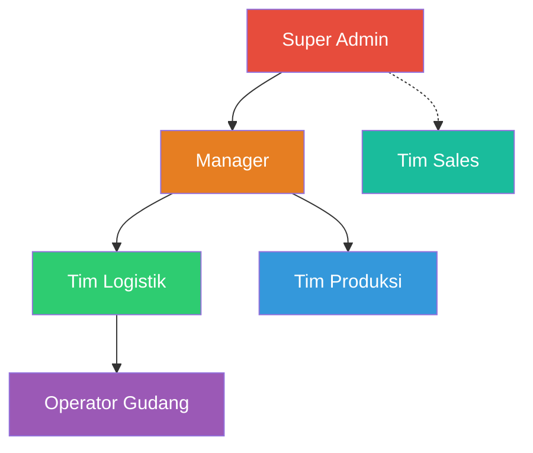

# Product Requirements Document (PRD)
## Sistem Terintegrasi WMS & Sales Order — PT Berger Paints Indonesia

> **Versi:** 1.3  
> **Tanggal:** 27 Agustus 2026 *(revisi dari v1.2, 27 Agustus 2026)*  
> **Status:** Draft — Menunggu Final Approval  
> **Pemilik Produk:** PT Berger Paints Indonesia  
> **Tim Pengembang:** AI-Assisted Development (Gemini 3.1 Pro + Claude Opus)

---

## Riwayat Revisi

### Versi 1.3 — 27 Agustus 2026

Menyelaraskan matriks §5.2 dengan pembatasan sidebar per role yang ditetapkan pemilik produk.

| # | Perubahan | Bagian Terdampak |
|---|---|---|
| 1 | **Manager kini boleh mengawasi alur outbound**: Approve/Reject Pesanan, Daftar Picking, Cetak Surat Jalan, Verifikasi Bukti SJ, dan Konfirmasi Pembayaran Billing berubah dari ❌ menjadi ✅. Yang tetap ❌ bagi Manager hanya **tugas tangan langsung**: Input Produksi, Put-away, Proses Picking, dan Penerimaan Retur. | §5.2 |
| 2 | **Manager juga boleh Verifikasi Inbound** (❌ → ✅), konsisten dengan peran pengawasannya. | §5.2 |
| 3 | Ditambahkan baris **Daftar Picking (batching)** dan **Riwayat Produksi (lihat)** yang sebelumnya tidak ada di matriks padahal menunya ada di sidebar. | §5.2 |
| 4 | Penegakan RBAC dipusatkan di `App\Support\Permission` — dipakai bersama oleh sidebar (`@can`) dan middleware route (`can:`), sehingga tampilan menu dan hak akses sebenarnya tidak bisa berbeda. | Implementasi |

> [!NOTE]
> **Prinsip pembeda Manager vs Super Admin setelah v1.3.** Manager adalah **pengawas**: boleh menyetujui, mencetak, memverifikasi, dan menutup tagihan — tetapi tidak pernah menjadi *maker* pada langkah fisik di gudang. Prinsip Maker-Checker tetap terjaga karena keempat langkah tangan-langsung tersebut tertutup baginya.

### Versi 1.2 — 27 Agustus 2026

| # | Perubahan | Bagian Terdampak |
|---|---|---|
| 1 | **MFA (Google Authenticator/TOTP) diganti Verifikasi Anti-Bot (Google reCAPTCHA v2).** reCAPTCHA memverifikasi manusia vs bot, BUKAN faktor kedua berbasis identitas — tidak ada lagi halaman verifikasi terpisah setelah password, widget-nya tampil langsung di form login. | §6.1 F-AUTH-01/02, §8.2, §9.1, §11 |
| 2 | **Batas percobaan progressive lockout diturunkan dari 5 menjadi 3 kali gagal** (password ATAU verifikasi anti-bot, satu counter yang sama). Durasi lockout tiap tingkat tidak berubah (5/10/30/60/120 menit), hanya ambang pemicunya yang bergeser. | §6.1 F-AUTH-03 |
| 3 | **Role Switcher pada navbar sudah dihapus** (bukan lagi "akan dihapus") — autentikasi sungguhan dan middleware RBAC sudah aktif sejak Fase 1. | Catatan di bawah, §5.1 |

### Versi 1.1 — 26 Agustus 2026

Revisi ini menyelaraskan PRD dengan keputusan bisnis terbaru dan dengan prototipe yang sudah dibangun.

| # | Perubahan | Bagian Terdampak |
|---|---|---|
| 1 | **Pengajuan customer oleh Sales dihapus.** Pelanggan kini dibuat langsung oleh Manager/Super Admin. Menu "My Customers" dihapus dari Portal Sales. | §5.2, §6.2 F-MASTER-06, §6.5 F-OUT-01, §6.8 |
| 2 | **Manager mendapat hak CRUD User dan Pengaturan Dokumen.** | §5.2, §6.2 F-MASTER-01 |
| 3 | **Super Admin mendapat akses penuh Portal Warehouse**, termasuk seluruh tugas operasional. Tetap tidak dapat mengakses Portal Sales. | §5.2 |
| 4 | **Blokir order untuk customer menunggak dihapus.** Diganti penandaan visual `⚠ Menunggak` yang bersifat informatif. | §6.5 F-OUT-01, §6.6 F-BILL-03, §7.4 |
| 5 | **Produk cat MEMILIKI masa kedaluwarsa** (default 30 bulan dari tanggal produksi). Ditambahkan pengelolaan Stok DDP. | §3.2, §6.4 F-INV-04, §7.2.1 |
| 6 | **Operator Gudang berwenang mengoreksi Qty Aktual** saat put-away. SKU & batch tetap terkunci. | §6.3 F-INB-02 |
| 7 | **Modul Retur masuk scope** (sebelumnya Fase Berikutnya). | §3.2, §6.10, §10 |
| 8 | **Transfer Stok antar lokasi/gudang masuk scope.** | §3.2, §6.4 F-INV-05, §10 |
| 9 | **Scan QR lokasi rak masuk scope.** | §3.2, §6.3 F-INB-02 |

> [!NOTE]
> **Role Switcher** yang sebelumnya terlihat di navbar prototipe sudah **dihapus** sejak Fase 1 (Autentikasi Nyata). Peran kini ditentukan oleh akun yang login sungguhan, ditegakkan oleh middleware RBAC — lihat `docs/0_ai_agent_instructions.md` §5.3.

---

## Daftar Isi

1. [Ringkasan Eksekutif](#1-ringkasan-eksekutif)
2. [Latar Belakang & Permasalahan](#2-latar-belakang--permasalahan)
3. [Tujuan & Ruang Lingkup](#3-tujuan--ruang-lingkup)
4. [Stakeholder & Pengguna](#4-stakeholder--pengguna)
5. [Peran Pengguna & Hak Akses (RBAC)](#5-peran-pengguna--hak-akses-rbac)
6. [Spesifikasi Fungsional](#6-spesifikasi-fungsional)
7. [Aturan Bisnis (Business Rules)](#7-aturan-bisnis-business-rules)
8. [Spesifikasi Non-Fungsional](#8-spesifikasi-non-fungsional)
9. [Teknologi & Infrastruktur](#9-teknologi--infrastruktur)
10. [Roadmap & Fase Pengembangan](#10-roadmap--fase-pengembangan)
11. [Glossarium](#11-glossarium)

---

## 1. Ringkasan Eksekutif

Dokumen ini mendefinisikan kebutuhan lengkap untuk pembangunan Sistem Terintegrasi **Warehouse Management System (WMS)** dan **Sales Order** PT Berger Paints Indonesia. Sistem ini bertujuan menggantikan proses manual berbasis WhatsApp yang rentan kesalahan, dengan sebuah platform digital terpusat yang menjadi *Single Source of Truth* untuk seluruh siklus rantai pasok internal — dari penerimaan barang produksi, penyimpanan di gudang, hingga pemesanan dan pengiriman ke pelanggan.

Sistem ini dirancang dengan arsitektur **Single Database, Multi-Portal (Monolithic)**, di mana dua portal terpisah (Portal Sales dan Portal Warehouse/Admin) beroperasi di atas satu basis data PostgreSQL yang sama, dijembatani oleh satu backend Laravel. Pemisahan portal ini menjamin isolasi data antar-divisi tanpa mengorbankan integritas data terpusat.

---

## 2. Latar Belakang & Permasalahan

### 2.1 Kondisi Saat Ini

Sebelum sistem ini dibangun, alur operasional PT Berger Paints Indonesia berjalan sebagai berikut:

1. Tim Sales di lapangan menerima pesanan dari toko/distributor.
2. Pesanan dikirimkan ke Tim Logistik di gudang **melalui pesan WhatsApp**.
3. Tim Logistik memproses pesanan secara manual: mencari barang, mengemas, dan mencetak surat jalan.
4. Koordinasi antar-divisi (Produksi → Gudang → Sales) dilakukan via grup chat tanpa standar format.

### 2.2 Permasalahan yang Teridentifikasi

| No | Permasalahan | Dampak |
|---|---|---|
| 1 | Input pesanan via WhatsApp rentan typo | Salah kirim jenis/jumlah barang |
| 2 | Tidak ada tracking status pesanan | Sales tidak tahu apakah pesanan sudah dikemas atau tertunda |
| 3 | Tidak ada pelacakan lokasi barang di gudang | Operator menghabiskan waktu mencari barang di rak |
| 4 | Tidak ada kontrol stok real-time | Pesanan bisa melebihi stok yang tersedia |
| 5 | Tidak ada jejak audit | Jika terjadi kesalahan, tidak ada bukti siapa yang salah input |
| 6 | Tidak ada pembatasan akses data | Sales bisa mengetahui stok dan melakukan praktik penimbunan |
| 7 | Tidak ada standar pengelolaan barang masuk | Barang dari produksi langsung masuk stok tanpa verifikasi |
| 8 | Tidak ada pengelolaan piutang/penagihan | Pelanggan dengan pembayaran tempo sulit dilacak |

### 2.3 Dampak Bisnis

- **Kerugian finansial** akibat salah kirim dan retur barang yang tidak tercatat
- **Inefisiensi operasional** karena proses pencarian barang manual di gudang
- **Kehilangan penjualan** karena pesanan yang terlambat diproses
- **Risiko kecurangan** tanpa adanya kontrol akses dan audit trail

---

## 3. Tujuan & Ruang Lingkup

### 3.1 Tujuan Utama

1. **Digitalisasi penuh** siklus rantai pasok internal: Produksi → Gudang → Sales → Pengiriman
2. **Single Source of Truth** untuk data stok, pesanan, dan pelanggan
3. **Eliminasi kesalahan manual** melalui validasi otomatis dan alur terstruktur
4. **Pembatasan akses data** (RBAC) antar-divisi untuk menjaga kerahasiaan informasi
5. **Pelacakan real-time** setiap pergerakan barang dan status pesanan
6. **Audit trail digital** yang tidak dapat dimanipulasi

### 3.2 Ruang Lingkup — Dalam Scope (Fase 1)

| Modul | Deskripsi |
|---|---|
| Autentikasi & Keamanan | Login, Verifikasi Anti-Bot (Google reCAPTCHA), RBAC, session management |
| Master Data | Pengelolaan User, Produk, Kategori, Lokasi Rak, Gudang, Pelanggan |
| Inbound (Barang Masuk) | Input produksi, put-away, verifikasi Maker-Checker |
| Inventory (Stok) | Stok real-time, stock movement ledger, adjustment oleh Manager |
| Expiry & Stok DDP | Masa simpan produk, pemisahan Good Stock vs stok DDP (rusak/expired) |
| Transfer Stok | Perpindahan stok antar lokasi rak dan antar gudang |
| Outbound (Sales Order) | Pembuatan PO (Semi-Blind), approval, FIFO allocation, picking, delivery |
| Surat Jalan | Generate nomor otomatis, cetak dokumen, upload bukti tanda tangan |
| Retur (Reverse Logistics) | Pelaporan penolakan barang oleh Sales, pengecekan fisik, alokasi Good Stock / DDP |
| Scan QR Lokasi Rak | Pemindaian QR pada rak untuk mempercepat put-away dan picking |
| Billing (Penagihan) | Manajemen piutang untuk pembayaran tempo 30/60/90 hari |
| Dashboard & Laporan | KPI per role, grafik penjualan, ekspor Excel |
| Notifikasi Real-time | Push notification dengan suara untuk setiap perubahan status |

### 3.3 Ruang Lingkup — Di Luar Scope (Fase Berikutnya)

| Modul | Keterangan |
|---|---|
| Integrasi Keuangan | Tidak ada integrasi ke sistem accounting/ERP |
| Backorder Management | Sisa pesanan tidak terpenuhi = Lost Sales |

---

## 4. Stakeholder & Pengguna

### 4.1 Stakeholder

| Peran | Kepentingan |
|---|---|
| Manajemen PT Berger Paints | Sponsor proyek, keputusan bisnis final |
| Kepala Gudang / Logistik | Operasional harian, validasi alur kerja |
| Supervisor Sales | Monitoring performa tim sales |
| IT Department | Infrastruktur, deployment, maintenance |

### 4.2 Estimasi Jumlah Pengguna

| Role | Estimasi Jumlah | Portal |
|---|---|---|
| Super Admin | 1-2 orang | Warehouse/Admin |
| Manager | 2-3 orang | Warehouse/Admin |
| Tim Produksi | 3-5 orang | Warehouse |
| Operator Gudang | 5-10 orang per gudang | Warehouse |
| Tim Logistik | 3-5 orang per gudang | Warehouse |
| Tim Sales | 10-30 orang | Sales |

### 4.3 Jumlah Gudang

Saat ini terdapat **3 gudang** yang beroperasi. Sistem harus mendukung **penambahan gudang baru** melalui menu Admin tanpa perubahan kode.

---

## 5. Peran Pengguna & Hak Akses (RBAC)

### 5.1 Hierarki Peran



### 5.2 Matriks Hak Akses Detail

#### Portal Warehouse / Admin

> [!IMPORTANT]
> **Prinsip Super Admin:** Super Admin memiliki akses **penuh ke seluruh fungsi Portal Warehouse/Admin**, termasuk seluruh tugas operasional harian (input produksi, put-away, verifikasi, approval pesanan, picking, cetak Surat Jalan). Satu-satunya yang **tidak** dimiliki Super Admin adalah **Portal Sales** — Super Admin tidak dapat membuat Purchase Order atas nama Sales.
>
> Konsekuensinya: bila Super Admin mengerjakan sendiri dua tahap berurutan pada alur Maker-Checker (misal put-away lalu verifikasi dokumen yang sama), prinsip pemisahan tugas menjadi gugur untuk dokumen tersebut. Karena itu setiap aksi operasional oleh Super Admin **wajib tercatat di `audit_logs`** dan ditandai khusus pada laporan agar tetap dapat diaudit.

| Fitur | Super Admin | Manager | Tim Logistik | Tim Produksi | Operator Gudang |
|---|:---:|:---:|:---:|:---:|:---:|
| **Dashboard (semua data)** | ✅ | ✅ | ✅ | ❌ | ❌ |
| **Master User (CRUD)** | ✅ | ✅ | ❌ | ❌ | ❌ |
| **Master Produk (CRUD)** | ✅ | ✅ | ❌ | ❌ | ❌ |
| **Master Kategori (CRUD)** | ✅ | ✅ | ❌ | ❌ | ❌ |
| **Master Lokasi Rak (CRUD)** | ✅ | ✅ | ❌ | ❌ | ❌ |
| **Master Gudang (CRUD)** | ✅ | ✅ | ❌ | ❌ | ❌ |
| **Master Customer (CRUD)** | ✅ | ✅ | ❌ | ❌ | ❌ |
| **Input Inbound (Produksi)** | ✅ | ❌ | ❌ | ✅ | ❌ |
| **Put-away (Penempatan Rak)** | ✅ | ❌ | ❌ | ❌ | ✅ |
| **Verifikasi Inbound (Ceklis)** | ✅ | ✅ | ✅ | ❌ | ❌ |
| **Lihat Stok** | ✅ | ✅ | ✅ | ✅ (lihat) | ✅ (lihat) |
| **Edit Stok (Adjustment)** | ✅ | ✅ | ❌ | ❌ | ❌ |
| **Transfer Stok (Lokasi/Gudang)** | ✅ | ✅ | ✅ | ❌ | ❌ |
| **Approve/Reject Pesanan** | ✅ | ✅ | ✅ | ❌ | ❌ |
| **Daftar Picking (batching)** | ✅ | ✅ | ✅ | ❌ | ❌ |
| **Proses Picking** | ✅ | ❌ | ❌ | ❌ | ✅ |
| **Cetak Surat Jalan** | ✅ | ✅ | ✅ | ❌ | ❌ |
| **Verifikasi Bukti Surat Jalan** | ✅ | ✅ | ✅ | ❌ | ❌ |
| **Proses Retur (Alokasi GR/DDP)** | ✅ | ❌ | ✅ | ❌ | ✅ |
| **Konfirmasi Pembayaran Billing** | ✅ | ✅ | ✅ | ❌ | ❌ |
| **Riwayat Produksi (lihat)** | ✅ | ✅ | ❌ | ✅ | ❌ |
| **Laporan & Ekspor Excel** | ✅ | ✅ | ✅ | ❌ | ❌ |
| **Audit Log (Lihat)** | ✅ | ✅ | ❌ | ❌ | ❌ |
| **Hapus Transaksi** | ✅ | ❌ | ❌ | ❌ | ❌ |
| **Pengaturan Dokumen (Sequence)** | ✅ | ✅ | ❌ | ❌ | ❌ |
| **Pengaturan Sistem** | ✅ | ❌ | ❌ | ❌ | ❌ |
| **Akses Portal Sales (Buat PO)** | ❌ | ❌ | ❌ | ❌ | ❌ |

**Catatan pembeda Manager vs Super Admin:**

| | Manager | Super Admin |
|---|---|---|
| Seluruh Master Data (termasuk User & Customer) | ✅ | ✅ |
| Pengaturan Dokumen / nomor urut | ✅ | ✅ |
| Membuat atau mengubah akun ber-role **Super Admin** | ❌ | ✅ |
| Pengawasan alur outbound (approve pesanan, cetak SJ, verifikasi bukti SJ, billing) | ✅ | ✅ |
| Tugas operasional **tangan langsung** (input produksi, put-away, proses picking, penerimaan retur) | ❌ | ✅ |
| Hapus transaksi | ❌ | ✅ |
| Pengaturan Sistem (cutoff, threshold, session, lockout) | ❌ | ✅ |
| Unlock akun terkunci (progressive lockout) | ❌ | ✅ |

#### Portal Sales

| Fitur | Tim Sales |
|---|:---:|
| **Dashboard (data pribadi)** | ✅ |
| **Buat Pesanan (Semi-Blind)** | ✅ |
| **Lihat Daftar Pesanan Sendiri** | ✅ |
| **Lacak Status Pesanan** | ✅ |
| **Upload Bukti Surat Jalan** | ✅ |
| **Lapor Penolakan Barang** | ✅ |
| **Pilih Customer saat Buat PO** | ✅ (hanya customer aktif) |
| **Tambah / Ajukan Customer Baru** | ❌ (dibuat oleh Manager / Super Admin) |
| **Lihat Stok** | ❌ (Hanya indikator ✅⚠️❌) |
| **Edit/Hapus Pesanan** | ❌ (kecuali status Draft) |
| **Akses Portal Warehouse** | ❌ |

> [!NOTE]
> Menu **"My Customers"** dihapus dari Portal Sales. Sales tidak lagi memiliki halaman daftar maupun form pengajuan pelanggan. Kebutuhan pelanggan baru disampaikan ke Manager/Super Admin melalui kanal di luar sistem, lalu didaftarkan langsung lewat menu **Master Customer**.

---

## 6. Spesifikasi Fungsional Sistem

### 6.1 Modul Autentikasi & Keamanan

#### F-AUTH-01: Login
- Pengguna memasukkan email, password, dan menyelesaikan verifikasi anti-bot (lihat F-AUTH-02) pada form yang sama.
- Validasi kredensial terhadap database.
- Jika berhasil, arahkan langsung ke portal sesuai role (lihat F-AUTH-05).
- Jika gagal, tampilkan pesan error generik ("Email atau Password salah").

#### F-AUTH-02: Verifikasi Anti-Bot (Google reCAPTCHA)
- Form login menampilkan widget **Google reCAPTCHA v2 ("Saya bukan robot")** berdampingan dengan kolom email/password — bukan halaman terpisah setelah password.
- Token reCAPTCHA diverifikasi ke Google (`siteverify`) bersamaan dengan pengecekan kredensial pada request yang sama.
- Verifikasi anti-bot gagal (token tidak valid/kedaluwarsa, atau tidak dicentang) diperlakukan sama seperti kredensial salah: masuk ke counter percobaan gagal di F-AUTH-03, dengan pesan generik yang sama.
- **Bukan MFA** — reCAPTCHA memverifikasi bahwa yang mengakses form adalah manusia, bukan mengonfirmasi identitas pengguna. Tidak ada faktor kedua berbasis identitas (mis. TOTP) pada versi ini.

#### F-AUTH-03: Progressive Lockout
- **Batas percobaan:** Maksimal **3 kali** salah memasukkan password/username **atau** gagal verifikasi anti-bot (F-AUTH-02) — keduanya berbagi counter yang sama.
- **Setelah 3 kali salah:** Akun terkunci selama **5 menit**.
- **Jika salah lagi setelah unlock:** Durasi lockout bertambah secara progresif:
  - Percobaan ke-4 gagal: 10 menit
  - Percobaan ke-5 gagal: 30 menit
  - Percobaan ke-6 gagal: 60 menit
  - Percobaan ke-7+ gagal: 120 menit
- **Reset lockout:** Hanya Super Admin yang dapat membuka kunci akun secara manual.

#### F-AUTH-04: Session Management
- **Auto-logout:** Sesi otomatis berakhir setelah **1 jam idle** (tidak ada aktivitas).
- **Maksimal device:** Satu akun hanya boleh aktif di maksimal **2 device** bersamaan.
- **Jika login di device ke-3:** Sesi di device paling lama (tertua) otomatis di-terminate.
- **Session tracking:** Setiap sesi aktif dicatat (device info, IP, waktu login).

#### F-AUTH-05: Routing Berdasarkan Role
- Setelah login berhasil (kredensial + verifikasi anti-bot), pengguna otomatis diarahkan ke portal sesuai rolenya:
  - Super Admin, Manager, Tim Produksi, Operator Gudang, Tim Logistik → **Portal Warehouse/Admin**
  - Tim Sales → **Portal Sales**
- Middleware memblokir akses silang antar-portal.

---

### 6.2 Modul Master Data

#### F-MASTER-01: Manajemen User
- **Akses:** Super Admin, **Manager**
- **Fungsi:** CRUD data pengguna (Nama, Email, Password, Role, Dispatch Code/Gudang Awal).
- **Aturan:**
  - Email harus unik.
  - Password minimal 8 karakter, kombinasi huruf dan angka.
  - Setiap user wajib ditetapkan ke satu gudang (dispatch code) sebagai default.
  - Setiap user memiliki **tepat satu role** (relasi `users.role_id`).
  - **Batasan Manager:** Manager dapat membuat dan mengubah user ber-role Manager, Tim Logistik, Tim Produksi, Operator Gudang, dan Tim Sales. Manager **tidak dapat** membuat, mengubah, atau menghapus akun ber-role **Super Admin**.
  - **Eksklusif Super Admin:** unlock akun yang terkunci akibat progressive lockout.
  - Penonaktifan user menggunakan flag status (Aktif/Non-aktif), **bukan** penghapusan data, agar jejak audit tetap utuh.

#### F-MASTER-02: Manajemen Produk
- **Akses:** Super Admin, Manager
- **Fungsi:** CRUD data produk/SKU.
- **Kapasitas Palet Standar:**

| UoM (Ukuran) | Kapasitas per Palet |
|---|---|
| 0.9 liter | 720 |
| 2.5 liter; 3.6 liter | 180 |
| 15 liter | 40 |
| 18 liter; 20 liter | 27 |
| 0.9 Kg; 1 Kg | 720 |
| 4 Kg; 5 Kg | 180 |
| 18 Kg; 20 Kg; 25 Kg | 36 |
- **Field:** Kode SKU, Deskripsi, Kategori (FK), Unit of Measure (UoM), Kapasitas Maks per Palet.
- **Aturan:** Kapasitas palet dapat diubah per produk oleh Manager/Super Admin.

#### F-MASTER-03: Manajemen Kategori Produk
- **Akses:** Super Admin, Manager
- **Fungsi:** CRUD kategori produk (misal: Cat Tembok, Cat Kayu, Thinner, dll.).

#### F-MASTER-04: Manajemen Lokasi Rak
- **Akses:** Super Admin, Manager
- **Fungsi:** CRUD lokasi penyimpanan di gudang.
- **Format Kode:** `[Rak]-[Lantai]-[Baris]` (contoh: `G-03-04` berarti Rak G, Lantai 3, Baris 4).
- **Relasi:** Setiap lokasi terikat ke satu Gudang (Warehouse).

#### F-MASTER-05: Manajemen Gudang
- **Akses:** Super Admin, Manager
- **Fungsi:** CRUD data gudang / dispatch code.
- **Field:** Kode Gudang (Dispatch Code), Nama Gudang, Alamat, Status (Aktif/Nonaktif).
- **Aturan:** Saat ini 3 gudang aktif. Sistem harus mendukung penambahan gudang baru tanpa perubahan kode.

#### F-MASTER-06: Manajemen Pelanggan (Customer)
- **Akses:** Super Admin, Manager
- **Fungsi:** CRUD data pelanggan melalui menu **Master Customer** di Portal Warehouse/Admin.
- **Field:** Nama Toko/Perusahaan, Alamat, Nama PIC, Nomor Kontak, Tipe Pembayaran Default (Cash/Transfer/Tempo 30/60/90 hari), Plafon Kredit (opsional), Status Aktif.
- **Aturan:**
  - Pelanggan **dibuat langsung** oleh Manager atau Super Admin dan **langsung berstatus aktif** — tidak ada alur pengajuan maupun persetujuan bertingkat.
  - Hanya pelanggan berstatus **aktif** yang muncul pada pilihan Customer di form Buat Pesanan milik Sales.
  - Penonaktifan pelanggan menggunakan flag `is_active`, bukan penghapusan data, agar riwayat pesanan dan piutang tetap dapat ditelusuri.
  - Setiap pembuatan dan perubahan data pelanggan tercatat di `audit_logs` beserta identitas pembuatnya (`created_by`).

> [!NOTE]
> **Perubahan dari versi 1.0.** Sebelumnya pelanggan diajukan oleh Sales lalu menunggu persetujuan Manager/Super Admin (status Pending → Approved/Rejected). Alur tersebut **dihapus**. Sales tidak lagi memiliki menu maupun form pengajuan pelanggan; kebutuhan pelanggan baru disampaikan ke Manager/Super Admin di luar sistem. Konsekuensi teknis: kolom `status`, `requested_by`, `approved_by`, `approved_at`, dan `rejection_reason` pada tabel `customers` digantikan oleh `is_active` dan `created_by`.

---

### 6.3 Modul Inbound (Barang Masuk)

#### F-INB-01: Input Produksi (Tim Produksi)
- **Proses: Role Produksi harus bisa memasukkan data hasil produksi dan menyimpannya ke sistem**
  1. Tim Produksi membuka form Inbound.
  2. Mengisi: Nomor Dokumen Produksi (manual), Tanggal Produksi (manual).
  3. Menambahkan detail item: melalui fitur uoload dokumen exel yang berisi data sebagai berikut
    - SKU Produk
    - Deskripsi Produk sesuai sku
    - UoM sesuai sku
    - Total Qty
    - Batch Number
  4. Setelah selesai mengupload dokumen exel, sistem akan menampilkan rincian data yang sudah diupload dan sistem **otomatis memecah** Total Qty ke dalam hitungan palet berdasarkan `max_qty_per_pallet` produk tersebut. **Jika total qty sudah benar maka tidak perlu diedit lagi**
     - Contoh: Input 500 pcs cat 5Kg (maks 180/palet) → Sistem membuat: Palet 1 (180), Palet 2 (180), Palet 3 (140). maka menghasilkan 3 palet.
     - Contoh 2: Input 360 pcs cat 5Kg (maks 180/palet) → Sistem membuat: Palet 1 (180), Palet 2 (180). maka menghasilkan 2 palet.
  5. Setelah data dicek kembali maka jika data sudah sesuai tinggal klik submit, namun jika ada data yang salah role produksi bisa mengedit data tersebut sebelum submit.
  6. Submit. Status inbound: **Production Delivery Note / Menunggu Put-away**.

#### F-INB-02: Put-away (Operator Gudang)
- **Proses: Operator Gudang Harus bisa melihat daftar inbound yang menunggu put-away dan menentukan lokasi penyimpanan barang**
  1. Operator melihat daftar inbound yang menunggu put-away.
  2. Operator meng klik kode produksi yang sudah dibuat.
  3. Sistem menampilkan data produksi beserta kolom **Qty Sistem** (dari Tim Produksi, read-only) dan **Qty Aktual** (dapat diisi operator).
  4. **Koreksi Qty Aktual:** Operator **dapat mengoreksi Qty Aktual** bila jumlah fisik di lapangan berbeda dengan Qty Sistem. **SKU dan Batch Number tetap terkunci** dan tidak dapat diubah oleh operator.
     - Nilai awal Qty Aktual selalu disamakan dengan Qty Sistem.
     - Bila `qty_actual ≠ qty_system`, sistem mencatat **selisih** pada palet tersebut dan menandainya agar mendapat perhatian khusus saat verifikasi Logistik.
     - Operator wajib mengaktifkan tuas **Verifikasi Fisik** pada setiap palet sebagai pernyataan bahwa jumlah tersebut sudah dihitung di lapangan.
  5. Untuk setiap palet, operator memasukkan **kode lokasi rak** tempat barang diletakkan (misal: `G-03-04`), atau menekan tombol **Scan QR** untuk memindai QR Code yang tertempel pada rak. Saat operator memilih kolom lokasi, sistem menampilkan **rekomendasi lokasi rak** yang masih memiliki kapasitas kosong.
  6. Kode lokasi divalidasi terhadap tabel `locations` — harus lokasi yang valid, terdaftar di gudang yang sesuai, dan masih memiliki kapasitas untuk menampung barang tersebut.
  7. **Auto-split kapasitas rak:** Bila Qty Aktual satu palet melebihi sisa kapasitas rak yang dipilih, sistem otomatis memecah baris — sebagian mengisi rak tersebut sampai penuh, sisanya menjadi baris baru yang harus ditempatkan operator di rak lain.
  8. Submit. Status berubah menjadi **Menunggu Verifikasi**.
  9. Stok **belum aktif** — masih "mengambang".

> [!IMPORTANT]
> **Perubahan dari versi 1.0.** Sebelumnya operator sama sekali tidak boleh menyentuh qty. Kini operator **berwenang mengoreksi Qty Aktual** karena dialah pihak pertama yang menghitung fisik barang saat menurunkan dari kendaraan. Prinsip Maker-Checker tetap terjaga: operator adalah *maker* yang melaporkan kondisi fisik, Tim Logistik tetap menjadi *checker* yang memvalidasi dan memutuskan angka final sebelum stok diaktifkan. Setiap selisih `qty_actual` vs `qty_system` tercatat di `audit_logs`.

#### F-INB-03: Verifikasi Maker-Checker (Tim Logistik)
- **Proses:**
  1. Tim Logistik melihat jumlah barang yang menunggu verifikasi di halaman dashboard.
  2. Tim Logistik mengklik card jumlah barang atau klik pada halaman dashboard fitur inbound untuk melihat detail barang.
  3. sistem menampilkan data inbound yang perlu di verifikasi.
  4. Logistik meng klik daftar kode produksi yang akan diverifikasi.
  5. sistem menampilkan detail data produk dan lokasinya yang sudah ditentukan oleh operator put-away.
  6. Logistik melakukan pengecekan fisik di gudang.
  7. **Opsi verifikasi:**
     - **Ceklis satu per satu:** Klik ceklis pada setiap palet yang sudah benar.
     - **Ceklis semua:** Jika sudah yakin semua benar, klik "Verifikasi Semua" + konfirmasi.
  8. **Jika ditemukan kesalahan:**
     - Logistik dapat **mengedit** data (qty, lokasi, batch) sebelum verifikasi.
     - Logistik dapat **menunda** verifikasi (status tetap Menunggu Verifikasi).
  9. Setelah diverifikasi, stok **resmi aktif** dan tercatat di `inventory_stocks`.
  10. `stock_movements` mencatat entri `IN` untuk setiap item yang diverifikasi.

#### F-INB-04: Koreksi Pasca-Verifikasi
- **Situasi:** Jika data sudah terlanjur diverifikasi dan ditemukan kesalahan.
- **Solusi:** Koreksi hanya dapat dilakukan melalui **Menu Stok** (bukan menu Inbound).
- **Akses:** Hanya **Manager** dan **Super Admin** yang bisa mengedit stok.
- **Pencatatan:** Setiap perubahan dicatat di `stock_movements` dengan tipe `ADJUSTMENT` dan `audit_logs`.

---

### 6.4 Modul Inventory (Stok)

#### F-INV-01: Tampilan Stok
- **Akses:** Tim Produksi (lihat saja), Operator Gudang (lihat saja), Tim Logistik (lihat saja), Manager, Super Admin.
- **Data yang ditampilkan:** no, SKU, Deskripsi Produk, Batch No, uom, Lokasi Rak/Pallet, Qty Tersedia, Qty Teralokasi, Tanggal Produksi, **Expired Date**, Gudang. (sehingga misal ada 1 produk dengan 2 kali tanggal produksi maka akan muncul 2 baris data)
- **Pengelompokan:** Stok setiap SKU dipisah menjadi dua kelompok yang ditampilkan terpisah:
  - **Good Stock** — layak jual, ikut alokasi FIFO.
  - **Stok DDP** — rusak / karantina / lewat masa simpan. **Tidak ikut alokasi FIFO.**
- **Filter:** kategori produk, lokasi rak, batch, tanggal produksi, gudang, **status stok (Good/DDP)**.
- **Pencarian:** kode produksi, SKU atau Deskripsi Produk.
- **Ekspor:** Excel (untuk Logistik, Manager, Super Admin).

#### F-INV-02: Stok Adjustment
- **Akses:** Manager, Super Admin SAJA.
- **Proses:**
  1. Memilih item stok yang akan dikoreksi.
  2. Memasukkan qty baru dan alasan koreksi.
  3. Sistem mencatat perubahan di `stock_movements` (tipe: `ADJUSTMENT`) dan `audit_logs`.
- **Aturan:** Qty tidak boleh dikurangi di bawah `qty_allocated` (stok yang sudah dialokasikan untuk pesanan).

#### F-INV-03: Semi-Blind Stock Indicator
- **Untuk Portal Sales:** Stok ditampilkan sebagai **indikator**, bukan angka:
  - ✅ **Tersedia** — Stok cukup (di atas threshold yang ditentukan Manager)
  - ⚠️ **Terbatas** — Stok mendekati habis
  - ❌ **Habis** — Stok 0
- **Threshold** dapat dikonfigurasi per produk oleh Manager/Super Admin di menu Pengaturan.
- Indikator **hanya menghitung Good Stock**. Stok DDP tidak pernah dihitung sebagai ketersediaan.

#### F-INV-04: Expiry Date & Stok DDP

Produk cat **memiliki masa simpan**. Sistem wajib melacaknya per batch.

- **Masa simpan default:** **30 bulan** terhitung dari **Tanggal Produksi**.
  - `expiry_date = production_date + shelf_life_months`
  - Nilai `shelf_life_months` disimpan **per produk** (`products.shelf_life_months`, default 30) dan dapat diubah oleh Manager/Super Admin, karena tiap jenis produk dapat berbeda.
- **Kategori stok:**

| Kategori | Kondisi | Ikut FIFO? | Bisa dikirim? |
|---|---|:---:|:---:|
| **Good Stock** (`active`) | Belum lewat `expiry_date` dan tidak ditandai rusak | ✅ | ✅ |
| **DDP — Expired** (`expired`) | `expiry_date` sudah terlewat | ❌ | ❌ |
| **DDP — Rusak/Karantina** (`ddp`) | Ditandai rusak dari hasil retur, write-off, atau temuan stock opname | ❌ | ❌ |

- **Perpindahan otomatis ke DDP:** Scheduled job harian memindahkan batch yang melewati `expiry_date` dari status `active` → `expired`, dan mencatatnya di `stock_movements` (tipe `ADJUSTMENT`, alasan `EXPIRED`).
- **Peringatan dini:** Batch yang akan kedaluwarsa dalam **90 hari** ditandai pada halaman Stok dan memicu notifikasi ke Tim Logistik & Manager.
- **Aturan alokasi:** Stok berstatus `expired` atau `ddp` **wajib dilewati** oleh mesin FIFO. Stok DDP hanya dapat dikeluarkan melalui Stock Adjustment oleh Manager/Super Admin (write-off atau pemusnahan) dan **tidak pernah** masuk Picking List.
- **Aturan FIFO tetap berlaku** di dalam Good Stock: batch dengan `production_date` tertua keluar lebih dulu — sekaligus meminimalkan risiko stok mendekati kedaluwarsa.

#### F-INV-05: Transfer Stok (Lokasi & Antar Gudang)
- **Akses:** Tim Logistik, Manager, Super Admin.
- **Fungsi:** Memindahkan stok dari satu lokasi rak ke lokasi lain, baik di dalam gudang yang sama maupun **antar gudang**.
- **Proses:**
  1. Pilih SKU, batch, lokasi asal, dan qty yang dipindahkan.
  2. Tentukan lokasi tujuan; sistem memvalidasi kapasitas lokasi tujuan.
  3. Sistem mengurangi qty di lokasi asal dan menambahkannya di lokasi tujuan **tanpa mengubah `batch_no` maupun `production_date`** — sehingga urutan FIFO dan perhitungan expiry tetap utuh.
  4. Tercatat di `stock_movements` dengan tipe `TRANSFER` (satu entri keluar, satu entri masuk) dan di `audit_logs`.
- **Aturan:**
  - Qty yang sudah teralokasi ke pesanan (`qty_allocated`) **tidak dapat** ditransfer.
  - Transfer antar gudang menghasilkan nomor dokumen otomatis dengan prefix `TRF-{YYYY}-` (dapat dikonfigurasi di Pengaturan Dokumen).

---

### 6.5 Modul Outbound (Sales Order)

#### F-OUT-01: Pembuatan PO oleh Sales
- **Proses: Sales harus bisa melakukan pemesanan sesuai dengan pilihan customer tanpa terpengaruh oleh status stok.**
  1. Sales membuka form Buat Pesanan di Portal Sales.
  2. Memilih **Customer** dari daftar pelanggan **aktif**. Bila pelanggan yang dituju belum terdaftar, Sales menghubungi Manager/Super Admin untuk didaftarkan lebih dulu melalui menu Master Customer (lihat F-MASTER-06). Sales **tidak memiliki** menu pengajuan pelanggan.
  3. **Penandaan Status Piutang (informatif, tidak memblokir):**
     - Jika customer memiliki tagihan tempo (30/60/90 hari) yang **belum dikonfirmasi lunas**, sistem menampilkan **peringatan** berupa badge `⚠ Menunggak` beserta pesan: *"Customer ini memiliki tagihan tempo yang belum lunas. Pesanan tetap dapat dilanjutkan dan akan ditandai untuk tinjauan tim logistik."*
     - **Pesanan tetap dapat disimpan maupun di-submit.** Sistem **tidak memblokir** pembuatan PO dalam kondisi apa pun terkait piutang.
     - Penanda ini ikut terbawa ke halaman Approval Logistik agar menjadi bahan pertimbangan saat memutuskan approve/reject.
  4. Memilih **Dispatch Code** (gudang tujuan pengiriman).
  5. Menambahkan item produk dan qty pesanan. **Sales TIDAK melihat angka stok**, hanya indikator (✅⚠️❌).
  6. Memilih **Payment Term**: Cash, Transfer, Tempo 30 Hari, Tempo 60 Hari, Tempo 90 Hari.
  7. Simpan draft. atau Submit. Status: **masuk ke riwayat order**. Jika draft masih bisa diedit atau di hapus pada riwayat namun jika telah di submit maka status berubah menjadi menunggu aproval dan tidak bisa di edit sama sekali
  8. Sistem mengirim **notifikasi real-time + suara** ke dashboard Logistik.

- **Batasan Waktu Order:**
  - Order hanya dapat di-submit **sebelum pukul 15:00 WIB** setiap hari kerja.
  - Setelah pukul 15:00, tombol "Submit Order" **terkunci** dan menampilkan pesan: *"Batas waktu pemesanan hari ini sudah lewat. Silakan order kembali besok."*

#### F-OUT-02: Approval & Auto-Adjustment (Tim Logistik)
- **Proses:**
  1. Logistik melihat daftar PO masuk. **Dapat difilter** berdasarkan gudang (Dispatch Code).
  2. logistik bisa melakukan preview sebelum Logistik menekan **Approve**. 
  3. **Pengecekan Stok Otomatis:**
     - Jika stok cukup → qty disetujui = qty pesanan.
     - Jika stok **kurang** → sistem otomatis memotong qty sesuai stok tersedia (**Partial Fulfillment**).
       - Contoh: Pesan 100, stok 80 → Qty Approved = 80.
       - Selisih (20) dicatat sebagai **Lost Sales** di `sales_order_details`.
     - Jika stok **habis total** untuk item tersebut → qty approved = 0, seluruh qty menjadi Lost Sales.
  4. **Alokasi FIFO:** Sistem mencari stok dengan `production_date` paling tua dan mengalokasikan (`qty_allocated` bertambah, `qty_available` berkurang).
  5. Logistik juga dapat **Reject** pesanan dengan alasan. Status berubah menjadi **Ditolak**.
  6. Notifikasi dikirim ke Sales (approved/rejected/partial).

#### F-OUT-03: Picking (Operator Gudang)
- **Proses:**
  1. Setelah PO di-approve, sistem menerbitkan **Picking List** di layar Operator.
  2. Picking List berisi: sku, deskripsi produk, Qty, Lokasi Rak, Batch No, dan uom. sehingga sistem menghitung otomatis ketika operator klik siap loading, misal dalam rak ada 100 dengan pesanan 50 maka sisa dalam rak menjadi 50.
  3. Urutan picking **disusun berdasarkan lokasi rak** (dari Rak A → terakhir) untuk efisiensi pergerakan.
  4. Operator mengambil barang dari rak dan meletakkan di **loading dock**.
  5. Operator menekan **"Siap Loading"** di sistem.
  6. Status PO berubah menjadi **Siap Kirim**.
  7. Notifikasi dikirim ke Logistik dan Sales.

#### F-OUT-04: Cetak Surat Jalan (Tim Logistik)
- **Proses:**
  1. Logistik melihat daftar PO yang sudah **Siap Kirim** dan meng klik salah satu daftar po.
  2. logistik mengupload data barang yang ada dan tidak ada dalam bentuk exel sebagai bahan konfirmasi.
  3. sistem akan membandingkan data barang yang ada dan tidak ada dengan data barang yang ada di sistem.
  4. jika sudah sesuai dengan data yang dikirim kan maka bisa lanjut, namun jika ada yang tidak sesuai maka logistik bisa mengoreksi stok yang tersedia di gudang saat ini berbeda sehingga bisa menjadi bahan perbaikan/ stock opname.
  5. jika data sudah sesuai logistik dapat mengisi data pengiriman: Nama Supir. nomer WA, Plat Nomor Kendaraan.
  6. Menekan **"Cetak Surat Jalan"**. 
  7. Sistem **generate nomor Surat Jalan otomatis** (melanjutkan dari starting number yang diatur Super Admin di Pengaturan).
  8. Format nomor: Dapat dikonfigurasi (misal: `SJ-KRW-2026-00001`).
  9. Surat Jalan dapat dicetak langsung (format PDF/print-friendly).
  7. Status PO berubah menjadi **Dalam Pengiriman**.
  8. **SLA Timer dimulai** — argo waktu mulai berjalan dari saat ini.
  9. Notifikasi dikirim ke Sales: *"Pesanan Anda sedang dalam pengiriman."*
  10. sistem mengirimkan link konfirmasi "pengiriman barang selesai" kepada nomer wa driver yang sudah dimasukkan tanpa driver login, sehingga ketika driver meng klik link hanya ada nomer po dan barang apa dan klik sudah terkirim, maka status po berubah menjadi menunggu verifikasi bukti.

#### F-OUT-05: Upload Bukti & Penyelesaian
- **Proses:**
  1. setelah driver meng klik Barang tiba di pelanggan. Sales mengambil foto Surat Jalan yang telah **ditandatangani oleh pelanggan**.
  2. Membuka Portal Sales → menu Pesanan → pilih PO → **Upload Bukti**.
  3. **Batasan Upload:**
     - Format file: **PNG atau JPG saja**.
     - Ukuran maksimal: **5 MB** per file.
     - Jumlah file: Minimal 1, maksimal 3 foto.
     - **Opsi kamera langsung:** Tombol "Buka Kamera" untuk foto langsung dari perangkat (menggunakan HTML5 `capture` attribute).
  4. Setelah upload, status berubah menjadi **Menunggu Verifikasi Bukti**.

#### F-OUT-06: Verifikasi Bukti Surat Jalan (Tim Logistik)
- **Proses:**
  1. Logistik melihat daftar PO yang menunggu verifikasi bukti.
  2. Logistik membuka foto yang diupload Sales.
  3. Logistik dapat **download foto** untuk arsip.
  4. Jika bukti valid, Logistik menekan **"Order Complete"**.
  5. **Alur berdasarkan Payment Term:**
     - **Cash / Transfer:** Status langsung menjadi **Complete**. Tidak masuk menu Billing. SLA dihitung final.
     - **Tempo 30/60/90 hari:** Status menjadi **Complete (Menunggu Pembayaran)**. Pesanan masuk ke **Menu Billing** untuk tracking piutang.
  6. `stock_movements` mencatat entri `OUT` untuk setiap item yang terkirim.

---

### 6.6 Modul Billing (Penagihan)

#### F-BILL-01: Daftar Piutang
- **Akses:** Tim Logistik, Manager, Super Admin.
- **Data:** Daftar semua transaksi dengan pembayaran tempo yang belum lunas.
- **Kolom:** Nomor PO, Customer, Tanggal Order, Payment Term, Jatuh Tempo, Total Item, Status Pembayaran.
- **Filter:** Berdasarkan status (Belum Bayar/Lunas), customer, gudang, rentang tanggal.
- **Highlight:** Piutang yang **sudah melewati jatuh tempo** ditandai warna merah.

#### F-BILL-02: Konfirmasi Pembayaran
- **Akses:** Tim Logistik, Super Admin.
- **Proses:**
  1. Logistik menerima informasi/bukti bahwa customer sudah membayar.
  2. Membuka data billing yang bersangkutan.
  3. Menekan **"Konfirmasi Lunas"** + memasukkan **tanggal bukti bayar diterima** dan **metode pelunasan** (Transfer/Giro/Tunai).
  4. Status berubah menjadi **Lunas**.
  5. Penanda `⚠ Menunggak` pada customer tersebut hilang dengan sendirinya begitu seluruh tagihannya lunas.
  6. Notifikasi dikirim ke Sales terkait.

#### F-BILL-03: Penandaan Customer Overdue

> [!IMPORTANT]
> **Perubahan dari versi 1.0.** Mekanisme **blokir order otomatis dihapus sepenuhnya.** Customer dengan tagihan belum lunas **tetap dapat menerima pesanan baru**. Keputusan meneruskan atau menolak pesanan diserahkan kepada Tim Logistik saat approval, karena merekalah yang memahami konteks hubungan dagang dengan pelanggan. Sistem hanya menyediakan **informasi**, bukan pemblokiran.

- **Mekanisme:**
  - Sistem menghitung status piutang setiap customer secara real-time dan menampilkannya sebagai **penanda visual** `⚠ Menunggak`.
  - Penanda muncul di: form Buat Pesanan (Portal Sales), halaman Approval Pesanan (Portal WMS), dan halaman Master Customer.
  - Relevan HANYA untuk customer dengan pembayaran **Tempo 30/60/90 hari**. Customer Cash/Transfer tidak pernah memiliki piutang berjalan.
  - Penanda hilang otomatis setelah Logistik mengkonfirmasi seluruh tagihan lunas.
- **Tidak ada pemblokiran** pembuatan PO, penyimpanan draft, maupun proses picking/pengiriman akibat status piutang.
- **Jejak keputusan:** Bila Logistik meng-approve PO milik customer bertanda `⚠ Menunggak`, keputusan tersebut dicatat di `audit_logs` beserta identitas penyetujunya.

---

### 6.7 Modul Dashboard & Laporan

#### F-DASH-01: Dashboard Sales (Portal Sales)
Dashboard sederhana dan ringkas, menampilkan data **milik sales yang login saja**:

| Widget | Data |
|---|---|
| Total Transaksi Bulan Ini | Jumlah PO yang dibuat sales ini bulan berjalan |
| Pesanan Menunggu Diterima | Jumlah PO yang masih pending approval |
| Pesanan Dalam Pengiriman | Jumlah PO yang sedang dikirim |
| Pesanan Complete Bulan Ini | Jumlah PO yang sudah selesai bulan berjalan |

#### F-DASH-02: Dashboard Logistik / Manager / Super Admin (Portal Warehouse)
Dashboard komprehensif menampilkan **data keseluruhan (semua sales, semua gudang)**:

| Widget | Data |
|---|---|
| Total Semua Transaksi | Jumlah seluruh PO (filter: bulan ini / custom range) |
| Semua Butuh Approval | Jumlah PO Menunggu Diterima |
| Semua Dalam Pengiriman | Jumlah PO sedang dikirim |
| Semua Complete | Jumlah PO selesai |
| Customer Overdue | Jumlah customer dengan tagihan jatuh tempo belum bayar |

#### F-DASH-03: Grafik & Analitik
- **Grafik Penjualan Bulanan:** Grafik bar/line menampilkan jumlah transaksi per bulan selama 1 tahun. Filter: per tahun.
- **Grafik Penjualan Tahunan:** Grafik menampilkan total penjualan per tahun (all-time).
- **Filter tambahan:** Berdasarkan gudang, sales tertentu, atau kategori produk.
- **Produk Terlaris:** Tabel/chart ranking produk berdasarkan jumlah transaksi. Filter: Bulan ini, 3 bulan, 6 bulan, 1 tahun, All-time.
- **Barang Terlaris per Transaksi:** Produk yang paling sering muncul di setiap PO.

#### F-DASH-04: Ekspor Laporan
- **Format:** Microsoft Excel (.xlsx).
- **Akses:** Tim Logistik, Manager, Super Admin.
- **Laporan yang bisa diekspor:**
  - Daftar seluruh pesanan (dengan filter tanggal, status, gudang)
  - Laporan Lost Sales
  - Laporan Stok per gudang
  - Laporan Piutang/Billing
  - Laporan performa Sales (jumlah transaksi, SLA rata-rata)

---

### 6.8 Modul Notifikasi Real-time

#### F-NOTIF-01: Mekanisme Notifikasi
- **Teknologi:** Laravel Echo + WebSocket (Pusher/Soketi).
- **Tampilan:** Bell icon di navbar dengan badge counter.
- **Suara:** Notifikasi baru membunyikan **suara notifikasi** secara otomatis jika halaman sedang terbuka.
- **Persistence:** Notifikasi disimpan di database dan bisa dibaca ulang.

#### F-NOTIF-02: Daftar Event Notifikasi

| Event | Penerima | Pesan |
|---|---|---|
| Sales submit PO baru | Tim Logistik (gudang terkait) | "Pesanan baru #{nomor} dari {sales} Menunggu Diterima" |
| PO diapprove | Sales pembuat | "Pesanan #{nomor} telah disetujui" |
| PO di-reject | Sales pembuat | "Pesanan #{nomor} ditolak. Alasan: {alasan}" |
| PO partial approved | Sales pembuat | "Pesanan #{nomor} disetujui sebagian. Cek detail." |
| Picking selesai (Siap Kirim) | Tim Logistik, Sales | "Pesanan #{nomor} siap untuk dikirim" |
| Surat Jalan dicetak | Sales pembuat | "Surat Jalan #{nomor} telah diterbitkan. Pesanan dalam pengiriman." |
| Bukti Surat Jalan diupload | Tim Logistik | "Sales {nama} mengunggah bukti SJ untuk pesanan #{nomor}" |
| **Penolakan** dilaporkan Sales | Tim Logistik, Operator Gudang | "Laporan penolakan #{nomor} untuk PO #{nomor} menunggu pengecekan fisik" |
| **Penolakan** selesai diproses | Sales pelapor | "Penolakan #{nomor} telah diproses dan barang dialokasikan ke {Good Stock / DDP}" |
| Batch mendekati kedaluwarsa | Tim Logistik, Manager | "Batch {batch} SKU {sku} akan kedaluwarsa dalam {n} hari" |
| Stok selesai diverifikasi | Tim Logistik | "Stok inbound #{nomor} telah diverifikasi dan aktif" |
| Pembayaran dikonfirmasi lunas | Sales terkait | "Pembayaran customer {nama} telah dikonfirmasi lunas" |

---

### 6.9 Modul Audit Log

#### F-AUDIT-01: Pencatatan Otomatis
- Sistem mencatat secara otomatis (immutable) setiap kali:
  - Data di-create, di-update, atau di-delete.
  - Stok di-adjustment.
  - Transaksi dihapus oleh Super Admin.
- **Data yang dicatat:** User ID, Timestamp, Tabel yang terpengaruh, Data sebelum perubahan (old values), Data setelah perubahan (new values), IP Address.

#### F-AUDIT-02: Hapus Transaksi
- **Akses:** Hanya **Super Admin**.
- **Aturan:**
  - Super Admin boleh **menghapus transaksi** yang salah.
  - Fitur edit transaksi **tidak disediakan** (jika ada kesalahan, hapus dan buat ulang).
  - Setiap penghapusan dicatat permanen di `audit_logs` dan **tidak bisa dihapus** oleh siapapun termasuk Super Admin.

#### F-AUDIT-03: Archival
- Data audit log yang sudah melewati umur tertentu (misal: >2 tahun) dapat dipindahkan ke tabel **archive** untuk menjaga performa query.
- Data arsip tetap bisa diakses melalui menu "Arsip Audit Log".

---

### 6.10 Modul Retur (Reverse Logistics)

Modul ini menangani barang yang **ditolak pelanggan** dan dibawa kembali oleh armada pengiriman.

> [!IMPORTANT]
> **Ketentuan istilah.** Dua kata ini merujuk pada dua hal berbeda dan **tidak boleh dipertukarkan** — baik di dokumen, label UI, isi notifikasi, maupun penamaan kode:
>
> | Istilah | Arti | Pelaku | Dipakai di |
> |---|---|---|---|
> | **Penolakan** | *Peristiwa* pelanggan menolak barang saat pengiriman, beserta pelaporannya | Tim Sales | Tombol "Lapor Penolakan", judul modal, isi notifikasi, status PO |
> | **Retur** | *Alur fisik* barang kembali ke gudang: penerimaan, pengecekan, alokasi GR/DDP | Gudang / Logistik | Menu "Penerimaan Retur", nomor dokumen `RTN-`, tabel `sales_returns` |
>
> Ringkasnya: **Sales melaporkan penolakan; gudang memproses retur.** Satu laporan penolakan menghasilkan satu dokumen retur.

#### F-RET-01: Pelaporan Penolakan oleh Sales
- **Akses:** Tim Sales.
- **Kapan:** Setelah barang tiba di pelanggan namun sebagian/seluruhnya ditolak.
- **Proses:**
  1. Sales membuka menu **My Orders** → pilih PO yang bersangkutan → **"Lapor Penolakan"**.
  2. **Upload bukti wajib:** foto Surat Jalan asli yang sudah diberi catatan/coretan penolakan (PNG/JPG, maks 5 MB).
  3. Menambahkan satu atau lebih baris barang yang ditolak, masing-masing berisi: **SKU**, **Qty**, dan **Alasan Penolakan**.
  4. **Pilihan alasan penolakan:** Kemasan Rusak/Bocor, Kualitas Buruk/Beku, Salah Varian, Kelebihan Kirim.
  5. Submit. Sistem membuat dokumen retur bernomor `RTN-{YYYY}{MM}-{urut}` berstatus **Menunggu Pengecekan Gudang** — dokumen inilah yang menjadi jembatan dari peristiwa penolakan ke alur fisik retur di gudang.
  6. Notifikasi real-time + suara dikirim ke Tim Logistik dan Operator Gudang.
- **Aturan:** Penolakan hanya dapat dilaporkan untuk PO yang berstatus **Dalam Pengiriman** atau **Menunggu Verifikasi Bukti**. PO yang sudah **Complete** tidak dapat dilaporkan melalui alur ini.

#### F-RET-02: Pengecekan Fisik & Alokasi
- **Akses:** Tim Logistik, Operator Gudang, Super Admin.
- **Proses:**
  1. Gudang membuka menu **Penerimaan Retur** dan melihat antrean laporan yang masuk.
  2. Barang retur diturunkan dari armada dan diperiksa fisiknya satu per satu.
  3. Petugas menekan **"Proses Fisik"** dan menentukan alokasi:
     - **GR (Good Stock)** — kemasan masih layak jual. Barang kembali menjadi stok aktif.
     - **DDP** — penyok parah, bocor, atau kemasan hancur. Barang masuk kategori DDP/karantina.
  4. **Catatan pengecekan wajib diisi** sebagai bukti dasar keputusan.
  5. Submit.
- **Dampak ke stok:**

| Alokasi | Dampak `inventory_stocks` | Entri `stock_movements` |
|---|---|---|
| **GR** | `qty_available` bertambah pada batch & lokasi asal; `production_date` dan `batch_no` **dipertahankan** agar urutan FIFO tetap benar | tipe `RETURN_IN`, status `active` |
| **DDP** | Baris stok baru berstatus `ddp` di lokasi karantina | tipe `RETURN_IN`, status `ddp` |

- **Aturan:**
  - Barang retur yang dialokasikan ke **GR wajib tetap memakai batch dan tanggal produksi aslinya** — dilarang membuat batch baru, karena akan merusak perhitungan FIFO dan masa kedaluwarsa.
  - Bila batch asli sudah melewati `expiry_date` pada saat retur diterima, alokasi **dipaksa ke DDP** meskipun kondisi fisiknya baik.
  - Seluruh keputusan alokasi tercatat di `audit_logs` beserta identitas petugas dan catatan pengecekannya.
  - Qty retur mengurangi qty terkirim pada PO terkait dan **tidak** dihitung sebagai Lost Sales (berbeda dari partial fulfillment).

---

## 7. Aturan Bisnis (Business Rules)

### 7.1 Aturan Palet Otomatis: sistem harus mampu menerapkan perhitungan palet otomatis sesuai dengan alur kerja.

```
RULE: PALLET_AUTO_SPLIT
WHEN: Tim Produksi input Total Qty pada form Inbound
THEN:
  1. Ambil max_qty_per_pallet dari tabel products
  2. Hitung jumlah palet penuh = FLOOR(total_qty / max_qty_per_pallet)
  3. Hitung sisa = total_qty MOD max_qty_per_pallet
  4. Jika sisa > 0, buat 1 palet tambahan dengan qty = sisa
  5. Setiap palet mendapat Pallet ID unik (auto-generated)
  
CONTOH:
  Input: 500 pcs cat 5Kg (max 180/palet)
  Output: Palet-1 (180), Palet-2 (180), Palet-3 (140) = 3 palet
```

### 7.2 Aturan FIFO (First-In, First-Out): sistem harus mampu menerapkan perhitungan fifo sesuai dengan alur kerja.

```
RULE: FIFO_ALLOCATION
WHEN: Tim Logistik meng-approve PO
THEN:
  1. Query inventory_stocks WHERE product_id = X 
     AND qty_available > 0 
     AND warehouse_id = dispatch_code
     AND status = 'active'          -- WAJIB: lewati stok 'ddp' dan 'expired'
     AND expiry_date > CURRENT_DATE -- WAJIB: lewati batch yang sudah kedaluwarsa
     ORDER BY production_date ASC (tertua duluan)
  2. Loop: Alokasikan qty dari stok tertua hingga qty pesanan terpenuhi
  3. Update inventory_stocks: 
     qty_available -= allocated_qty
     qty_allocated += allocated_qty
  4. Catat di stock_movements (type: ALLOCATED)
  
ATURAN TAMBAHAN:
  - Alokasi bersifat LOCK: stok yang sudah dialokasikan tidak bisa dialokasikan ulang
  - Stok berstatus 'ddp' atau 'expired' TIDAK PERNAH masuk hitungan alokasi
  - Jika total qty_available < qty_ordered → Partial Fulfillment
  - Selisih masuk ke lost_qty di sales_order_details
```

### 7.2.1 Aturan Expiry & Stok DDP

```
RULE: EXPIRY_CALCULATION
WHEN: Stok diaktifkan oleh Logistik (verifikasi inbound) atau retur masuk sebagai GR
THEN:
  expiry_date = production_date + products.shelf_life_months (default 30 bulan)

RULE: EXPIRY_SWEEP
WHEN: Scheduled job harian (00:05 WIB)
THEN:
  1. UPDATE inventory_stocks
     SET status = 'expired'
     WHERE status = 'active' AND expiry_date <= CURRENT_DATE
  2. Catat setiap perubahan di stock_movements (type: ADJUSTMENT, reason: EXPIRED)
  3. Kirim notifikasi ke Tim Logistik & Manager

RULE: EXPIRY_EARLY_WARNING
WHEN: Scheduled job harian
THEN:
  Tandai + notifikasikan batch dengan
  expiry_date BETWEEN CURRENT_DATE AND CURRENT_DATE + 90 hari

CATATAN:
  - Stok 'expired' dan 'ddp' hanya bisa keluar lewat Stock Adjustment
    oleh Manager/Super Admin (write-off / pemusnahan)
  - Stok DDP tidak pernah muncul di Picking List
```

### 7.3 Aturan Partial Fulfillment & Lost Sales

```
RULE: PARTIAL_FULFILLMENT
WHEN: qty_ordered > total_qty_available (per produk per gudang)
THEN:
  1. qty_approved = total_qty_available
  2. lost_qty = qty_ordered - qty_approved
  3. Catat lost_qty di sales_order_details
  4. Lanjutkan proses dengan qty_approved
  
CATATAN: Tidak ada backorder. Lost sales hanya dicatat untuk laporan.
```

### 7.4 Aturan Pembayaran & Billing

```
RULE: PAYMENT_FLOW
WHEN: Order selesai (bukti SJ diverifikasi Logistik)
THEN:
  IF payment_term = 'cash' OR 'transfer':
    → Status langsung COMPLETE
    → Tidak masuk menu Billing
    
  IF payment_term = 'tempo_30' OR 'tempo_60' OR 'tempo_90':
    → Status COMPLETE (Menunggu Pembayaran)
    → Masuk menu Billing
    → Hitung jatuh_tempo = tanggal_complete + payment_term_days
    → Customer DITANDAI '⚠ Menunggak' (informatif, TIDAK memblokir)

RULE: CUSTOMER_OVERDUE_FLAG
WHEN: Sistem menampilkan customer di form Buat Pesanan,
      halaman Approval Pesanan, atau Master Customer
THEN:
  IF customer memiliki billing dengan status 'belum_lunas':
    → Tampilkan badge '⚠ Menunggak' + tanggal jatuh tempo terlama
    → Pesanan TETAP boleh dibuat, disimpan, dan di-submit
    → Penanda ikut terbawa ke halaman Approval Logistik
  ELSE:
    → Tidak ada penanda

  CATATAN: Aturan ini murni INFORMATIF.
  Sistem TIDAK PERNAH memblokir pembuatan PO karena alasan piutang.
  Keputusan approve/reject sepenuhnya di tangan Tim Logistik,
  dan keputusan tersebut dicatat di audit_logs.
```

### 7.5 Aturan Batas Waktu Order

```
RULE: ORDER_CUTOFF
WHEN: Sales menekan tombol Submit Order
THEN:
  IF current_time >= 15:00 WIB:
    → BLOKIR submit
    → Tampilkan pesan: "Batas waktu pemesanan hari ini sudah lewat"
  ELSE:
    → Izinkan submit
    
CATATAN: Jam cutoff dapat dikonfigurasi di System Settings oleh Super Admin.
```

### 7.6 Aturan SLA (Service Level Agreement)

```
RULE: SLA_CALCULATION
START: Tanggal dan jam Sales submit PO (created_at di sales_orders)
END: Tanggal dan jam bukti Surat Jalan diverifikasi complete oleh Logistik

SLA_DURATION = END - START (dalam jam)

CATATAN: SLA dihitung per PO dan ditampilkan di:
  - Timeline tracking di Portal Sales
  - Dashboard Manager/Super Admin
  - Laporan performa yang bisa diekspor
```

---

## 8. Spesifikasi Non-Fungsional

### 8.1 Performa: sistem harus cepat dan andal saat digunakan

| Metrik | Target |
|---|---|
| Waktu muat halaman (desktop) | < 3 detik |
| Waktu muat halaman (mobile) | < 4 detik |
| Waktu proses approval (backend) | < 5 detik |
| Notifikasi real-time delivery | < 2 detik |
| Concurrent users | Minimal 50 user bersamaan |

### 8.2 Keamanan
| Aspek | Implementasi |
|---|---|
| Autentikasi | Email/Password + Google reCAPTCHA v2 (anti-bot) |
| Otorisasi | RBAC via Laravel Middleware + Policy |
| Session | 1 jam idle timeout, max 2 device |
| Rate Limiting | 3 kali gagal (password atau anti-bot) → progressive lockout |
| File Upload | PNG/JPG only, max 5MB, validasi MIME type |
| CSRF Protection | Laravel CSRF Token pada semua form |
| XSS Protection | Blade auto-escaping + Content Security Policy |
| SQL Injection | Eloquent ORM parameterized queries |
| Password | Bcrypt hashing, min 8 karakter |
| Audit Trail | Immutable log, bahkan Super Admin tidak bisa hapus |

### 8.3 Ketersediaan (Availability)
| Aspek | Implementasi |
|---|---|
| Toleransi downtime | Backup berkala (daily) sudah cukup |
| Backup database | PostgreSQL `pg_dump` terjadwal (daily, simpan 30 hari) |
| Recovery | Restore dari backup terakhir |
| Deployment | Zero-downtime deployment via Docker + CI/CD |

### 8.4 Skalabilitas
| Aspek | Implementasi |
|---|---|
| Gudang baru | Tambah via menu Admin tanpa perubahan kode |
| User baru | Tambah via menu Admin |
| Produk baru | Tambah via menu Admin |
| Data growth | Archival strategy untuk audit log > 2 tahun |

---

## 9. Teknologi & Infrastruktur

### 9.1 Technology Stack

| Layer | Teknologi | Versi Minimum |
|---|---|---|
| Bahasa Pemrograman | PHP | 8.2+ |
| Framework Backend | Laravel | 11+ |
| Template Engine | Laravel Blade | (built-in) |
| CSS Framework | Bootstrap | 5.3+ |
| Database | PostgreSQL | 16+ |
| Cache & Session | Redis | 7+ |
| Queue Worker | Laravel Horizon | (latest) |
| Real-time | Laravel Echo + Pusher/Soketi | (latest) |
| Verifikasi Anti-Bot | Google reCAPTCHA v2 | `Illuminate\Support\Facades\Http` langsung ke endpoint siteverify — tanpa package tambahan |
| Excel Export | Maatwebsite/Laravel-Excel | 3.x |
| Charts | Chart.js atau ApexCharts | (latest) |
| PDF Generation | DomPDF atau Snappy | (latest) |
| Containerization | Docker + Docker Compose | 24+ |
| CI/CD | GitHub Actions | (latest) |
| Web Server | Nginx | (latest) |
| Process Manager | Supervisor (dalam Docker) | (latest) |

### 9.2 Arsitektur Deployment

```
┌──────────────────────────────────────────────────┐
│                   Docker Host                    │
│                                                  │
│  ┌─────────┐  ┌─────────┐  ┌─────────┐           │
│  │  Nginx  │  │ Laravel │  │  Redis  │           │
│  │ (proxy) │→ │  (PHP)  │→ │ (cache) │           │
│  └─────────┘  └─────────┘  └─────────┘           │
│                     ↓                            │
│  ┌─────────┐  ┌─────────┐  ┌──────────┐          │
│  │PostgreSQL│  │Horizon  │  │ Soketi/  │          │
│  │  (DB)   │  │(queue)  │  │ Pusher   │          │
│  └─────────┘  └─────────┘  └──────────┘          │
│                                                  │
└──────────────────────────────────────────────────┘
```

---

## 10. Roadmap & Fase Pengembangan

### Fase 1: Foundation (Minggu 1-3)
- Setup infrastruktur Docker
- Database migration & seeder
- Autentikasi (Login, Verifikasi Anti-Bot, Session, Lockout)
- RBAC Middleware
- Master Data (User, Produk, Kategori, Lokasi, Gudang, Customer)

### Fase 2: Core Workflow (Minggu 4-7)
- Modul Inbound (Input Produksi, Put-away + koreksi Qty Aktual, Verifikasi)
- Modul Inventory (Tampilan Stok, Adjustment, Semi-Blind)
- **Modul Expiry & Stok DDP** (perhitungan masa simpan, sweep harian, pemisahan Good/DDP)
- Modul Outbound (PO Creation, Approval, FIFO, Picking, Surat Jalan)
- Modul Upload Bukti & Verifikasi
- Modul Billing (Penagihan, Konfirmasi Lunas, Penandaan Overdue)

### Fase 3: Enhancement (Minggu 8-9)
- **Modul Retur (Reverse Logistics)** — pelaporan Sales, pengecekan fisik, alokasi GR/DDP
- **Modul Transfer Stok** (antar lokasi rak & antar gudang)
- **Scan QR Lokasi Rak** (put-away & picking)
- Notifikasi Real-time + Suara
- Dashboard & Grafik Analitik
- Laporan & Ekspor Excel
- Audit Log & Archival
- SLA Calculation & Display

### Fase 4: Polish & Deployment (Minggu 10-11)
- Testing komprehensif (Unit, Feature, Browser, UAT)
- Performance optimization (Redis cache, query optimization)
- CI/CD pipeline setup
- **Pencabutan Role Switcher** dari navbar (alat pengembangan, wajib hilang sebelum Go-Live)
- User Acceptance Testing dengan tim operasional
- Go-Live & monitoring

### Fase Masa Depan (Post Go-Live)
- Offline/PWA Mode
- Advanced Analytics & Forecasting
- Integrasi ke sistem accounting/ERP

---

## 11. Glossarium

| Istilah | Definisi |
|---|---|
| **WMS** | Warehouse Management System — Sistem pengelolaan gudang |
| **PO** | Purchase Order — Pesanan pembelian dari customer |
| **SKU** | Stock Keeping Unit — Kode unik produk |
| **UoM** | Unit of Measure — Satuan ukur produk (liter, kg) |
| **FIFO** | First-In, First-Out — Stok tertua keluar duluan |
| **RBAC** | Role-Based Access Control — Kontrol akses berbasis peran |
| **reCAPTCHA** | Layanan verifikasi anti-bot dari Google ("Saya bukan robot") — memverifikasi manusia, bukan identitas pengguna |
| **SLA** | Service Level Agreement — Standar waktu layanan |
| **Dispatch Code** | Kode identifikasi gudang |
| **Put-away** | Proses meletakkan barang di rak gudang |
| **Picking** | Proses mengambil barang dari rak untuk pesanan |
| **Loading Dock** | Area pemuatan barang ke kendaraan |
| **Maker-Checker** | Prinsip validasi silang: 1 orang membuat, 1 orang memeriksa |
| **Blind Order** | Pemesanan tanpa mengetahui jumlah stok |
| **Semi-Blind** | Pemesanan dengan indikator ketersediaan (tanpa angka pasti) |
| **Lost Sales** | Pesanan yang tidak terpenuhi karena stok habis |
| **Partial Fulfillment** | Pemenuhan pesanan sebagian karena stok kurang |
| **Billing** | Pengelolaan piutang/tagihan |
| **Payment Term** | Syarat pembayaran (Cash, Transfer, Tempo) |
