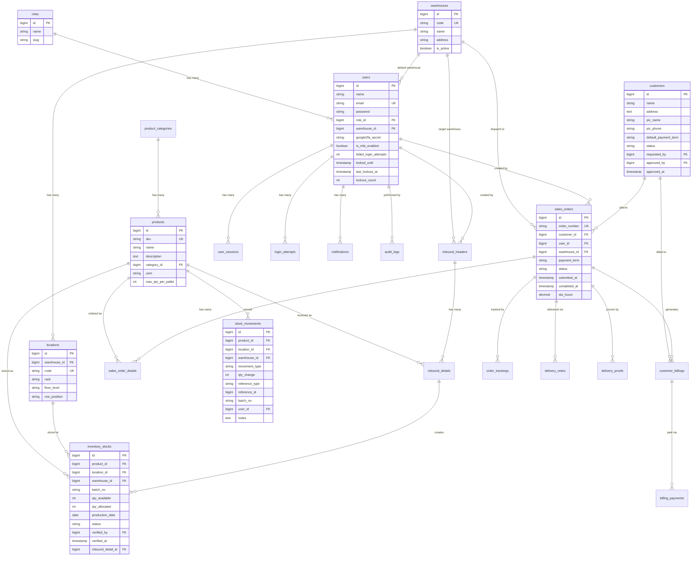

# Desain Database
## Sistem WMS & Sales Order — PT Berger Paints Indonesia

> **Versi:** 1.0  
> **Tanggal:** 14 Agustus 2026  
> **Database Engine:** PostgreSQL 16+  
> **ORM:** Laravel Eloquent  

---

## Daftar Isi

1. [Prinsip Desain](#1-prinsip-desain)
2. [Entity Relationship Diagram (ERD)](#2-entity-relationship-diagram-erd)
3. [Definisi Tabel](#3-definisi-tabel)
4. [Relasi Antar Tabel](#4-relasi-antar-tabel)
5. [Strategi Indexing](#5-strategi-indexing)
6. [Strategi Archival](#6-strategi-archival)
7. [Seed Data Awal](#7-seed-data-awal)
8. [Urutan Migration](#8-urutan-migration)

---

## 1. Prinsip Desain

### 1.1 Konvensi Umum
- **Nama tabel:** `snake_case`, plural (contoh: `sales_orders`, `inventory_stocks`)
- **Nama kolom:** `snake_case` (contoh: `qty_available`, `created_at`)
- **Primary Key:** `id` — `BIGINT UNSIGNED AUTO INCREMENT` (Laravel default)
- **Foreign Key:** `{tabel_singular}_id` (contoh: `user_id`, `product_id`)
- **Timestamps:** Semua tabel memiliki `created_at` dan `updated_at`
- **Soft Deletes:** Diterapkan pada tabel master dan transaksi utama (`deleted_at`)
- **UUID:** Tidak digunakan demi performa join dan simplicity

### 1.2 Prinsip Integritas Data
- **Referential Integrity:** Semua foreign key menggunakan `RESTRICT` pada delete untuk mencegah penghapusan data yang masih direferensi.
- **Stock Ledger:** Tabel `stock_movements` berfungsi sebagai *journal/ledger* — setiap perubahan qty stok HARUS tercatat di sini.
- **Immutable Audit:** Tabel `audit_logs` tidak memiliki `updated_at` — data hanya INSERT, tidak pernah UPDATE atau DELETE.
- **Atomic Transactions:** Semua operasi yang melibatkan perubahan stok harus dibungkus dalam database transaction.

---

## 2. Entity Relationship Diagram (ERD)



---

## 3. Definisi Tabel

### 3.1 Tabel Keamanan & Autentikasi

#### `roles`
Menyimpan definisi peran pengguna dalam sistem.

| Kolom | Tipe | Constraint | Deskripsi |
|---|---|---|---|
| `id` | BIGINT UNSIGNED | PK, AUTO INCREMENT | |
| `name` | VARCHAR(50) | NOT NULL | Nama tampilan (contoh: "Super Admin") |
| `slug` | VARCHAR(50) | NOT NULL, UNIQUE | Kode internal (contoh: "super_admin") |
| `description` | TEXT | NULLABLE | Deskripsi peran |
| `created_at` | TIMESTAMP | | |
| `updated_at` | TIMESTAMP | | |

#### `users`
Menyimpan data autentikasi dan profil pengguna.

| Kolom | Tipe | Constraint | Deskripsi |
|---|---|---|---|
| `id` | BIGINT UNSIGNED | PK, AUTO INCREMENT | |
| `name` | VARCHAR(100) | NOT NULL | Nama lengkap |
| `email` | VARCHAR(150) | NOT NULL, UNIQUE | Email login |
| `password` | VARCHAR(255) | NOT NULL | Bcrypt hash |
| `role_id` | BIGINT UNSIGNED | FK → roles.id | Peran pengguna |
| `warehouse_id` | BIGINT UNSIGNED | FK → warehouses.id | Gudang default |
| `google2fa_secret` | VARCHAR(255) | NULLABLE, ENCRYPTED | Secret key TOTP |
| `is_mfa_enabled` | BOOLEAN | DEFAULT FALSE | Apakah MFA sudah disetup |
| `failed_login_attempts` | INTEGER | DEFAULT 0 | Counter login gagal |
| `locked_until` | TIMESTAMP | NULLABLE | Waktu akun bisa dicoba lagi |
| `last_lockout_at` | TIMESTAMP | NULLABLE | Waktu terakhir terkunci |
| `lockout_count` | INTEGER | DEFAULT 0 | Counter berapa kali terkunci |
| `is_active` | BOOLEAN | DEFAULT TRUE | Status akun aktif/nonaktif |
| `created_at` | TIMESTAMP | | |
| `updated_at` | TIMESTAMP | | |
| `deleted_at` | TIMESTAMP | NULLABLE | Soft delete |

#### `user_sessions`
Melacak sesi aktif per user untuk enforce max 2 device.

| Kolom | Tipe | Constraint | Deskripsi |
|---|---|---|---|
| `id` | BIGINT UNSIGNED | PK, AUTO INCREMENT | |
| `user_id` | BIGINT UNSIGNED | FK → users.id | |
| `session_id` | VARCHAR(255) | NOT NULL, UNIQUE | Laravel session ID |
| `ip_address` | VARCHAR(45) | NULLABLE | IPv4/IPv6 |
| `user_agent` | TEXT | NULLABLE | Browser/Device info |
| `last_activity_at` | TIMESTAMP | NOT NULL | Waktu aktivitas terakhir |
| `created_at` | TIMESTAMP | | Login time |

#### `login_attempts`
Mencatat history percobaan login (untuk analisis keamanan).

| Kolom | Tipe | Constraint | Deskripsi |
|---|---|---|---|
| `id` | BIGINT UNSIGNED | PK, AUTO INCREMENT | |
| `email` | VARCHAR(150) | NOT NULL | Email yang dicoba |
| `ip_address` | VARCHAR(45) | NULLABLE | |
| `user_agent` | TEXT | NULLABLE | |
| `is_successful` | BOOLEAN | NOT NULL | Berhasil atau gagal |
| `failure_reason` | VARCHAR(50) | NULLABLE | "wrong_password", "locked", "mfa_failed" |
| `created_at` | TIMESTAMP | | |

---

### 3.2 Tabel Master Data

#### `warehouses`
Master data gudang / dispatch code.

| Kolom | Tipe | Constraint | Deskripsi |
|---|---|---|---|
| `id` | BIGINT UNSIGNED | PK, AUTO INCREMENT | |
| `code` | VARCHAR(20) | NOT NULL, UNIQUE | Dispatch code (contoh: "KRW", "JKT") |
| `name` | VARCHAR(100) | NOT NULL | Nama gudang |
| `address` | TEXT | NULLABLE | Alamat lengkap |
| `is_active` | BOOLEAN | DEFAULT TRUE | Status aktif |
| `created_at` | TIMESTAMP | | |
| `updated_at` | TIMESTAMP | | |
| `deleted_at` | TIMESTAMP | NULLABLE | Soft delete |

#### `product_categories`
Kategori/grup produk untuk pelaporan dan filter.

| Kolom | Tipe | Constraint | Deskripsi |
|---|---|---|---|
| `id` | BIGINT UNSIGNED | PK, AUTO INCREMENT | |
| `name` | VARCHAR(100) | NOT NULL | Nama kategori (contoh: "Cat Tembok") |
| `description` | TEXT | NULLABLE | |
| `created_at` | TIMESTAMP | | |
| `updated_at` | TIMESTAMP | | |
| `deleted_at` | TIMESTAMP | NULLABLE | Soft delete |

#### `products`
Master data SKU/produk.

| Kolom | Tipe | Constraint | Deskripsi |
|---|---|---|---|
| `id` | BIGINT UNSIGNED | PK, AUTO INCREMENT | |
| `sku` | VARCHAR(50) | NOT NULL, UNIQUE | Kode SKU produk |
| `name` | VARCHAR(200) | NOT NULL | Nama produk |
| `description` | TEXT | NULLABLE | Deskripsi lengkap |
| `category_id` | BIGINT UNSIGNED | FK → product_categories.id | Kategori produk |
| `uom` | VARCHAR(20) | NOT NULL | Unit of Measure (contoh: "5 Kg", "2.5 Lt") |
| `max_qty_per_pallet` | INTEGER | NOT NULL | Kapasitas maks per palet |
| `stock_threshold_low` | INTEGER | DEFAULT 50 | Batas "Terbatas" untuk Semi-Blind indicator |
| `is_active` | BOOLEAN | DEFAULT TRUE | Apakah produk masih aktif diproduksi |
| `created_at` | TIMESTAMP | | |
| `updated_at` | TIMESTAMP | | |
| `deleted_at` | TIMESTAMP | NULLABLE | Soft delete |

#### `locations`
Master lokasi rak penyimpanan di gudang.

| Kolom | Tipe | Constraint | Deskripsi |
|---|---|---|---|
| `id` | BIGINT UNSIGNED | PK, AUTO INCREMENT | |
| `warehouse_id` | BIGINT UNSIGNED | FK → warehouses.id | Gudang pemilik |
| `code` | VARCHAR(20) | NOT NULL, UNIQUE | Kode lokasi lengkap (contoh: "G-03-04") |
| `rack` | VARCHAR(5) | NOT NULL | Huruf rak (contoh: "G") |
| `floor_level` | VARCHAR(5) | NOT NULL | Level lantai (contoh: "03") |
| `row_position` | VARCHAR(5) | NOT NULL | Posisi baris (contoh: "04") |
| `is_active` | BOOLEAN | DEFAULT TRUE | Status aktif |
| `created_at` | TIMESTAMP | | |
| `updated_at` | TIMESTAMP | | |
| `deleted_at` | TIMESTAMP | NULLABLE | Soft delete |

#### `customers`
Data pelanggan / toko.

| Kolom | Tipe | Constraint | Deskripsi |
|---|---|---|---|
| `id` | BIGINT UNSIGNED | PK, AUTO INCREMENT | |
| `name` | VARCHAR(200) | NOT NULL | Nama toko/distributor |
| `address` | TEXT | NOT NULL | Alamat lengkap |
| `pic_name` | VARCHAR(100) | NOT NULL | Nama Person In Charge |
| `pic_phone` | VARCHAR(20) | NOT NULL | Nomor kontak PIC |
| `default_payment_term` | ENUM | NOT NULL | 'cash', 'transfer', 'tempo_30', 'tempo_60', 'tempo_90' |
| `status` | ENUM | NOT NULL, DEFAULT 'pending' | 'pending', 'approved', 'rejected' |
| `requested_by` | BIGINT UNSIGNED | FK → users.id | Sales yang mengajukan |
| `approved_by` | BIGINT UNSIGNED | FK → users.id, NULLABLE | Manager/SA yang menyetujui |
| `approved_at` | TIMESTAMP | NULLABLE | Waktu approval |
| `rejection_reason` | TEXT | NULLABLE | Alasan ditolak |
| `created_at` | TIMESTAMP | | |
| `updated_at` | TIMESTAMP | | |
| `deleted_at` | TIMESTAMP | NULLABLE | Soft delete |

---

### 3.3 Tabel Inbound (Barang Masuk)

#### `inbound_headers`
Header dokumen penerimaan barang dari pabrik.

| Kolom | Tipe | Constraint | Deskripsi |
|---|---|---|---|
| `id` | BIGINT UNSIGNED | PK, AUTO INCREMENT | |
| `document_number` | VARCHAR(50) | NOT NULL | Nomor dokumen fisik pabrik (input manual) |
| `warehouse_id` | BIGINT UNSIGNED | FK → warehouses.id | Gudang tujuan |
| `production_date` | DATE | NOT NULL | Tanggal produksi |
| `status` | ENUM | NOT NULL, DEFAULT 'draft' | 'draft', 'putaway_pending', 'verification_pending', 'verified', 'partial_verified' |
| `notes` | TEXT | NULLABLE | Catatan tambahan |
| `created_by` | BIGINT UNSIGNED | FK → users.id | Tim Produksi yang input |
| `created_at` | TIMESTAMP | | |
| `updated_at` | TIMESTAMP | | |
| `deleted_at` | TIMESTAMP | NULLABLE | Soft delete |

#### `inbound_details`
Rincian per item per palet dalam satu inbound.

| Kolom | Tipe | Constraint | Deskripsi |
|---|---|---|---|
| `id` | BIGINT UNSIGNED | PK, AUTO INCREMENT | |
| `inbound_header_id` | BIGINT UNSIGNED | FK → inbound_headers.id | Header induk |
| `product_id` | BIGINT UNSIGNED | FK → products.id | Produk yang diterima |
| `batch_no` | VARCHAR(50) | NOT NULL | Nomor batch produksi |
| `total_qty` | INTEGER | NOT NULL | Total qty sebelum split palet |
| `pallet_no` | INTEGER | NOT NULL | Urutan palet (1, 2, 3, ...) |
| `pallet_qty` | INTEGER | NOT NULL | Qty aktual di palet ini |
| `location_id` | BIGINT UNSIGNED | FK → locations.id, NULLABLE | Lokasi rak (diisi oleh Operator) |
| `putaway_by` | BIGINT UNSIGNED | FK → users.id, NULLABLE | Operator yang menempatkan |
| `putaway_at` | TIMESTAMP | NULLABLE | Waktu penempatan |
| `is_verified` | BOOLEAN | DEFAULT FALSE | Sudah diverifikasi Logistik? |
| `verified_by` | BIGINT UNSIGNED | FK → users.id, NULLABLE | Logistik yang memverifikasi |
| `verified_at` | TIMESTAMP | NULLABLE | Waktu verifikasi |
| `created_at` | TIMESTAMP | | |
| `updated_at` | TIMESTAMP | | |

---

### 3.4 Tabel Inventory (Stok)

#### `inventory_stocks`
**Tabel paling kritis.** Menyimpan data stok aktual yang ada di gudang, per produk per lokasi per batch.

| Kolom | Tipe | Constraint | Deskripsi |
|---|---|---|---|
| `id` | BIGINT UNSIGNED | PK, AUTO INCREMENT | |
| `product_id` | BIGINT UNSIGNED | FK → products.id | Produk |
| `location_id` | BIGINT UNSIGNED | FK → locations.id | Lokasi rak |
| `warehouse_id` | BIGINT UNSIGNED | FK → warehouses.id | Gudang (denormalized untuk performa) |
| `batch_no` | VARCHAR(50) | NOT NULL | Nomor batch |
| `qty_available` | INTEGER | NOT NULL, DEFAULT 0 | Qty yang tersedia untuk dialokasikan |
| `qty_allocated` | INTEGER | NOT NULL, DEFAULT 0 | Qty yang sudah dialokasikan untuk order |
| `production_date` | DATE | NOT NULL | Tanggal produksi (untuk FIFO) |
| `status` | ENUM | NOT NULL, DEFAULT 'active' | 'active', 'quarantine' |
| `inbound_detail_id` | BIGINT UNSIGNED | FK → inbound_details.id | Asal palet inbound |
| `verified_by` | BIGINT UNSIGNED | FK → users.id | Logistik yang memverifikasi |
| `verified_at` | TIMESTAMP | NOT NULL | Waktu stok aktif |
| `created_at` | TIMESTAMP | | |
| `updated_at` | TIMESTAMP | | |

> [!IMPORTANT]
> **Constraint:** `qty_available` >= 0, `qty_allocated` >= 0. Tidak boleh ada stok minus.  
> **Composite Index:** (`product_id`, `warehouse_id`, `production_date`) — untuk query FIFO.

#### `stock_movements`
**Tabel Ledger.** Mencatat SETIAP mutasi stok sebagai jurnal yang tidak boleh di-update atau di-delete.

| Kolom | Tipe | Constraint | Deskripsi |
|---|---|---|---|
| `id` | BIGINT UNSIGNED | PK, AUTO INCREMENT | |
| `product_id` | BIGINT UNSIGNED | FK → products.id | Produk yang dimutasi |
| `location_id` | BIGINT UNSIGNED | FK → locations.id, NULLABLE | Lokasi rak (null jika adjustment) |
| `warehouse_id` | BIGINT UNSIGNED | FK → warehouses.id | Gudang |
| `movement_type` | ENUM | NOT NULL | 'IN', 'OUT', 'ALLOCATED', 'DEALLOCATED', 'ADJUSTMENT' |
| `qty_change` | INTEGER | NOT NULL | Perubahan qty (positif = tambah, negatif = kurang) |
| `qty_before` | INTEGER | NOT NULL | Qty sebelum perubahan |
| `qty_after` | INTEGER | NOT NULL | Qty setelah perubahan |
| `reference_type` | VARCHAR(50) | NOT NULL | 'inbound', 'sales_order', 'adjustment' |
| `reference_id` | BIGINT UNSIGNED | NOT NULL | ID dari tabel referensi |
| `batch_no` | VARCHAR(50) | NULLABLE | Nomor batch (jika relevan) |
| `notes` | TEXT | NULLABLE | Catatan (wajib diisi untuk ADJUSTMENT) |
| `user_id` | BIGINT UNSIGNED | FK → users.id | Siapa yang melakukan |
| `created_at` | TIMESTAMP | | Waktu mutasi (immutable) |

> [!CAUTION]
> Tabel ini bersifat **IMMUTABLE** (append-only). Tidak ada operasi UPDATE atau DELETE. Ini adalah audit trail finansial untuk stok.

---

### 3.5 Tabel Outbound (Sales Order)

#### `sales_orders`
Header pesanan penjualan.

| Kolom | Tipe | Constraint | Deskripsi |
|---|---|---|---|
| `id` | BIGINT UNSIGNED | PK, AUTO INCREMENT | |
| `order_number` | VARCHAR(30) | NOT NULL, UNIQUE | Nomor PO otomatis (contoh: "PO-KRW-2026-00001") |
| `customer_id` | BIGINT UNSIGNED | FK → customers.id | Pelanggan |
| `user_id` | BIGINT UNSIGNED | FK → users.id | Sales yang membuat |
| `warehouse_id` | BIGINT UNSIGNED | FK → warehouses.id | Gudang tujuan (dispatch code) |
| `payment_term` | ENUM | NOT NULL | 'cash', 'transfer', 'tempo_30', 'tempo_60', 'tempo_90' |
| `status` | ENUM | NOT NULL, DEFAULT 'pending' | Lihat daftar status di bawah |
| `submitted_at` | TIMESTAMP | NOT NULL | Waktu submit oleh Sales (awal SLA) |
| `approved_at` | TIMESTAMP | NULLABLE | Waktu approve oleh Logistik |
| `approved_by` | BIGINT UNSIGNED | FK → users.id, NULLABLE | Logistik yang approve |
| `rejected_at` | TIMESTAMP | NULLABLE | Waktu reject (jika ditolak) |
| `rejected_by` | BIGINT UNSIGNED | FK → users.id, NULLABLE | |
| `rejection_reason` | TEXT | NULLABLE | Alasan penolakan |
| `picking_completed_at` | TIMESTAMP | NULLABLE | Waktu picking selesai |
| `completed_at` | TIMESTAMP | NULLABLE | Waktu order complete (akhir SLA) |
| `sla_hours` | DECIMAL(8,2) | NULLABLE | Durasi SLA dalam jam |
| `notes` | TEXT | NULLABLE | Catatan dari Sales |
| `created_at` | TIMESTAMP | | |
| `updated_at` | TIMESTAMP | | |
| `deleted_at` | TIMESTAMP | NULLABLE | Soft delete (hanya Super Admin) |

**Daftar Status Sales Order:**

| Status | Kode Enum | Deskripsi |
|---|---|---|
| Menunggu Approval | `pending` | PO baru disubmit Sales |
| Disetujui | `approved` | Logistik sudah approve, FIFO allocated |
| Ditolak | `rejected` | Logistik menolak PO |
| Proses Picking | `picking` | Operator sedang mengambil barang |
| Siap Kirim | `ready_to_ship` | Barang sudah di loading dock |
| Dalam Pengiriman | `shipping` | Surat Jalan sudah dicetak |
| Menunggu Verifikasi Bukti | `proof_uploaded` | Sales sudah upload bukti SJ |
| Complete | `completed` | Logistik sudah verifikasi bukti |
| Complete (Menunggu Bayar) | `completed_billing` | Complete tapi menunggu pembayaran tempo |

#### `sales_order_details`
Rincian item per PO.

| Kolom | Tipe | Constraint | Deskripsi |
|---|---|---|---|
| `id` | BIGINT UNSIGNED | PK, AUTO INCREMENT | |
| `sales_order_id` | BIGINT UNSIGNED | FK → sales_orders.id | Header PO |
| `product_id` | BIGINT UNSIGNED | FK → products.id | Produk yang dipesan |
| `qty_ordered` | INTEGER | NOT NULL | Qty yang diminta Sales |
| `qty_approved` | INTEGER | DEFAULT 0 | Qty yang disetujui (setelah auto-adjustment) |
| `qty_shipped` | INTEGER | DEFAULT 0 | Qty yang benar-benar dikirim |
| `lost_qty` | INTEGER | DEFAULT 0 | Selisih: qty_ordered - qty_approved (Lost Sales) |
| `created_at` | TIMESTAMP | | |
| `updated_at` | TIMESTAMP | | |

> [!NOTE]
> `lost_qty = qty_ordered - qty_approved`. Kolom ini dihitung dan disimpan saat approval untuk kemudahan pelaporan.

#### `sales_order_allocations`
Detail alokasi FIFO per item pesanan — menghubungkan order detail ke inventory stock spesifik.

| Kolom | Tipe | Constraint | Deskripsi |
|---|---|---|---|
| `id` | BIGINT UNSIGNED | PK, AUTO INCREMENT | |
| `sales_order_detail_id` | BIGINT UNSIGNED | FK → sales_order_details.id | Detail PO |
| `inventory_stock_id` | BIGINT UNSIGNED | FK → inventory_stocks.id | Stok yang dialokasikan |
| `qty_allocated` | INTEGER | NOT NULL | Qty yang dialokasikan dari stok ini |
| `created_at` | TIMESTAMP | | |

#### `delivery_notes`
Surat Jalan.

| Kolom | Tipe | Constraint | Deskripsi |
|---|---|---|---|
| `id` | BIGINT UNSIGNED | PK, AUTO INCREMENT | |
| `sales_order_id` | BIGINT UNSIGNED | FK → sales_orders.id | PO terkait |
| `delivery_number` | VARCHAR(30) | NOT NULL, UNIQUE | Nomor SJ otomatis |
| `driver_name` | VARCHAR(100) | NOT NULL | Nama supir |
| `vehicle_plate` | VARCHAR(20) | NOT NULL | Plat nomor kendaraan |
| `vehicle_description` | VARCHAR(100) | NULLABLE | Deskripsi kendaraan |
| `printed_at` | TIMESTAMP | NOT NULL | Waktu cetak |
| `printed_by` | BIGINT UNSIGNED | FK → users.id | Logistik yang mencetak |
| `created_at` | TIMESTAMP | | |
| `updated_at` | TIMESTAMP | | |

#### `delivery_proofs`
Bukti foto Surat Jalan yang ditandatangani.

| Kolom | Tipe | Constraint | Deskripsi |
|---|---|---|---|
| `id` | BIGINT UNSIGNED | PK, AUTO INCREMENT | |
| `sales_order_id` | BIGINT UNSIGNED | FK → sales_orders.id | PO terkait |
| `file_path` | VARCHAR(500) | NOT NULL | Path penyimpanan file |
| `file_name` | VARCHAR(255) | NOT NULL | Nama file asli |
| `file_size` | INTEGER | NOT NULL | Ukuran file dalam bytes |
| `mime_type` | VARCHAR(50) | NOT NULL | 'image/png' atau 'image/jpeg' |
| `uploaded_by` | BIGINT UNSIGNED | FK → users.id | Sales/Kurir yang upload |
| `created_at` | TIMESTAMP | | |

---

### 3.6 Tabel Billing (Penagihan)

#### `customer_billings`
Catatan piutang untuk pembayaran tempo.

| Kolom | Tipe | Constraint | Deskripsi |
|---|---|---|---|
| `id` | BIGINT UNSIGNED | PK, AUTO INCREMENT | |
| `sales_order_id` | BIGINT UNSIGNED | FK → sales_orders.id, UNIQUE | 1 PO = 1 billing |
| `customer_id` | BIGINT UNSIGNED | FK → customers.id | Customer yang ditagih |
| `payment_term` | ENUM | NOT NULL | 'tempo_30', 'tempo_60', 'tempo_90' |
| `billing_date` | DATE | NOT NULL | Tanggal billing dibuat (= tanggal order complete) |
| `due_date` | DATE | NOT NULL | Tanggal jatuh tempo |
| `status` | ENUM | NOT NULL, DEFAULT 'unpaid' | 'unpaid', 'paid', 'overdue' |
| `created_at` | TIMESTAMP | | |
| `updated_at` | TIMESTAMP | | |

#### `billing_payments`
Konfirmasi pembayaran oleh Logistik.

| Kolom | Tipe | Constraint | Deskripsi |
|---|---|---|---|
| `id` | BIGINT UNSIGNED | PK, AUTO INCREMENT | |
| `customer_billing_id` | BIGINT UNSIGNED | FK → customer_billings.id | Billing yang dibayar |
| `paid_date` | DATE | NOT NULL | Tanggal pembayaran diterima |
| `confirmed_by` | BIGINT UNSIGNED | FK → users.id | Logistik yang konfirmasi |
| `notes` | TEXT | NULLABLE | Catatan pembayaran |
| `created_at` | TIMESTAMP | | |

---

### 3.7 Tabel Tracking & Audit

#### `order_trackings`
Timeline histori setiap perubahan status PO. Digunakan untuk tampilan timeline di portal Sales dan kalkulasi SLA.

| Kolom | Tipe | Constraint | Deskripsi |
|---|---|---|---|
| `id` | BIGINT UNSIGNED | PK, AUTO INCREMENT | |
| `sales_order_id` | BIGINT UNSIGNED | FK → sales_orders.id | PO terkait |
| `status` | VARCHAR(30) | NOT NULL | Status saat itu |
| `description` | TEXT | NULLABLE | Deskripsi/pesan status |
| `user_id` | BIGINT UNSIGNED | FK → users.id | Siapa yang melakukan perubahan |
| `created_at` | TIMESTAMP | | Waktu perubahan status |

#### `notifications`
Notifikasi in-app untuk semua role.

| Kolom | Tipe | Constraint | Deskripsi |
|---|---|---|---|
| `id` | BIGINT UNSIGNED | PK, AUTO INCREMENT | |
| `user_id` | BIGINT UNSIGNED | FK → users.id | Penerima notifikasi |
| `title` | VARCHAR(200) | NOT NULL | Judul notifikasi |
| `message` | TEXT | NOT NULL | Isi pesan |
| `type` | VARCHAR(50) | NOT NULL | Tipe: 'order', 'inbound', 'billing', 'customer', 'stock' |
| `reference_type` | VARCHAR(50) | NULLABLE | Model yang dirujuk |
| `reference_id` | BIGINT UNSIGNED | NULLABLE | ID model yang dirujuk |
| `is_read` | BOOLEAN | DEFAULT FALSE | Sudah dibaca? |
| `read_at` | TIMESTAMP | NULLABLE | Waktu dibaca |
| `created_at` | TIMESTAMP | | |

#### `audit_logs`
Jejak audit immutable untuk semua operasi sensitif.

| Kolom | Tipe | Constraint | Deskripsi |
|---|---|---|---|
| `id` | BIGINT UNSIGNED | PK, AUTO INCREMENT | |
| `user_id` | BIGINT UNSIGNED | FK → users.id | Siapa yang melakukan |
| `action` | ENUM | NOT NULL | 'create', 'update', 'delete', 'adjustment' |
| `auditable_type` | VARCHAR(100) | NOT NULL | Nama model (contoh: "App\\Models\\InventoryStock") |
| `auditable_id` | BIGINT UNSIGNED | NOT NULL | ID record yang terpengaruh |
| `old_values` | JSON | NULLABLE | Data sebelum perubahan |
| `new_values` | JSON | NULLABLE | Data setelah perubahan |
| `ip_address` | VARCHAR(45) | NULLABLE | IP pengguna |
| `user_agent` | TEXT | NULLABLE | Browser/device |
| `created_at` | TIMESTAMP | | Immutable — tidak ada updated_at |

> [!CAUTION]
> Tabel ini bersifat **IMMUTABLE**. Tidak ada kolom `updated_at` atau `deleted_at`. Record HANYA di-INSERT, tidak pernah di-UPDATE atau di-DELETE.

---

### 3.8 Tabel Sistem

#### `system_settings`
Pengaturan sistem yang bisa dikonfigurasi Super Admin.

| Kolom | Tipe | Constraint | Deskripsi |
|---|---|---|---|
| `id` | BIGINT UNSIGNED | PK, AUTO INCREMENT | |
| `key` | VARCHAR(100) | NOT NULL, UNIQUE | Kunci pengaturan |
| `value` | TEXT | NOT NULL | Nilai pengaturan |
| `description` | TEXT | NULLABLE | Deskripsi untuk UI admin |
| `created_at` | TIMESTAMP | | |
| `updated_at` | TIMESTAMP | | |

**Setting keys yang dibutuhkan:**

| Key | Default Value | Deskripsi |
|---|---|---|
| `order_cutoff_time` | `15:00` | Batas waktu order harian (WIB) |
| `delivery_note_prefix` | `SJ` | Prefix nomor Surat Jalan |
| `delivery_note_starting_number` | `1` | Starting number SJ |
| `order_number_prefix` | `PO` | Prefix nomor PO |
| `order_number_starting_number` | `1` | Starting number PO |
| `max_upload_size_mb` | `5` | Max ukuran upload file (MB) |
| `max_upload_files` | `3` | Max jumlah file upload per proof |
| `session_idle_timeout_minutes` | `60` | Durasi idle sebelum auto-logout |
| `max_concurrent_sessions` | `2` | Max device per akun |
| `max_login_attempts` | `5` | Max percobaan login sebelum lockout |
| `initial_lockout_minutes` | `5` | Durasi lockout pertama (menit) |
| `audit_archive_months` | `24` | Umur audit log sebelum di-archive |

#### `document_sequences`
Penomoran otomatis untuk dokumen (PO, SJ).

| Kolom | Tipe | Constraint | Deskripsi |
|---|---|---|---|
| `id` | BIGINT UNSIGNED | PK, AUTO INCREMENT | |
| `warehouse_id` | BIGINT UNSIGNED | FK → warehouses.id | Per gudang |
| `document_type` | VARCHAR(30) | NOT NULL | 'sales_order', 'delivery_note' |
| `year` | INTEGER | NOT NULL | Tahun |
| `last_number` | INTEGER | NOT NULL, DEFAULT 0 | Nomor terakhir yang digunakan |
| `created_at` | TIMESTAMP | | |
| `updated_at` | TIMESTAMP | | |

> **Unique Constraint:** (`warehouse_id`, `document_type`, `year`)

---

## 4. Relasi Antar Tabel

### 4.1 Ringkasan Relasi

| Tabel Induk | Tabel Anak | Tipe Relasi | FK Column |
|---|---|---|---|
| `roles` | `users` | One-to-Many | `users.role_id` |
| `warehouses` | `users` | One-to-Many | `users.warehouse_id` |
| `warehouses` | `locations` | One-to-Many | `locations.warehouse_id` |
| `warehouses` | `inbound_headers` | One-to-Many | `inbound_headers.warehouse_id` |
| `warehouses` | `sales_orders` | One-to-Many | `sales_orders.warehouse_id` |
| `warehouses` | `inventory_stocks` | One-to-Many | `inventory_stocks.warehouse_id` |
| `product_categories` | `products` | One-to-Many | `products.category_id` |
| `products` | `inbound_details` | One-to-Many | `inbound_details.product_id` |
| `products` | `inventory_stocks` | One-to-Many | `inventory_stocks.product_id` |
| `products` | `sales_order_details` | One-to-Many | `sales_order_details.product_id` |
| `locations` | `inventory_stocks` | One-to-Many | `inventory_stocks.location_id` |
| `inbound_headers` | `inbound_details` | One-to-Many | `inbound_details.inbound_header_id` |
| `inbound_details` | `inventory_stocks` | One-to-One | `inventory_stocks.inbound_detail_id` |
| `customers` | `sales_orders` | One-to-Many | `sales_orders.customer_id` |
| `customers` | `customer_billings` | One-to-Many | `customer_billings.customer_id` |
| `sales_orders` | `sales_order_details` | One-to-Many | `sales_order_details.sales_order_id` |
| `sales_orders` | `order_trackings` | One-to-Many | `order_trackings.sales_order_id` |
| `sales_orders` | `delivery_notes` | One-to-One | `delivery_notes.sales_order_id` |
| `sales_orders` | `delivery_proofs` | One-to-Many | `delivery_proofs.sales_order_id` |
| `sales_orders` | `customer_billings` | One-to-One | `customer_billings.sales_order_id` |
| `sales_order_details` | `sales_order_allocations` | One-to-Many | `sales_order_allocations.sales_order_detail_id` |
| `inventory_stocks` | `sales_order_allocations` | One-to-Many | `sales_order_allocations.inventory_stock_id` |
| `customer_billings` | `billing_payments` | One-to-One | `billing_payments.customer_billing_id` |
| `users` | `user_sessions` | One-to-Many | `user_sessions.user_id` |
| `users` | `login_attempts` | One-to-Many | (by email, no FK) |
| `users` | `notifications` | One-to-Many | `notifications.user_id` |
| `users` | `audit_logs` | One-to-Many | `audit_logs.user_id` |

---

## 5. Strategi Indexing

### 5.1 Index Kritis untuk Performa

```sql
-- FIFO Query: Mencari stok tertua per produk per gudang
CREATE INDEX idx_inventory_fifo 
ON inventory_stocks (product_id, warehouse_id, production_date ASC)
WHERE qty_available > 0 AND status = 'active';

-- Stok per gudang: Dashboard dan laporan
CREATE INDEX idx_inventory_warehouse 
ON inventory_stocks (warehouse_id, product_id);

-- Pesanan per status: Dashboard dan filter
CREATE INDEX idx_orders_status 
ON sales_orders (status, warehouse_id);

-- Pesanan per sales: Dashboard sales
CREATE INDEX idx_orders_user 
ON sales_orders (user_id, status, created_at DESC);

-- Pesanan per customer: Check billing block
CREATE INDEX idx_orders_customer 
ON sales_orders (customer_id, status);

-- Billing unpaid: Check customer block
CREATE INDEX idx_billing_unpaid 
ON customer_billings (customer_id, status)
WHERE status = 'unpaid';

-- Notifikasi unread per user
CREATE INDEX idx_notifications_unread 
ON notifications (user_id, is_read, created_at DESC)
WHERE is_read = FALSE;

-- Audit log: Pencarian per tabel/record
CREATE INDEX idx_audit_auditable 
ON audit_logs (auditable_type, auditable_id, created_at DESC);

-- Stock movements: Pencarian per referensi
CREATE INDEX idx_movements_reference 
ON stock_movements (reference_type, reference_id);

-- Stock movements: Pencarian per produk
CREATE INDEX idx_movements_product 
ON stock_movements (product_id, warehouse_id, created_at DESC);

-- Login attempts: Check lockout
CREATE INDEX idx_login_email 
ON login_attempts (email, created_at DESC);

-- User sessions: Enforce max devices
CREATE INDEX idx_sessions_user 
ON user_sessions (user_id, last_activity_at DESC);

-- Document sequences: Generate next number
CREATE UNIQUE INDEX idx_doc_seq_unique 
ON document_sequences (warehouse_id, document_type, year);
```

---

## 6. Strategi Archival

### 6.1 Tabel yang Membutuhkan Archival

| Tabel | Kriteria Archival | Tabel Archive |
|---|---|---|
| `audit_logs` | `created_at` > 2 tahun | `audit_logs_archive` |
| `login_attempts` | `created_at` > 6 bulan | `login_attempts_archive` |
| `notifications` | `created_at` > 1 tahun AND `is_read` = TRUE | `notifications_archive` |
| `stock_movements` | `created_at` > 2 tahun | `stock_movements_archive` |
| `order_trackings` | `created_at` > 2 tahun | `order_trackings_archive` |

### 6.2 Proses Archival

```
SCHEDULE: Monthly (1st day of month, 02:00 WIB)
PROCESS:
  1. BEGIN TRANSACTION
  2. INSERT INTO {table}_archive SELECT * FROM {table} WHERE created_at < threshold
  3. DELETE FROM {table} WHERE created_at < threshold
  4. COMMIT
  5. Log hasil archival ke audit_logs
```

> [!NOTE]
> Tabel archive memiliki struktur identik dengan tabel asli. Data archive tetap bisa diakses melalui menu "Arsip" di panel Admin.

---

## 7. Seed Data Awal

### 7.1 Roles

```
| id | name             | slug             |
|----|------------------|------------------|
| 1  | Super Admin      | super_admin      |
| 2  | Manager          | manager          |
| 3  | Tim Logistik     | logistics        |
| 4  | Tim Produksi     | production       |
| 5  | Operator Gudang  | warehouse_operator |
| 6  | Tim Sales        | sales            |
```

### 7.2 System Settings

```
| key                          | value | description                           |
|------------------------------|-------|---------------------------------------|
| order_cutoff_time            | 15:00 | Batas waktu order harian (WIB)       |
| delivery_note_prefix         | SJ    | Prefix nomor Surat Jalan             |
| delivery_note_starting_number| 1     | Starting number SJ                   |
| order_number_prefix          | PO    | Prefix nomor PO                      |
| order_number_starting_number | 1     | Starting number PO                   |
| max_upload_size_mb           | 5     | Max ukuran upload file (MB)          |
| max_upload_files             | 3     | Max jumlah file upload per proof     |
| session_idle_timeout_minutes | 60    | Durasi idle sebelum auto-logout      |
| max_concurrent_sessions      | 2     | Max device per akun                  |
| max_login_attempts           | 5     | Max percobaan login sebelum lockout  |
| initial_lockout_minutes      | 5     | Durasi lockout pertama (menit)       |
| audit_archive_months         | 24    | Umur audit log sebelum di-archive    |
```

---

## 8. Urutan Migration

Migration harus dijalankan sesuai urutan dependensi. Berikut urutan yang benar:

```
01. create_roles_table
02. create_warehouses_table
03. create_users_table                    (FK: roles, warehouses)
04. create_user_sessions_table            (FK: users)
05. create_login_attempts_table
06. create_product_categories_table
07. create_products_table                 (FK: product_categories)
08. create_locations_table                (FK: warehouses)
09. create_customers_table                (FK: users)
10. create_inbound_headers_table          (FK: warehouses, users)
11. create_inbound_details_table          (FK: inbound_headers, products, locations, users)
12. create_inventory_stocks_table         (FK: products, locations, warehouses, users, inbound_details)
13. create_stock_movements_table          (FK: products, locations, warehouses, users)
14. create_sales_orders_table             (FK: customers, users, warehouses)
15. create_sales_order_details_table      (FK: sales_orders, products)
16. create_sales_order_allocations_table  (FK: sales_order_details, inventory_stocks)
17. create_delivery_notes_table           (FK: sales_orders, users)
18. create_delivery_proofs_table          (FK: sales_orders, users)
19. create_customer_billings_table        (FK: sales_orders, customers)
20. create_billing_payments_table         (FK: customer_billings, users)
21. create_order_trackings_table          (FK: sales_orders, users)
22. create_notifications_table            (FK: users)
23. create_audit_logs_table               (FK: users)
24. create_system_settings_table
25. create_document_sequences_table       (FK: warehouses)
```

> [!TIP]
> Gunakan `php artisan migrate:fresh --seed` saat development. Seeder harus mengisi: roles, system_settings, dan 1 user Super Admin default.
