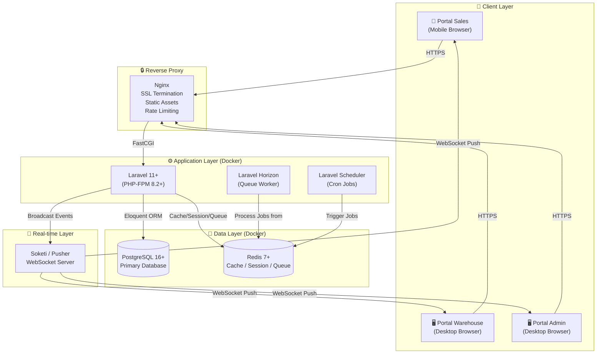
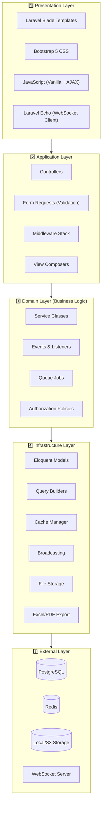
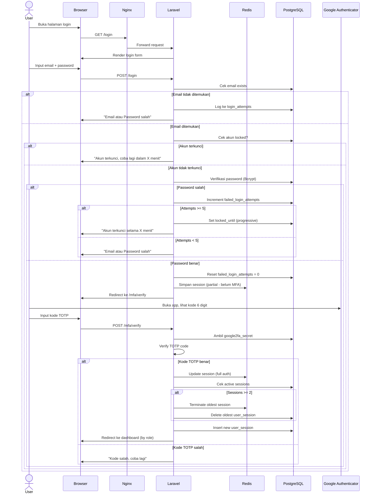
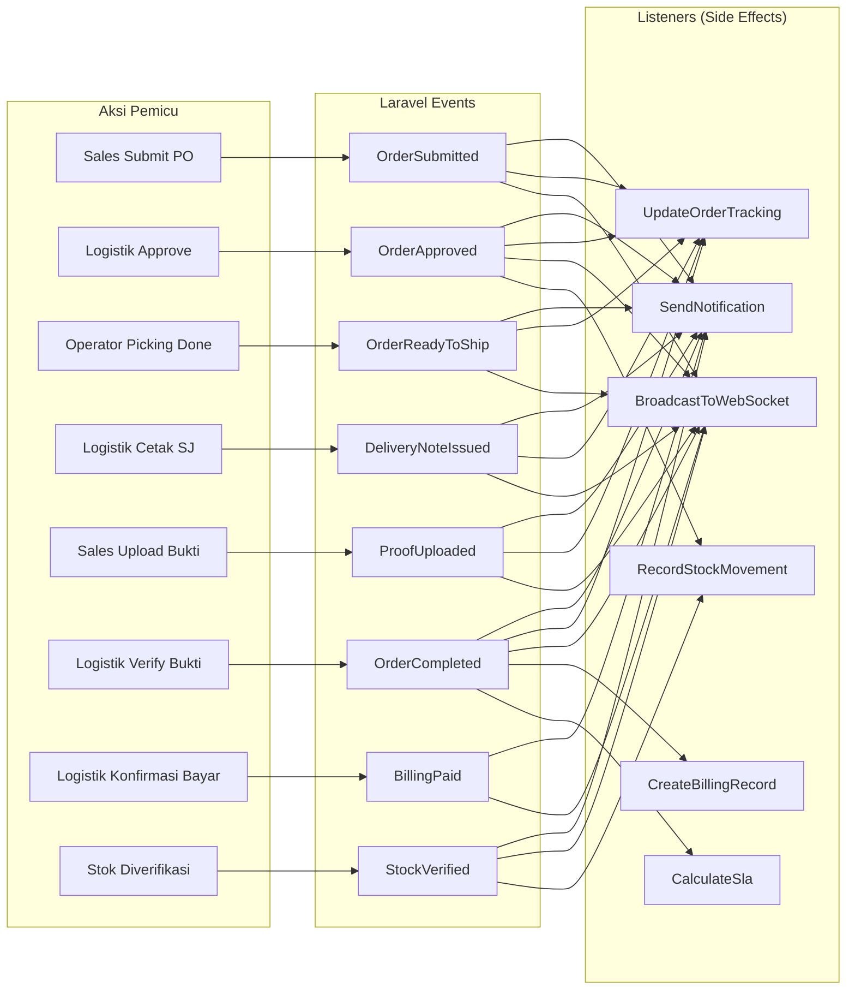
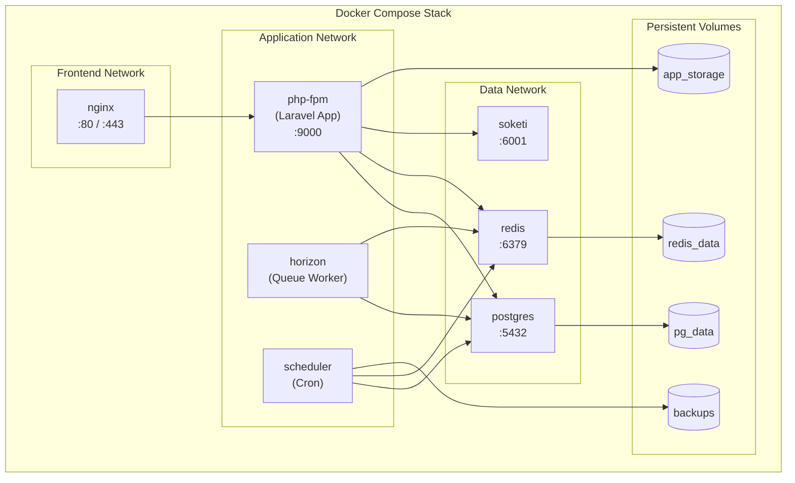
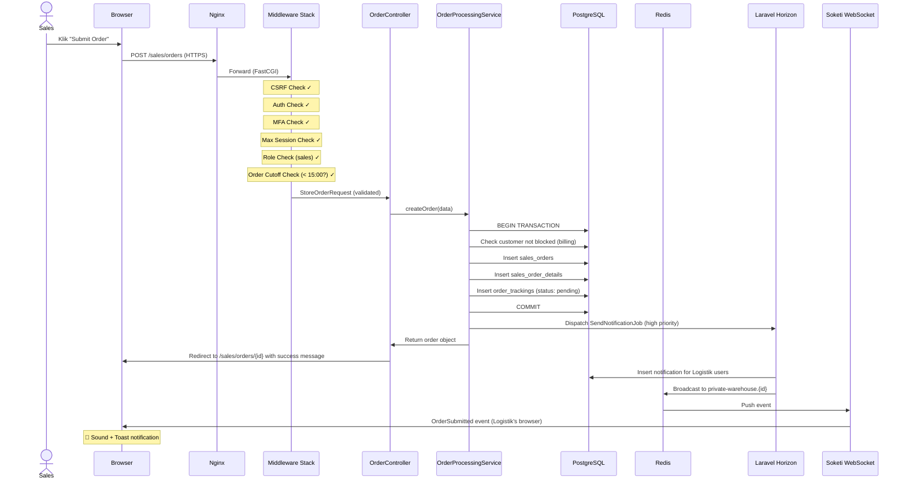

# Arsitektur Sistem
## Sistem WMS & Sales Order — PT Berger Paints Indonesia

> **Versi:** 1.0  
> **Tanggal:** 14 Agustus 2026  
> **Pola Arsitektur:** Single Database, Multi-Portal (Monolithic)

---

## Daftar Isi

1. [Arsitektur Tingkat Tinggi (High-Level)](#1-arsitektur-tingkat-tinggi)
2. [Arsitektur Lapisan (Layered Architecture)](#2-arsitektur-lapisan)
3. [Arsitektur Keamanan](#3-arsitektur-keamanan)
4. [Arsitektur Event & Notifikasi](#4-arsitektur-event--notifikasi)
5. [Arsitektur Queue & Background Jobs](#5-arsitektur-queue--background-jobs)
6. [Arsitektur Caching](#6-arsitektur-caching)
7. [Arsitektur Deployment](#7-arsitektur-deployment)
8. [Alur Request Lifecycle](#8-alur-request-lifecycle)
9. [Disaster Recovery & Backup](#9-disaster-recovery--backup)

---

## 1. Arsitektur Tingkat Tinggi

### 1.1 Diagram Arsitektur Utama



### 1.2 Deskripsi Arsitektur

Sistem ini menggunakan arsitektur **Monolithic Multi-Portal** di mana satu instance Laravel melayani tiga portal berbeda melalui routing dan middleware:

| Portal | Target Device | Pengguna | URL Pattern |
|---|---|---|---|
| **Portal Sales** | Smartphone (Mobile-first) | Tim Sales | `/sales/*` |
| **Portal Warehouse** | Desktop/Tablet (Desktop-first) | Tim Logistik, Operator Gudang, Tim Produksi | `/warehouse/*` |
| **Portal Admin** | Desktop (Desktop-first) | Super Admin, Manager | `/admin/*` |

Semua portal **berbagi satu database** PostgreSQL yang sama, namun diisolasi melalui:
- **Route Groups** terpisah di `routes/web.php`
- **Middleware RBAC** yang memfilter akses per role
- **Blade Layout** berbeda per portal (sales layout vs warehouse layout)
- **Controller namespace** berbeda per portal

---

## 2. Arsitektur Lapisan (Layered Architecture)

### 2.1 Diagram Lapisan



### 2.2 Penjelasan Setiap Lapisan

#### Layer 1: Presentation (Frontend — Gemini 2.5 Pro)
- **Blade Templates:** Render HTML per portal (sales, warehouse, admin)
- **Bootstrap 5:** Framework CSS untuk responsivitas
- **JavaScript:** Interaksi UI, AJAX calls, chart rendering, camera capture
- **Laravel Echo:** Client-side WebSocket listener untuk notifikasi real-time

#### Layer 2: Application (Koordinator — Claude Opus)
- **Controllers:** Menerima HTTP request, memanggil Service, mengembalikan View/JSON
- **Form Requests:** Validasi input sebelum masuk ke business logic
- **Middleware:** Authentication, RBAC, MFA check, session enforcement, order cutoff
- **View Composers:** Menyediakan data global ke semua view (notif count, user info)

#### Layer 3: Domain (Business Logic — Claude Opus)
- **Service Classes:** Encapsulasi logika bisnis kompleks:
  - `FifoAllocationService` — Algoritma FIFO untuk alokasi stok
  - `PalletSplitService` — Pemecahan qty ke palet
  - `OrderProcessingService` — Orchestrasi alur order (validate → allocate → track)
  - `StockMovementService` — Pencatatan setiap mutasi stok ke ledger
  - `BillingService` — Pembuatan dan pengecekan billing
  - `SlaCalculationService` — Perhitungan durasi SLA
  - `NotificationService` — Pengiriman notifikasi
  - `AuditService` — Pencatatan audit log
- **Events & Listeners:** Event-driven untuk notifikasi dan side-effects
- **Queue Jobs:** Background processing untuk operasi berat
- **Policies:** Authorization rules per model (siapa boleh apa)

#### Layer 4: Infrastructure (Data Access — Claude Opus)
- **Eloquent Models:** Mapping tabel database ke PHP objects
- **Cache Manager:** Abstraksi Redis caching
- **Broadcasting:** Abstraksi pengiriman WebSocket events
- **File Storage:** Manajemen upload file (foto bukti Surat Jalan)
- **Excel/PDF Export:** Generate laporan

#### Layer 5: External (Infrastruktur Eksternal)
- PostgreSQL, Redis, File System, WebSocket Server

---

## 3. Arsitektur Keamanan

### 3.1 Lapisan Keamanan (Defense in Depth)

```mermaid
graph LR
    subgraph L1 ["Layer 1: Network"]
        HTTPS["HTTPS/TLS"]
        RATE["Rate Limiting<br>(Nginx)"]
    end
    
    subgraph L2 ["Layer 2: Authentication"]
        LOGIN["Email/Password"]
        MFA_L["Google Authenticator<br>(TOTP)"]
        LOCKOUT["Progressive Lockout"]
    end
    
    subgraph L3 ["Layer 3: Session"]
        SESSION["Session Management"]
        MAX_DEV["Max 2 Devices"]
        IDLE["1 Hour Idle Timeout"]
    end
    
    subgraph L4 ["Layer 4: Authorization"]
        RBAC_L["RBAC Middleware"]
        POLICY["Model Policies"]
        PORTAL["Portal Isolation"]
    end
    
    subgraph L5 ["Layer 5: Input Validation"]
        CSRF["CSRF Token"]
        XSS_L["XSS Prevention"]
        UPLOAD["File Upload Validation"]
        SQL_L["SQL Injection Prevention"]
    end
    
    subgraph L6 ["Layer 6: Audit"]
        AUDIT["Immutable Audit Log"]
        STOCK_LOG["Stock Movement Ledger"]
    end
    
    L1 --> L2 --> L3 --> L4 --> L5 --> L6
```



### 3.2 Middleware Stack (Urutan Eksekusi)

Setiap request HTTP melewati middleware dalam urutan berikut:

```
1. EncryptCookies
2. StartSession
3. VerifyCsrfToken
4. ShareErrorsFromSession
5. ──────────────────────── (Laravel Default di atas)
6. Authenticate           → Cek user sudah login?
7. CheckMfa               → Cek MFA sudah diverifikasi?
8. EnforceMaxSessions     → Cek max 2 device
9. UpdateLastActivity     → Update last_activity_at untuk idle timeout
10. CheckRole:{roles}     → Cek user punya role yang diizinkan?
11. CheckOrderCutoff      → (Khusus route order) Cek belum lewat jam 15:00?
12. CheckCustomerBlocked  → (Khusus route order) Cek customer tidak di-block?
13. TrackAuditLog         → Record ke audit_logs (untuk operasi CUD)
```

### 3.3 Alur Autentikasi Lengkap



### 3.4 File Upload Security

```
Upload Request (POST /sales/orders/{id}/proof)
│
├── 1. CSRF Token Check (Middleware)
│
├── 2. Authentication Check (Middleware)
│
├── 3. Form Request Validation:
│   ├── files.* → required | file | mimes:png,jpg,jpeg
│   ├── files.* → max:5120 (5MB in KB)
│   ├── files   → max:3 (max 3 files)
│   └── Reject jika tidak valid
│
├── 4. Server-side MIME Verification:
│   ├── Baca file header (magic bytes)
│   ├── Verifikasi benar-benar image (bukan PHP/shell)
│   └── Reject jika file berbahaya
│
├── 5. File Processing:
│   ├── Generate unique filename (UUID + timestamp)
│   ├── Strip EXIF metadata
│   ├── Simpan ke storage/app/delivery-proofs/ (non-public)
│   └── Catat di tabel delivery_proofs
│
└── 6. Serving:
    └── File hanya bisa diakses via Controller route (bukan direct URL)
    └── Controller cek authorization sebelum serve file
```

---

## 4. Arsitektur Event & Notifikasi

### 4.1 Event-Driven Flow

Sistem menggunakan **Laravel Events & Listeners** untuk memisahkan aksi utama dari efek samping (notifikasi, logging, dll).



### 4.2 WebSocket Channel Architecture

```
Channels:
├── private-user.{userId}           → Notifikasi personal per user
├── private-warehouse.{warehouseId} → Event per gudang (untuk Logistik/Operator)
└── private-admin                   → Event untuk Manager/Super Admin

Contoh:
- Sales submit PO untuk gudang KRW
  → Broadcast ke channel: private-warehouse.1 (gudang KRW)
  → Semua Logistik yang membuka dashboard gudang KRW menerima notifikasi

- Logistik approve PO dari Sales ID 5
  → Broadcast ke channel: private-user.5
  → Sales ID 5 menerima notifikasi di HP-nya
```

### 4.3 Notifikasi dengan Suara

```javascript
// Frontend (JavaScript) - Listener
window.Echo.private(`user.${userId}`)
    .listen('OrderApproved', (event) => {
        // 1. Tampilkan toast notification
        showToast(event.title, event.message);
        
        // 2. Update badge counter di bell icon
        incrementNotificationBadge();
        
        // 3. Mainkan suara notifikasi
        playNotificationSound();
        
        // 4. Update data di halaman (jika relevan)
        if (currentPage === 'orders') {
            refreshOrderTable();
        }
    });

function playNotificationSound() {
    const audio = new Audio('/sounds/notification.mp3');
    audio.volume = 0.5;
    audio.play().catch(() => {
        // Browser mungkin memblokir autoplay
        // Tampilkan visual indicator sebagai fallback
    });
}
```

---

## 5. Arsitektur Queue & Background Jobs

### 5.1 Queue Configuration

```
Queue Driver: Redis
Queue Monitor: Laravel Horizon

Queues (ordered by priority):
├── high      → Notifikasi real-time, WebSocket broadcast
├── default   → Order processing, FIFO allocation, stock movements
├── low       → Report generation, Excel export, archival
└── backups   → Database backup, cleanup jobs
```

### 5.2 Job yang Menggunakan Queue

| Job | Queue | Deskripsi |
|---|---|---|
| `SendNotificationJob` | high | Kirim notifikasi + broadcast WebSocket |
| `ProcessOrderApprovalJob` | default | FIFO allocation + stock movement recording |
| `CalculateSlaJob` | default | Hitung durasi SLA saat order complete |
| `GenerateExcelReportJob` | low | Generate laporan Excel (bisa lambat) |
| `ArchiveOldDataJob` | low | Pindahkan data lama ke tabel archive |
| `DatabaseBackupJob` | backups | pg_dump + compress + rotate |
| `CleanExpiredSessionsJob` | low | Hapus session yang sudah expired |
| `UpdateBillingOverdueJob` | default | Cek dan update status billing overdue |

### 5.3 Scheduled Jobs (Cron)

| Schedule | Job | Deskripsi |
|---|---|---|
| Setiap 1 menit | `CleanExpiredSessions` | Hapus session idle > 1 jam |
| Setiap 5 menit | `UpdateBillingOverdue` | Cek billing yang melewati jatuh tempo |
| Setiap hari 02:00 | `DatabaseBackup` | Backup PostgreSQL |
| Setiap bulan 1st 03:00 | `ArchiveOldData` | Archive data lama |

---

## 6. Arsitektur Caching

### 6.1 Cache Strategy

| Data | Cache Driver | TTL | Invalidation |
|---|---|---|---|
| Session | Redis | 60 menit (idle) | On logout / idle |
| System Settings | Redis | 24 jam | On settings update |
| Product list (per warehouse) | Redis | 1 jam | On product CRUD |
| Dashboard stats (aggregates) | Redis | 5 menit | Time-based expiry |
| User permissions/roles | Redis | Session lifetime | On role change |
| Semi-blind stock indicators | Redis | 5 menit | On stock change |
| Notification count (unread) | Redis | Real-time update | On notification event |

### 6.2 Cache Invalidation Strategy

```php
// Contoh: Saat stok berubah, invalidate related caches
class StockMovementService
{
    public function recordMovement(StockMovement $movement): void
    {
        // ... simpan ke database ...
        
        // Invalidate caches
        Cache::tags(['stock', "warehouse:{$movement->warehouse_id}"])->flush();
        Cache::forget("dashboard:stats:{$movement->warehouse_id}");
        Cache::forget("product:availability:{$movement->product_id}:{$movement->warehouse_id}");
    }
}
```

---

## 7. Arsitektur Deployment

### 7.1 Docker Compose Architecture



### 7.2 Container Specifications

| Container | Image | CPU | Memory | Restart |
|---|---|---|---|---|
| `nginx` | nginx:alpine | 0.5 | 256MB | always |
| `php-fpm` | Custom (PHP 8.2-fpm) | 2.0 | 1GB | always |
| `horizon` | Same as php-fpm | 1.0 | 512MB | always |
| `scheduler` | Same as php-fpm | 0.5 | 256MB | always |
| `postgres` | postgres:16-alpine | 2.0 | 2GB | always |
| `redis` | redis:7-alpine | 0.5 | 512MB | always |
| `soketi` | quay.io/soketi/soketi | 0.5 | 256MB | always |

### 7.3 Volume Mapping

```yaml
volumes:
  pg_data:         # PostgreSQL data files
  redis_data:      # Redis persistence (RDB)
  app_storage:     # Laravel storage/ (uploads, logs, cache)
  backups:         # Database backup files
```

---

## 8. Alur Request Lifecycle

### 8.1 Request Flow (Contoh: Sales Submit PO)



---

## 9. Disaster Recovery & Backup

### 9.1 Backup Strategy

| Komponen | Metode | Frekuensi | Retensi |
|---|---|---|---|
| PostgreSQL (Full) | `pg_dump` + gzip | Harian (02:00 WIB) | 30 hari |
| PostgreSQL (WAL) | Continuous archiving | Real-time | 7 hari |
| Redis (RDB) | Redis BGSAVE | Setiap 15 menit | 3 snapshot |
| Upload Files | Rsync ke backup volume | Harian | 90 hari |
| Application Code | Git repository | Setiap commit | Unlimited |

### 9.2 Recovery Procedures

```
Level 1 — Application Error:
  → Rollback ke Docker image sebelumnya
  → Downtime: < 5 menit

Level 2 — Data Corruption:
  → Restore dari pg_dump backup terakhir
  → Replay WAL dari titik korupsi
  → Downtime: 15-60 menit (tergantung ukuran DB)

Level 3 — Hardware Failure:
  → Setup ulang Docker stack di server baru
  → Restore database dari backup
  → Restore uploads dari backup
  → Downtime: 1-4 jam
```

### 9.3 Backup Verification

```
Schedule: Mingguan (Minggu, 04:00 WIB)
Process:
  1. Copy backup terbaru ke environment test
  2. Restore database
  3. Jalankan health check queries:
     - SELECT COUNT(*) FROM inventory_stocks
     - SELECT COUNT(*) FROM sales_orders
     - SELECT MAX(created_at) FROM audit_logs
  4. Bandingkan dengan production counts
  5. Log hasil verifikasi
```
