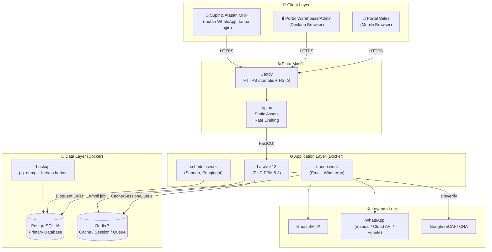
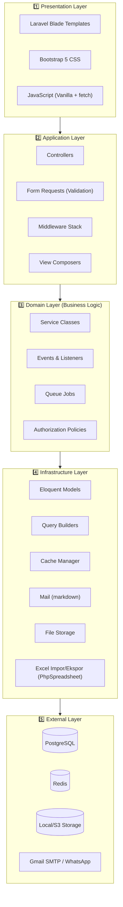
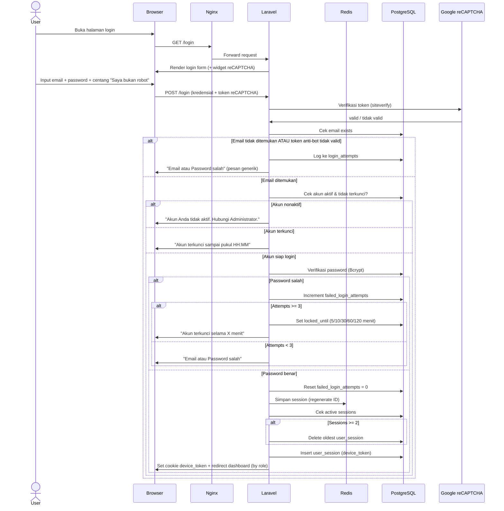
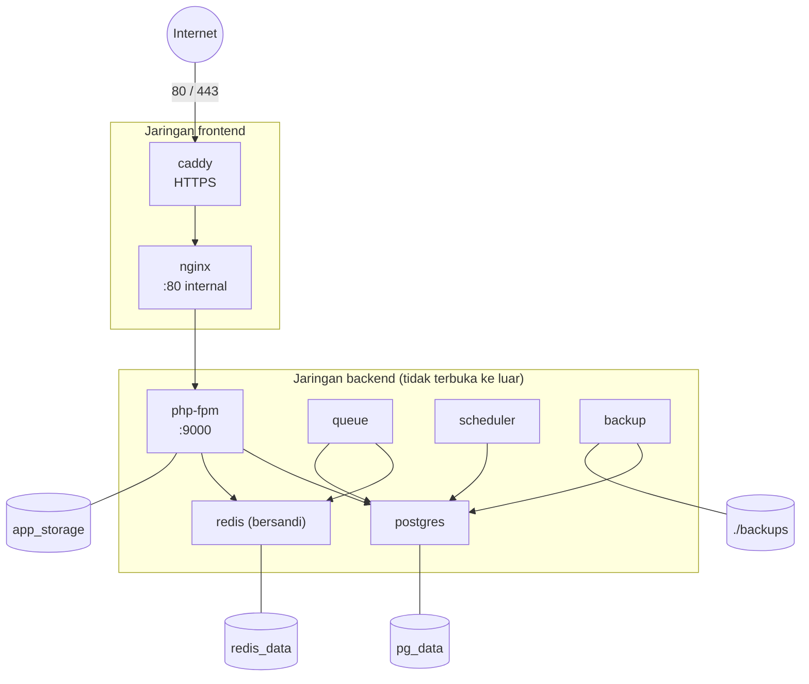
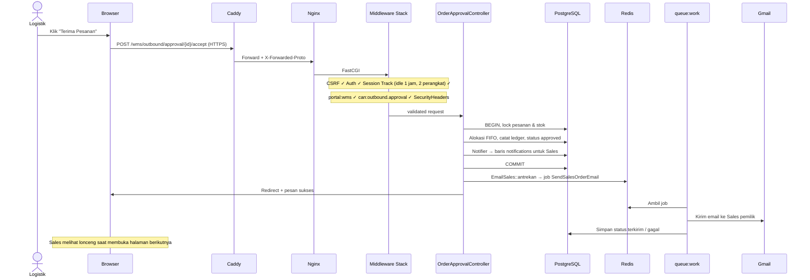

# Arsitektur Sistem
## Sistem WMS & Sales Order — PT Berger Paints Indonesia

> **Versi:** 1.1  
> **Tanggal:** 14 September 2026 *(revisi dari v1.0, 14 Agustus 2026)*  
> **Pola Arsitektur:** Single Database, Multi-Portal (Monolithic)

> [!NOTE]
> **Perubahan v1.1 (pra-go-live).** Diselaraskan dengan yang benar-benar dibangun: tidak ada WebSocket (Soketi/Echo) maupun Laravel Horizon; notifikasi lewat lonceng web, email, dan WhatsApp; antrean `queue:work`; HTTPS oleh Caddy di depan Nginx; tidak ada ekspor PDF. §4, §5, §7, §8, §9 ditulis ulang. Konfigurasi rinci ada di berkasnya — lihat `docs/6_cicd_docker_setup.md` §1.

---

## Daftar Isi

1. [Arsitektur Tingkat Tinggi (High-Level)](#1-arsitektur-tingkat-tinggi)
2. [Arsitektur Lapisan (Layered Architecture)](#2-arsitektur-lapisan)
3. [Arsitektur Keamanan](#3-arsitektur-keamanan)
4. [Arsitektur Event & Notifikasi](#4-arsitektur-event--notifikasi)
5. [Arsitektur Queue & Background Jobs](#5-arsitektur-queue--background-jobs)
6. [Arsitektur Caching](#6-arsitektur-caching)
7. [Arsitektur Deployment](#7-arsitektur-deployment)
8. [Alur Request Lifecycle](#8-alur-request-lifecycle)
9. [Disaster Recovery & Backup](#9-disaster-recovery--backup)

---

## 1. Arsitektur Tingkat Tinggi

### 1.1 Diagram Arsitektur Utama



### 1.2 Deskripsi Arsitektur

Sistem ini menggunakan arsitektur **Monolithic Multi-Portal** di mana satu instance Laravel melayani tiga portal berbeda melalui routing dan middleware:

| Portal | Target Device | Pengguna | URL Pattern |
|---|---|---|---|
| **Portal Sales** | Smartphone (Mobile-first) | Tim Sales | `/sales/*` |
| **Portal Warehouse** | Desktop/Tablet (Desktop-first) | Tim Logistik, Operator Gudang, Tim Produksi | `/wms/*` |
| **Portal Admin** | Desktop (Desktop-first) | Super Admin, Manager | `/wms/admin/*` (satu portal dengan Warehouse, dibatasi gate) |
| **Halaman bertoken** | Smartphone | Supir (konfirmasi sampai), atasan (persetujuan MRF) | `/epod/{token}`, `/mrf/{token}` |

Semua portal **berbagi satu database** PostgreSQL yang sama, namun diisolasi melalui:
- **Route Groups** terpisah di `routes/web.php`
- **Middleware RBAC** yang memfilter akses per role
- **Blade Layout** berbeda per portal (sales layout vs warehouse layout)
- **Controller namespace** berbeda per portal

---

## 2. Arsitektur Lapisan (Layered Architecture)

### 2.1 Diagram Lapisan



### 2.2 Penjelasan Setiap Lapisan

#### Layer 1: Presentation (Frontend — Gemini 2.5 Pro)
- **Blade Templates:** Render HTML per portal (sales, warehouse, admin)
- **Bootstrap 5:** Framework CSS untuk responsivitas
- **JavaScript:** Interaksi UI, AJAX calls, chart rendering, camera capture

#### Layer 2: Application (Koordinator — Claude Opus)
- **Controllers:** Menerima HTTP request, memanggil Service, mengembalikan View/JSON
- **Form Requests:** Validasi input sebelum masuk ke business logic
- **Middleware:** Authentication, RBAC, portal separation, session enforcement, order cutoff
- **View Composers:** Menyediakan data global ke semua view (notif count, user info)

#### Layer 3: Domain (Business Logic — Claude Opus)
- **Service Classes:** Encapsulasi logika bisnis kompleks:
  - `FifoAllocationService` — Algoritma FIFO untuk alokasi stok
  - `PalletSplitService` — Pemecahan qty ke palet
  - `OrderProcessingService` — Orchestrasi alur order (validate → allocate → track)
  - `StockMovementService` — Pencatatan setiap mutasi stok ke ledger
  - `BillingService` — Pembuatan dan pengecekan billing
  - `SlaCalculationService` — Perhitungan durasi SLA
  - `NotificationService` — Pengiriman notifikasi
  - `AuditService` — Pencatatan audit log
- **Events & Listeners:** Event-driven untuk notifikasi dan side-effects
- **Queue Jobs:** Background processing untuk operasi berat
- **Policies:** Authorization rules per model (siapa boleh apa)

#### Layer 4: Infrastructure (Data Access — Claude Opus)
- **Eloquent Models:** Mapping tabel database ke PHP objects
- **Cache Manager:** Abstraksi Redis caching
- **Mail & WhatsApp:** `App\Mail\Pesanan\*` dan `App\Support\Messaging\WhatsAppSender` (driver dipilih dari konfigurasi)
- **File Storage:** Manajemen upload file (foto bukti Surat Jalan)
- **Excel Export:** `App\Support\Export\XlsxWriter` — laporan diunduh sebagai .xlsx, tidak ada PDF

#### Layer 5: External (Infrastruktur Eksternal)
- PostgreSQL, Redis, File System, Gmail SMTP, penyedia WhatsApp, Google reCAPTCHA

---

## 3. Arsitektur Keamanan

### 3.1 Lapisan Keamanan (Defense in Depth)

```mermaid
graph LR
    subgraph L1 ["Layer 1: Network"]
        HTTPS["HTTPS/TLS"]
        RATE["Rate Limiting<br>(Nginx)"]
    end
    
    subgraph L2 ["Layer 2: Authentication"]
        LOGIN["Email/Password"]
        BOT_L["Google reCAPTCHA v2<br>(anti-bot)"]
        LOCKOUT["Progressive Lockout"]
    end
    
    subgraph L3 ["Layer 3: Session"]
        SESSION["Session Management"]
        MAX_DEV["Max 2 Devices"]
        IDLE["1 Hour Idle Timeout"]
    end
    
    subgraph L4 ["Layer 4: Authorization"]
        RBAC_L["RBAC Middleware"]
        POLICY["Model Policies"]
        PORTAL["Portal Isolation"]
    end
    
    subgraph L5 ["Layer 5: Input Validation"]
        CSRF["CSRF Token"]
        XSS_L["XSS Prevention"]
        UPLOAD["File Upload Validation"]
        SQL_L["SQL Injection Prevention"]
    end
    
    subgraph L6 ["Layer 6: Audit"]
        AUDIT["Immutable Audit Log"]
        STOCK_LOG["Stock Movement Ledger"]
    end
    
    L1 --> L2 --> L3 --> L4 --> L5 --> L6
```



### 3.2 Middleware Stack (Urutan Eksekusi)

Setiap request HTTP melewati middleware dalam urutan berikut:

```
1. EncryptCookies
2. StartSession
3. VerifyCsrfToken
4. ShareErrorsFromSession
5. ──────────────────────── (Laravel Default di atas)
6. auth                   → Cek user sudah login?                    [SUDAH ADA]
7. session.track          → Max 2 device + idle timeout 1 jam         [SUDAH ADA]
                            (TrackUserSession: satu middleware untuk keduanya)
8. portal:{wms|sales}     → Cegah akses silang antar-portal           [SUDAH ADA]
                            (EnsurePortalAccess)
9. CheckRole:{roles}      → Cek user punya role yang diizinkan?       [rencana]
10. CheckOrderCutoff      → (Khusus route order) Cek belum lewat jam 15:00?  [rencana]
11. TrackAuditLog         → Record ke audit_logs (untuk operasi CUD)  [rencana]
```

### 3.3 Alur Autentikasi Lengkap



> [!NOTE]
> **Tidak ada langkah verifikasi terpisah setelah password.** reCAPTCHA diverifikasi pada request `POST /login` yang sama (PRD v1.2) — berbeda dengan rancangan MFA/TOTP lama yang memerlukan halaman `/mfa/verify` tersendiri.

### 3.4 File Upload Security

```
Upload Request (POST /sales/orders/{id}/proof)
│
├── 1. CSRF Token Check (Middleware)
│
├── 2. Authentication Check (Middleware)
│
├── 3. Form Request Validation:
│   ├── files.* → required | file | mimes:png,jpg,jpeg
│   ├── files.* → max:5120 (5MB in KB)
│   ├── files   → max:3 (max 3 files)
│   └── Reject jika tidak valid
│
├── 4. Server-side MIME Verification:
│   ├── Baca file header (magic bytes)
│   ├── Verifikasi benar-benar image (bukan PHP/shell)
│   └── Reject jika file berbahaya
│
├── 5. File Processing:
│   ├── Generate unique filename (UUID + timestamp)
│   ├── Strip EXIF metadata
│   ├── Simpan ke storage/app/delivery-proofs/ (non-public)
│   └── Catat di tabel delivery_proofs
│
└── 6. Serving:
    └── File hanya bisa diakses via Controller route (bukan direct URL)
    └── Controller cek authorization sebelum serve file
```

---

## 4. Arsitektur Notifikasi

Tidak ada WebSocket. Setiap perubahan status yang perlu diketahui orang lain ditulis sebagai baris `notifications` oleh `App\Support\Notifier` **di dalam alur yang sama** — bukan lewat event/listener — sehingga notifikasi tidak bisa terlewat karena listener lupa didaftarkan.

| Saluran | Kapan dibaca | Penerima | Kode |
|---|---|---|---|
| **Lonceng web** | Saat halaman dibuka (View Composer `partials.navbar-top`) | Per permission (`Notifier::toPermission`, dibatasi gudang) atau per user (`toUser`) | `App\Support\Notifier`, `App\Models\Notification` |
| **Email** | Masuk kotak surat Sales | Hanya Sales pemilik pesanan | `App\Support\Messaging\EmailSales` → job `SendSalesOrderEmail` |
| **WhatsApp** | Di HP penerima | Supir (tautan konfirmasi), atasan (tautan MRF), Sales (barang sampai) | `SendDeliveryNotification`, `SendMrfApprovalRequest`, `SendArrivalNoticeToSales` |

Email dan WhatsApp **selalu lewat antrean** dan statusnya disimpan (terkirim/gagal/dilewati beserta galatnya), sehingga Logistik bisa melihat kabar mana yang tidak sampai dan mengirim ulang. Kegagalan kirim tidak pernah membatalkan tindakan gudang yang memicunya.

---

## 5. Arsitektur Queue & Background Jobs

### 5.1 Queue Configuration

```
Queue Driver : Redis (antrean `default`)
Worker       : php artisan queue:work redis --tries=3 --timeout=60 --max-time=3600
Monitor      : /health → checks.antrean (detak DetakAntrean tiap 5 menit)
```

### 5.2 Job yang Menggunakan Queue

| Job | Deskripsi |
|---|---|
| `SendSalesOrderEmail` | Email kabar pesanan ke Sales pemilik (diterima, ditolak, berangkat, sampai, selesai) |
| `SendDeliveryNotification` | WhatsApp tautan konfirmasi sampai ke supir |
| `SendArrivalNoticeToSales` | WhatsApp kabar barang sampai ke Sales |
| `SendMrfApprovalRequest` | WhatsApp tautan persetujuan MRF ke atasan |
| `DetakAntrean` | Bukti worker antrean hidup |

### 5.3 Scheduled Jobs (`routes/console.php`, zona Asia/Jakarta)

| Jadwal | Perintah | Deskripsi |
|---|---|---|
| Tiap menit | detak penjadwal | Bukti scheduler hidup (`/health`) |
| Tiap 5 menit | `DetakAntrean` | Bukti worker antrean hidup |
| Tiap jam | `wms:bersihkan` | Sesi mati, berkas impor telantar, riwayat login lama |
| 00:05 | `stock:sweep-expired` | Batch lewat kedaluwarsa → DDP |
| 00:10 | `stock:sweep-quarantine` | Lepas karantina yang habis masanya |
| 00:15 | `stock:sweep-priority` | Lepas penanda dahulukan keluar yang habis |
| 00:25 | `activity:purge` | Pangkas log aktivitas melewati masa simpan |
| 07:00 | `billing:ingatkan` | Tagihan terlewat + pengingat jatuh tempo untuk Manager |

Cadangan basis data **bukan** job Laravel — dijalankan container `backup` terpisah (§9), supaya tetap jalan walau aplikasinya bermasalah.

---

## 6. Arsitektur Caching

### 6.1 Cache Strategy

| Data | Cache Driver | TTL | Invalidation |
|---|---|---|---|
| Session | Redis | 60 menit (idle) | On logout / idle |
| System Settings | Redis | 24 jam | On settings update |
| Product list (per warehouse) | Redis | 1 jam | On product CRUD |
| Dashboard stats (aggregates) | Redis | 5 menit | Time-based expiry |
| User permissions/roles | Redis | Session lifetime | On role change |
| Semi-blind stock indicators | Redis | 5 menit | On stock change |
| Notification count (unread) | Redis | Real-time update | On notification event |

### 6.2 Cache Invalidation Strategy

```php
// Contoh: Saat stok berubah, invalidate related caches
class StockMovementService
{
    public function recordMovement(StockMovement $movement): void
    {
        // ... simpan ke database ...
        
        // Invalidate caches
        Cache::tags(['stock', "warehouse:{$movement->warehouse_id}"])->flush();
        Cache::forget("dashboard:stats:{$movement->warehouse_id}");
        Cache::forget("product:availability:{$movement->product_id}:{$movement->warehouse_id}");
    }
}
```

---

## 7. Arsitektur Deployment

### 7.1 Docker Compose Production (`docker-compose.prod.yml`)



### 7.2 Container

| Container | Image | CPU | Memory |
|---|---|---|---|
| `caddy` | caddy:2.8-alpine | — | — |
| `nginx` | Custom (nginx:1.27-alpine + `public/`) | — | — |
| `php-fpm` | Custom (php:8.3-fpm-alpine, tahap production) | 2.0 | 1GB |
| `queue` | Sama dengan php-fpm | 1.0 | 512MB |
| `scheduler` | Sama dengan php-fpm | 0.5 | 256MB |
| `postgres` | postgres:16-alpine | 2.0 | 2GB |
| `redis` | redis:7-alpine | — | maxmemory 512MB, noeviction |
| `backup` | postgres:16-alpine | — | — |

### 7.3 Volume

| Volume | Isi |
|---|---|
| `pg_data` | Berkas PostgreSQL |
| `redis_data` | Persistensi Redis (AOF) |
| `app_storage` | `storage/` Laravel: foto Surat Jalan, foto sampai, dokumen PO, foto profil, log |
| `caddy_data`, `caddy_config` | Sertifikat Let's Encrypt |
| `./backups` (bind mount) | Cadangan harian — salin ke luar VPS |

---

## 8. Alur Request Lifecycle

### 8.1 Request Flow (Contoh: Logistik Menerima Pesanan)



---

## 9. Disaster Recovery & Backup

### 9.1 Backup Strategy

| Komponen | Metode | Frekuensi | Retensi |
|---|---|---|---|
| PostgreSQL | `pg_dump --format=custom`, dibaca ulang `pg_restore --list` | Harian setelah 01:00 WIB + sebelum setiap deploy | 30 hari |
| Berkas unggahan (`storage/app`) | `tar.gz`, dibaca ulang `tar -t` | Harian, bersama basis data | 30 hari |
| Redis | AOF (`appendonly yes`) | Terus-menerus | — (hanya cache, sesi, antrean) |
| Kode | Git + tag rilis | Setiap rilis | Tanpa batas |

Skrip: `docker/backup/cadangkan.sh`. Cadangan ada di disk VPS yang sama — **salin `backups/` ke luar VPS** secara berkala (lihat `docs/9_panduan_go_live.md`).

### 9.2 Recovery Procedures

```
Level 1 — Rilis bermasalah:
  → git checkout <tag sebelumnya> && docker compose -f docker-compose.prod.yml up -d --build
  → Downtime: beberapa menit (build ulang image)

Level 2 — Data rusak:
  → Hentikan php-fpm, queue, scheduler
  → sh /skrip/pulihkan.sh <tanggal>  (basis data + berkas unggahan)
  → Kehilangan data: sejak cadangan terakhir (maks. ±24 jam, atau sejak deploy terakhir)

Level 3 — VPS hilang:
  → VPS baru, ikuti docs/9_panduan_go_live.md
  → Salin cadangan dari luar VPS ke ./backups, pulihkan
  → Arahkan DNS ke IP baru
```

### 9.3 Backup Verification

```
Jadwal : Bulanan, dan setiap sebelum rilis besar
Perintah: docker compose -f docker-compose.prod.yml exec backup sh /skrip/pulihkan.sh <tanggal> --uji
Proses : pulihkan ke basis data sementara wms_uji_pulih → hitung users, sales_orders,
         migrations → baca arsip berkas → hapus basis data sementara
```
