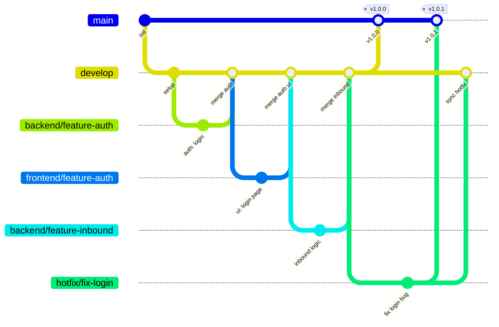

# CI/CD dengan Docker & GitHub
## Sistem WMS & Sales Order — PT Berger Paints Indonesia

> **Versi:** 1.1  
> **Tanggal:** 26 Agustus 2026 *(revisi dari v1.0, 14 Agustus 2026)*  
> **Teknologi:** Docker, Docker Compose, GitHub Actions, Nginx, PostgreSQL, Redis

> [!IMPORTANT]
> **Perubahan v1.1 — penyesuaian dengan kondisi repo saat ini.**
>
> Contoh workflow di dokumen ini mengasumsikan beberapa perkakas yang **belum terpasang**. Berkas nyata di `.github/workflows/` sudah disesuaikan agar pipeline benar-benar hijau:
>
> | Bagian | Rencana dokumen | Kondisi repo & langkah nyata |
> |---|---|---|
> | Lint PHP | `php-cs-fixer` + `phpstan` | Keduanya belum ada. Dipakai **`./vendor/bin/pint --test`** (sudah di `require-dev`). PHPStan ditambahkan menyusul |
> | Build frontend | `npm ci` | ✅ **Sudah sesuai.** `package-lock.json` telah dibuat & di-commit, `cache: 'npm'` aktif |
> | Eksekusi test | `php artisan test --parallel` | `brianium/paratest` belum terpasang → dijalankan **tanpa** `--parallel` |
> | Restart worker | `horizon:terminate` | Horizon belum terpasang → dipakai **`queue:restart`** |
> | Endpoint `/health` | Hanya contoh kode | **Sudah diimplementasikan** di `routes/web.php` |
>
> Setiap penyesuaian di atas diberi komentar di berkas workflow, lengkap dengan instruksi mengembalikannya begitu dependensinya terpasang. **Jangan menyalin mentah-mentah contoh workflow di bawah** — gunakan berkas nyata sebagai acuan.

---

## Daftar Isi

1. [Instalasi Docker](#1-instalasi-docker)
2. [Dockerfile & Container Setup](#2-dockerfile--container-setup)
3. [Docker Compose](#3-docker-compose)
4. [GitHub Repository & Branch Strategy](#4-github-repository--branch-strategy)
5. [GitHub Actions Pipeline](#5-github-actions-pipeline)
6. [Environment Management](#6-environment-management)
7. [Deployment Workflow](#7-deployment-workflow)
8. [Rollback Procedures](#8-rollback-procedures)
9. [Monitoring & Health Checks](#9-monitoring--health-checks)

---

## 1. Instalasi Docker

### 1.1 Development (Windows)

```powershell
# 1. Download Docker Desktop for Windows
# https://docs.docker.com/desktop/install/windows-install/

# 2. Setelah install, verifikasi
docker --version
# Docker version 27.x.x

docker compose version
# Docker Compose version v2.x.x

# 3. Aktifkan WSL2 backend (recommended)
# Settings → General → "Use the WSL 2 based engine" ✓

# 4. Alokasikan resource
# Settings → Resources → Advanced:
#   CPUs: 4 (minimum 2)
#   Memory: 8 GB (minimum 4 GB)
#   Swap: 2 GB
#   Disk: 60 GB
```

### 1.2 Production Server (Ubuntu 22.04 LTS)

```bash
# 1. Update system
sudo apt update && sudo apt upgrade -y

# 2. Install dependencies
sudo apt install -y \
    ca-certificates \
    curl \
    gnupg \
    lsb-release

# 3. Add Docker GPG key
sudo install -m 0755 -d /etc/apt/keyrings
curl -fsSL https://download.docker.com/linux/ubuntu/gpg | \
    sudo gpg --dearmor -o /etc/apt/keyrings/docker.gpg
sudo chmod a+r /etc/apt/keyrings/docker.gpg

# 4. Add Docker repository
echo \
  "deb [arch=$(dpkg --print-architecture) signed-by=/etc/apt/keyrings/docker.gpg] \
  https://download.docker.com/linux/ubuntu \
  $(lsb_release -cs) stable" | \
  sudo tee /etc/apt/sources.list.d/docker.list > /dev/null

# 5. Install Docker Engine + Compose
sudo apt update
sudo apt install -y docker-ce docker-ce-cli containerd.io docker-compose-plugin

# 6. Add user to docker group (no sudo needed)
sudo usermod -aG docker $USER
newgrp docker

# 7. Enable Docker on boot
sudo systemctl enable docker
sudo systemctl start docker

# 8. Verify
docker --version
docker compose version
```

---

## 2. Dockerfile & Container Setup

### 2.1 Struktur File Docker

```
project-root/
├── docker/
│   ├── php/
│   │   ├── Dockerfile
│   │   ├── php.ini
│   │   └── supervisord.conf
│   ├── nginx/
│   │   ├── Dockerfile
│   │   ├── nginx.conf
│   │   └── default.conf
│   └── scheduler/
│       └── crontab
├── docker-compose.yml
├── docker-compose.prod.yml
├── .dockerignore
└── .env.docker
```

### 2.2 PHP-FPM Dockerfile (Multi-Stage Build)

```dockerfile
# docker/php/Dockerfile

# ==============================
# Stage 1: Composer Dependencies
# ==============================
FROM composer:2.7 AS composer-deps

WORKDIR /app

# Copy hanya file dependency dulu (leverage cache)
COPY composer.json composer.lock ./

# Install dependencies tanpa dev
RUN composer install \
    --no-dev \
    --no-interaction \
    --no-scripts \
    --no-autoloader \
    --prefer-dist

# Copy seluruh source code
COPY . .

# Generate optimized autoload
RUN composer dump-autoload --optimize --no-dev

# ==============================
# Stage 2: Frontend Assets
# ==============================
FROM node:20-alpine AS frontend-build

WORKDIR /app

COPY package.json package-lock.json ./
RUN npm ci

COPY . .
RUN npm run build

# ==============================
# Stage 3: Production Image
# ==============================
FROM php:8.3-fpm-alpine

# Install system dependencies
RUN apk add --no-cache \
    postgresql-dev \
    libpng-dev \
    libjpeg-turbo-dev \
    freetype-dev \
    libzip-dev \
    zip \
    unzip \
    supervisor \
    curl

# Install PHP extensions
RUN docker-php-ext-configure gd \
        --with-freetype \
        --with-jpeg \
    && docker-php-ext-install \
        pdo \
        pdo_pgsql \
        gd \
        zip \
        pcntl \
        bcmath \
        opcache

# Install Redis extension
RUN pecl install redis && docker-php-ext-enable redis

# Copy custom PHP config
COPY docker/php/php.ini /usr/local/etc/php/conf.d/custom.ini

# Set working directory
WORKDIR /var/www/html

# Copy application from build stages
COPY --from=composer-deps /app/vendor /var/www/html/vendor
COPY --from=frontend-build /app/public/build /var/www/html/public/build
COPY . /var/www/html

# Set permissions
RUN chown -R www-data:www-data /var/www/html \
    && chmod -R 755 /var/www/html/storage \
    && chmod -R 755 /var/www/html/bootstrap/cache

# Expose PHP-FPM port
EXPOSE 9000

CMD ["php-fpm"]
```

### 2.3 PHP Configuration (`docker/php/php.ini`)

```ini
; Performance
opcache.enable=1
opcache.memory_consumption=256
opcache.max_accelerated_files=20000
opcache.validate_timestamps=0

; Upload limits (untuk foto Surat Jalan)
upload_max_filesize=10M
post_max_size=20M
max_file_uploads=5

; Memory & Time
memory_limit=256M
max_execution_time=60
max_input_time=60

; Session
session.gc_maxlifetime=3600
session.cookie_httponly=1
session.cookie_secure=1
session.cookie_samesite=Lax

; Timezone
date.timezone=Asia/Jakarta

; Error handling (production)
display_errors=Off
log_errors=On
error_log=/var/log/php/error.log
```

### 2.4 Nginx Dockerfile

```dockerfile
# docker/nginx/Dockerfile
FROM nginx:1.25-alpine

# Remove default config
RUN rm /etc/nginx/conf.d/default.conf

# Copy custom config
COPY docker/nginx/nginx.conf /etc/nginx/nginx.conf
COPY docker/nginx/default.conf /etc/nginx/conf.d/default.conf

EXPOSE 80 443
```

### 2.5 Nginx Configuration (`docker/nginx/default.conf`)

```nginx
server {
    listen 80;
    server_name _;
    root /var/www/html/public;
    index index.php;

    charset utf-8;

    # Security headers
    add_header X-Frame-Options "SAMEORIGIN" always;
    add_header X-Content-Type-Options "nosniff" always;
    add_header X-XSS-Protection "1; mode=block" always;
    add_header Referrer-Policy "strict-origin-when-cross-origin" always;
    add_header Content-Security-Policy "default-src 'self'; script-src 'self' 'unsafe-inline' 'unsafe-eval'; style-src 'self' 'unsafe-inline' https://fonts.googleapis.com; font-src 'self' https://fonts.gstatic.com; img-src 'self' data: blob:;" always;

    # File upload limit (match PHP)
    client_max_body_size 20M;

    # Gzip compression
    gzip on;
    gzip_types text/plain text/css application/json application/javascript text/xml;
    gzip_min_length 1024;

    # Rate limiting zone
    limit_req_zone $binary_remote_addr zone=login:10m rate=5r/m;

    # Static assets caching
    location ~* \.(css|js|jpg|jpeg|png|gif|ico|svg|woff|woff2|ttf)$ {
        expires 30d;
        access_log off;
        add_header Cache-Control "public, immutable";
    }

    # Main location
    location / {
        try_files $uri $uri/ /index.php?$query_string;
    }

    # PHP-FPM
    location ~ \.php$ {
        fastcgi_pass php-fpm:9000;
        fastcgi_index index.php;
        fastcgi_param SCRIPT_FILENAME $realpath_root$fastcgi_script_name;
        include fastcgi_params;
        fastcgi_read_timeout 60;
    }

    # Rate limit pada login
    location = /login {
        limit_req zone=login burst=3 nodelay;
        try_files $uri /index.php?$query_string;
    }

    # Block akses langsung ke storage uploads
    location /storage/delivery-proofs {
        deny all;
        return 403;
    }

    # Deny hidden files
    location ~ /\. {
        deny all;
        access_log off;
        log_not_found off;
    }
}
```

### 2.6 `.dockerignore`

```
.git
.github
.env
.env.*
!.env.docker
node_modules
vendor
storage/logs/*
storage/framework/cache/data/*
storage/framework/sessions/*
storage/framework/views/*
tests/
docker-compose*.yml
README.md
*.md
```

---

## 3. Docker Compose

### 3.1 Development (`docker-compose.yml`)

```yaml
version: '3.8'

services:
  # ===== Nginx Reverse Proxy =====
  nginx:
    build:
      context: .
      dockerfile: docker/nginx/Dockerfile
    ports:
      - "8080:80"
    volumes:
      - ./public:/var/www/html/public:ro
      - ./storage/app/public:/var/www/html/storage/app/public:ro
    depends_on:
      - php-fpm
    networks:
      - frontend
      - backend
    restart: unless-stopped

  # ===== PHP-FPM Application =====
  php-fpm:
    build:
      context: .
      dockerfile: docker/php/Dockerfile
      target: php-fpm-dev   # Development target (with xdebug)
    volumes:
      - .:/var/www/html       # Hot reload during development
      - ./storage:/var/www/html/storage
    environment:
      - APP_ENV=local
      - APP_DEBUG=true
    depends_on:
      postgres:
        condition: service_healthy
      redis:
        condition: service_healthy
    networks:
      - backend
    restart: unless-stopped

  # ===== Laravel Horizon (Queue Worker) =====
  horizon:
    build:
      context: .
      dockerfile: docker/php/Dockerfile
    command: php artisan horizon
    volumes:
      - .:/var/www/html
      - ./storage:/var/www/html/storage
    depends_on:
      - php-fpm
      - redis
    networks:
      - backend
    restart: unless-stopped

  # ===== Laravel Scheduler (Cron) =====
  scheduler:
    build:
      context: .
      dockerfile: docker/php/Dockerfile
    command: >
      sh -c "while true; do
        php /var/www/html/artisan schedule:run --no-interaction;
        sleep 60;
      done"
    volumes:
      - .:/var/www/html
      - ./storage:/var/www/html/storage
    depends_on:
      - php-fpm
    networks:
      - backend
    restart: unless-stopped

  # ===== PostgreSQL Database =====
  postgres:
    image: postgres:16-alpine
    ports:
      - "5432:5432"
    environment:
      POSTGRES_DB: ${DB_DATABASE:-wms_berger}
      POSTGRES_USER: ${DB_USERNAME:-wms_user}
      POSTGRES_PASSWORD: ${DB_PASSWORD:-secret}
    volumes:
      - pg_data:/var/lib/postgresql/data
    healthcheck:
      test: ["CMD-SHELL", "pg_isready -U ${DB_USERNAME:-wms_user} -d ${DB_DATABASE:-wms_berger}"]
      interval: 10s
      timeout: 5s
      retries: 5
    networks:
      - backend
    restart: unless-stopped

  # ===== Redis (Cache + Session + Queue) =====
  redis:
    image: redis:7-alpine
    ports:
      - "6379:6379"
    command: redis-server --appendonly yes --maxmemory 512mb --maxmemory-policy allkeys-lru
    volumes:
      - redis_data:/data
    healthcheck:
      test: ["CMD", "redis-cli", "ping"]
      interval: 10s
      timeout: 5s
      retries: 5
    networks:
      - backend
    restart: unless-stopped

  # ===== Soketi (WebSocket Server) =====
  soketi:
    image: quay.io/soketi/soketi:1.6-16-alpine
    ports:
      - "6001:6001"
      - "9601:9601"   # Metrics
    environment:
      SOKETI_DEBUG: "1"
      SOKETI_DEFAULT_APP_ID: "berger-wms"
      SOKETI_DEFAULT_APP_KEY: "${PUSHER_APP_KEY:-app-key}"
      SOKETI_DEFAULT_APP_SECRET: "${PUSHER_APP_SECRET:-app-secret}"
    networks:
      - backend
      - frontend
    restart: unless-stopped

volumes:
  pg_data:
    driver: local
  redis_data:
    driver: local

networks:
  frontend:
    driver: bridge
  backend:
    driver: bridge
```

### 3.2 Production Override (`docker-compose.prod.yml`)

```yaml
version: '3.8'

services:
  nginx:
    ports:
      - "80:80"
      - "443:443"
    volumes:
      - ./docker/nginx/ssl:/etc/nginx/ssl:ro   # SSL certificates
    restart: always

  php-fpm:
    build:
      target: production   # Production stage (no xdebug, optimized)
    volumes: []             # No host mount in production
    environment:
      - APP_ENV=production
      - APP_DEBUG=false
    deploy:
      resources:
        limits:
          cpus: '2.0'
          memory: 1G
    restart: always

  horizon:
    volumes: []
    deploy:
      resources:
        limits:
          cpus: '1.0'
          memory: 512M
    restart: always

  scheduler:
    volumes: []
    deploy:
      resources:
        limits:
          cpus: '0.5'
          memory: 256M
    restart: always

  postgres:
    ports: []               # No external port in production
    environment:
      POSTGRES_PASSWORD: ${DB_PASSWORD}   # From secure env
    deploy:
      resources:
        limits:
          cpus: '2.0'
          memory: 2G
    restart: always

  redis:
    ports: []               # No external port in production
    restart: always

  soketi:
    ports:
      - "6001:6001"
    environment:
      SOKETI_DEBUG: "0"
    restart: always
```

### 3.3 Commands Docker Compose

```bash
# ===== Development =====

# Start semua services
docker compose up -d

# Build ulang setelah perubahan Dockerfile
docker compose build --no-cache

# Jalankan artisan commands
docker compose exec php-fpm php artisan migrate
docker compose exec php-fpm php artisan db:seed
docker compose exec php-fpm php artisan cache:clear
docker compose exec php-fpm php artisan test

# Lihat logs
docker compose logs -f php-fpm
docker compose logs -f horizon

# Stop semua
docker compose down

# Stop + hapus volumes (RESET database)
docker compose down -v

# ===== Production =====

# Start dengan production override
docker compose -f docker-compose.yml -f docker-compose.prod.yml up -d

# Rolling update
docker compose -f docker-compose.yml -f docker-compose.prod.yml up -d --build php-fpm horizon scheduler nginx
```

---

## 4. GitHub Repository & Branch Strategy

### 4.1 Branch Strategy (GitFlow Simplified)



### 4.2 Branch Naming Convention

| Branch Type | Pattern | Contoh |
|---|---|---|
| **Main** | `main` | `main` (production) |
| **Develop** | `develop` | `develop` (staging) |
| **Backend Feature** | `backend/feature-{name}` | `backend/feature-inbound` |
| **Frontend Feature** | `frontend/feature-{name}` | `frontend/feature-dashboard` |
| **Backend Bugfix** | `backend/fix-{name}` | `backend/fix-fifo-allocation` |
| **Frontend Bugfix** | `frontend/fix-{name}` | `frontend/fix-mobile-layout` |
| **Hotfix** | `hotfix/{name}` | `hotfix/fix-login-lockout` |
| **Release** | `release/v{version}` | `release/v1.0.0` |

### 4.3 Branch Protection Rules

#### `main` Branch:
- ✅ Require pull request before merging
- ✅ Require at least 1 approval
- ✅ Require status checks to pass (CI pipeline)
- ✅ Require branches to be up to date
- ❌ No direct push
- ❌ No force push

#### `develop` Branch:
- ✅ Require pull request before merging
- ✅ Require status checks to pass (CI pipeline)
- ❌ No direct push

### 4.4 Repository Setup

```bash
# 1. Inisialisasi repository
git init
git remote add origin https://github.com/{org}/berger-wms.git

# 2. Commit awal
git add .
git commit -m "chore: initial project setup"
git push -u origin main

# 3. Buat branch develop
git checkout -b develop
git push -u origin develop

# 4. Set default branch ke develop (di GitHub Settings)

# 5. Buat feature branch
git checkout develop
git checkout -b backend/feature-auth
# ... kerja ...
git add .
git commit -m "feat(auth): implement login with email and password"
git push -u origin backend/feature-auth
# → Create Pull Request di GitHub: backend/feature-auth → develop
```

### 4.5 `.gitignore`

```gitignore
# Laravel
/vendor/
/node_modules/
/public/build/
/public/hot
/public/storage
/storage/*.key
/storage/framework/cache/data/*
/storage/framework/sessions/*
/storage/framework/views/*

# Environment
.env
.env.backup
.env.production

# IDE
.idea/
.vscode/
*.swp
*.swo

# OS
.DS_Store
Thumbs.db

# Docker data (local only)
docker/data/

# Testing
.phpunit.result.cache
coverage/

# Logs
*.log
```

---

## 5. GitHub Actions Pipeline

### 5.1 CI Pipeline — Test & Lint (`.github/workflows/ci.yml`)

```yaml
name: CI — Test & Lint

on:
  pull_request:
    branches: [develop, main]
  push:
    branches: [develop]

jobs:
  # ===========================
  # Job 1: PHP Lint & Analysis
  # ===========================
  lint:
    name: PHP Lint
    runs-on: ubuntu-latest
    steps:
      - uses: actions/checkout@v4

      - name: Setup PHP
        uses: shivammathur/setup-php@v2
        with:
          php-version: '8.3'
          tools: phpstan, php-cs-fixer

      - name: Cache Composer
        uses: actions/cache@v4
        with:
          path: vendor
          key: ${{ runner.os }}-composer-${{ hashFiles('composer.lock') }}

      - name: Install Dependencies
        run: composer install --no-interaction --prefer-dist

      - name: PHP CS Fixer (Dry Run)
        run: php-cs-fixer fix --dry-run --diff

      - name: PHPStan Analysis
        run: phpstan analyse --memory-limit=512M

  # ===========================
  # Job 2: Run Tests
  # ===========================
  test:
    name: Run Tests
    runs-on: ubuntu-latest
    needs: lint
    
    services:
      postgres:
        image: postgres:16-alpine
        env:
          POSTGRES_DB: wms_testing
          POSTGRES_USER: wms_test
          POSTGRES_PASSWORD: testing
        ports:
          - 5432:5432
        options: >-
          --health-cmd pg_isready
          --health-interval 10s
          --health-timeout 5s
          --health-retries 5
      
      redis:
        image: redis:7-alpine
        ports:
          - 6379:6379
        options: >-
          --health-cmd "redis-cli ping"
          --health-interval 10s
          --health-timeout 5s
          --health-retries 5

    steps:
      - uses: actions/checkout@v4

      - name: Setup PHP
        uses: shivammathur/setup-php@v2
        with:
          php-version: '8.3'
          extensions: pdo_pgsql, redis, gd, zip, pcntl, bcmath
          coverage: xdebug

      - name: Cache Composer
        uses: actions/cache@v4
        with:
          path: vendor
          key: ${{ runner.os }}-composer-${{ hashFiles('composer.lock') }}

      - name: Install Dependencies
        run: composer install --no-interaction --prefer-dist

      - name: Setup Node
        uses: actions/setup-node@v4
        with:
          node-version: '20'
          cache: 'npm'

      - name: Install NPM Dependencies
        run: npm ci

      - name: Build Assets
        run: npm run build

      - name: Copy ENV
        run: cp .env.ci .env

      - name: Generate Key
        run: php artisan key:generate

      - name: Run Migrations
        run: php artisan migrate --force
        env:
          DB_CONNECTION: pgsql
          DB_HOST: 127.0.0.1
          DB_PORT: 5432
          DB_DATABASE: wms_testing
          DB_USERNAME: wms_test
          DB_PASSWORD: testing

      - name: Run Tests
        run: php artisan test --parallel --coverage --min=80
        env:
          DB_CONNECTION: pgsql
          DB_HOST: 127.0.0.1
          DB_PORT: 5432
          DB_DATABASE: wms_testing
          DB_USERNAME: wms_test
          DB_PASSWORD: testing
          CACHE_DRIVER: redis
          REDIS_HOST: 127.0.0.1
          SESSION_DRIVER: redis
          QUEUE_CONNECTION: sync

      - name: Upload Coverage Report
        if: always()
        uses: actions/upload-artifact@v4
        with:
          name: coverage-report
          path: coverage/
```

### 5.2 CD Pipeline — Build & Deploy (`.github/workflows/cd.yml`)

```yaml
name: CD — Build & Deploy

on:
  push:
    branches: [main]
    tags: ['v*']

env:
  REGISTRY: ghcr.io
  IMAGE_NAME: ${{ github.repository }}

jobs:
  # ===========================
  # Job 1: Build Docker Image
  # ===========================
  build:
    name: Build Docker Image
    runs-on: ubuntu-latest
    permissions:
      contents: read
      packages: write

    steps:
      - uses: actions/checkout@v4

      - name: Login to GitHub Container Registry
        uses: docker/login-action@v3
        with:
          registry: ${{ env.REGISTRY }}
          username: ${{ github.actor }}
          password: ${{ secrets.GITHUB_TOKEN }}

      - name: Extract metadata
        id: meta
        uses: docker/metadata-action@v5
        with:
          images: ${{ env.REGISTRY }}/${{ env.IMAGE_NAME }}
          tags: |
            type=ref,event=branch
            type=semver,pattern={{version}}
            type=sha,prefix=

      - name: Build and push Docker image
        uses: docker/build-push-action@v5
        with:
          context: .
          file: docker/php/Dockerfile
          push: true
          tags: ${{ steps.meta.outputs.tags }}
          labels: ${{ steps.meta.outputs.labels }}
          cache-from: type=gha
          cache-to: type=gha,mode=max

  # ===========================
  # Job 2: Deploy to Production
  # ===========================
  deploy:
    name: Deploy to Production
    runs-on: ubuntu-latest
    needs: build
    if: startsWith(github.ref, 'refs/tags/v')
    environment: production

    steps:
      - name: Deploy to Server
        uses: appleboy/ssh-action@v1
        with:
          host: ${{ secrets.SERVER_HOST }}
          username: ${{ secrets.SERVER_USER }}
          key: ${{ secrets.SERVER_SSH_KEY }}
          script: |
            cd /opt/berger-wms
            
            # Pull latest code
            git fetch --all --tags
            git checkout ${{ github.ref_name }}
            
            # Pull latest Docker images
            docker compose -f docker-compose.yml -f docker-compose.prod.yml pull
            
            # Run database migrations
            docker compose exec -T php-fpm php artisan migrate --force
            
            # Clear & rebuild caches
            docker compose exec -T php-fpm php artisan config:cache
            docker compose exec -T php-fpm php artisan route:cache
            docker compose exec -T php-fpm php artisan view:cache
            docker compose exec -T php-fpm php artisan event:cache
            
            # Restart containers with new images
            docker compose -f docker-compose.yml -f docker-compose.prod.yml up -d --build
            
            # Restart Horizon
            docker compose exec -T php-fpm php artisan horizon:terminate
            
            # Health check
            sleep 10
            curl -f http://localhost/health || exit 1
            
            echo "✅ Deployment successful: ${{ github.ref_name }}"
```

### 5.3 CI Environment File (`.env.ci`)

```env
APP_NAME="Berger WMS"
APP_ENV=testing
APP_KEY=
APP_DEBUG=true
APP_URL=http://localhost

DB_CONNECTION=pgsql
DB_HOST=127.0.0.1
DB_PORT=5432
DB_DATABASE=wms_testing
DB_USERNAME=wms_test
DB_PASSWORD=testing

CACHE_DRIVER=array
SESSION_DRIVER=array
QUEUE_CONNECTION=sync
BROADCAST_DRIVER=null

MAIL_MAILER=array
```

---

## 6. Environment Management

### 6.1 Environment Files

| File | Tujuan | Di-commit ke Git? |
|---|---|---|
| `.env.example` | Template referensi | ✅ Ya |
| `.env` | Development lokal | ❌ Tidak |
| `.env.ci` | CI/CD pipeline testing | ✅ Ya |
| `.env.production` | Production server | ❌ Tidak (manual di server) |
| `.env.docker` | Docker Compose defaults | ✅ Ya |

### 6.2 `.env.example` (Template)

```env
APP_NAME="Berger WMS"
APP_ENV=local
APP_KEY=
APP_DEBUG=true
APP_URL=http://localhost:8080
APP_TIMEZONE=Asia/Jakarta

# Database
DB_CONNECTION=pgsql
DB_HOST=postgres
DB_PORT=5432
DB_DATABASE=wms_berger
DB_USERNAME=wms_user
DB_PASSWORD=secret

# Redis
REDIS_HOST=redis
REDIS_PORT=6379

# Cache & Session
CACHE_DRIVER=redis
SESSION_DRIVER=redis
SESSION_LIFETIME=60

# Queue
QUEUE_CONNECTION=redis

# Broadcasting (Soketi)
BROADCAST_DRIVER=pusher
PUSHER_APP_ID=berger-wms
PUSHER_APP_KEY=app-key
PUSHER_APP_SECRET=app-secret
PUSHER_HOST=soketi
PUSHER_PORT=6001
PUSHER_SCHEME=http

# File Upload
FILESYSTEM_DISK=local

# Google reCAPTCHA v2 (verifikasi anti-bot pada form login, PRD v1.2)
RECAPTCHA_SITE_KEY=
RECAPTCHA_SECRET_KEY=
```

### 6.3 GitHub Secrets (untuk CD Pipeline)

| Secret | Deskripsi |
|---|---|
| `SERVER_HOST` | IP address / domain server production |
| `SERVER_USER` | SSH username |
| `SERVER_SSH_KEY` | SSH private key |
| `DB_PASSWORD` | PostgreSQL password production |
| `PUSHER_APP_SECRET` | WebSocket secret |

---

## 7. Deployment Workflow

### 7.1 Alur Kerja dari Development ke Production

```mermaid
flowchart LR
    subgraph DEV ["💻 Development"]
        A[Code di feature branch] --> B[Push ke GitHub]
        B --> C{PR ke develop}
    end
    
    subgraph CI ["🔍 CI Pipeline"]
        C --> D[Lint Check]
        D --> E[Run Tests]
        E --> F{All Passed?}
        F -->|No| G[❌ Fix Issues]
        G --> A
        F -->|Yes| H[✅ Merge to develop]
    end
    
    subgraph STAGING ["🧪 Staging"]
        H --> I[Auto-deploy to staging]
        I --> J[Manual Testing / UAT]
        J --> K{Ready for Release?}
        K -->|No| A
    end
    
    subgraph RELEASE ["🚀 Release"]
        K -->|Yes| L[Create PR: develop → main]
        L --> M[Review & Approve]
        M --> N[Merge to main]
        N --> O[Create Git Tag v1.x.x]
    end
    
    subgraph CD ["📦 CD Pipeline"]
        O --> P[Build Docker Image]
        P --> Q[Push to Registry]
        Q --> R[Deploy to Production]
        R --> S[Health Check]
        S --> T[✅ Live!]
    end
```



### 7.2 First-Time Server Setup

```bash
# 1. Login ke production server
ssh user@production-server

# 2. Clone repository
cd /opt
git clone https://github.com/{org}/berger-wms.git
cd berger-wms

# 3. Copy production env
cp .env.example .env.production
# Edit .env.production dengan credentials production
nano .env.production

# 4. Symlink .env
ln -sf .env.production .env

# 5. First-time Docker build
docker compose -f docker-compose.yml -f docker-compose.prod.yml up -d --build

# 6. Run migrations & seeder
docker compose exec php-fpm php artisan migrate --force
docker compose exec php-fpm php artisan db:seed --force

# 7. Generate application key
docker compose exec php-fpm php artisan key:generate

# 8. Create storage link
docker compose exec php-fpm php artisan storage:link

# 9. Cache optimization
docker compose exec php-fpm php artisan config:cache
docker compose exec php-fpm php artisan route:cache
docker compose exec php-fpm php artisan view:cache

# 10. Setup automated database backup
crontab -e
# Add: 0 2 * * * cd /opt/berger-wms && docker compose exec -T postgres pg_dump -U wms_user wms_berger | gzip > /opt/backups/wms_$(date +\%Y\%m\%d).sql.gz

# 11. Verify all containers running
docker compose ps
```

---

## 8. Rollback Procedures

### 8.1 Rollback Application (Container Level)

```bash
# Cek versi saat ini
docker compose exec php-fpm php artisan --version
cat VERSION

# Rollback ke tag sebelumnya
cd /opt/berger-wms
git checkout v1.0.0   # Tag versi sebelumnya

# Rebuild containers
docker compose -f docker-compose.yml -f docker-compose.prod.yml up -d --build

# Clear cache
docker compose exec php-fpm php artisan config:cache
docker compose exec php-fpm php artisan route:cache
```

### 8.2 Rollback Database (Migration)

```bash
# Rollback 1 batch migration terakhir
docker compose exec php-fpm php artisan migrate:rollback --step=1

# Rollback ke migration tertentu
docker compose exec php-fpm php artisan migrate:rollback --step=3
```

### 8.3 Rollback Database (Full Restore)

```bash
# 1. Stop application containers
docker compose stop php-fpm horizon scheduler

# 2. Restore dari backup
gunzip -c /opt/backups/wms_20260813.sql.gz | \
  docker compose exec -T postgres psql -U wms_user wms_berger

# 3. Start application
docker compose start php-fpm horizon scheduler

# 4. Clear cache
docker compose exec php-fpm php artisan cache:clear
```

---

## 9. Monitoring & Health Checks

### 9.1 Health Check Endpoint

```php
// routes/web.php
Route::get('/health', function () {
    $checks = [
        'database' => false,
        'redis' => false,
        'storage' => false,
    ];
    
    try {
        DB::connection()->getPdo();
        $checks['database'] = true;
    } catch (\Exception $e) {}
    
    try {
        Redis::ping();
        $checks['redis'] = true;
    } catch (\Exception $e) {}
    
    $checks['storage'] = is_writable(storage_path());
    
    $allHealthy = !in_array(false, $checks);
    
    return response()->json([
        'status' => $allHealthy ? 'healthy' : 'unhealthy',
        'checks' => $checks,
        'timestamp' => now()->toISOString(),
    ], $allHealthy ? 200 : 503);
});
```

### 9.2 Docker Container Health Monitoring

```bash
# Cek status semua containers
docker compose ps

# Cek resource usage
docker stats --no-stream

# Cek logs error
docker compose logs --since 1h php-fpm | grep -i error
docker compose logs --since 1h horizon | grep -i error
docker compose logs --since 1h postgres | grep -i error

# Cek disk usage
docker system df

# Cleanup unused images/containers
docker system prune -f
```

### 9.3 Automated Monitoring Script

```bash
#!/bin/bash
# /opt/berger-wms/scripts/health-check.sh
# Schedule: crontab → */5 * * * *

HEALTH_URL="http://localhost/health"
LOG_FILE="/var/log/berger-wms/health.log"

response=$(curl -s -o /dev/null -w "%{http_code}" $HEALTH_URL)

if [ "$response" != "200" ]; then
    echo "$(date) UNHEALTHY - HTTP $response" >> $LOG_FILE
    
    # Restart containers
    cd /opt/berger-wms
    docker compose -f docker-compose.yml -f docker-compose.prod.yml restart
    
    echo "$(date) RESTARTED containers" >> $LOG_FILE
else
    echo "$(date) HEALTHY" >> $LOG_FILE
fi
```

### 9.4 Laravel Horizon Dashboard

Horizon menyediakan monitoring dashboard untuk queue jobs:

```
URL: /horizon
Access: Hanya Super Admin (dikontrol di HorizonServiceProvider)

Monitoring:
- Active jobs per queue (high, default, low)
- Failed jobs + retry
- Job throughput (jobs/minute)
- Wait time per queue
- Recent jobs history
```

> [!IMPORTANT]
> Horizon dashboard di production harus dilindungi agar hanya bisa diakses oleh Super Admin. Konfigurasi gate di `app/Providers/HorizonServiceProvider.php`.
